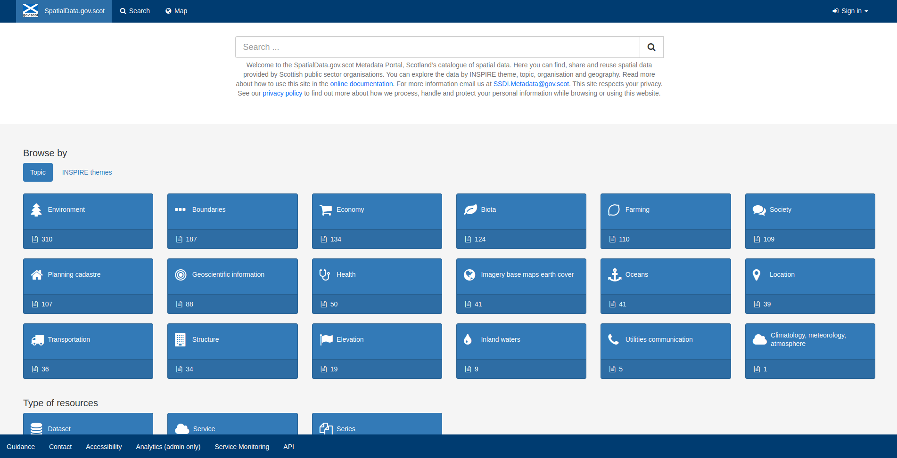
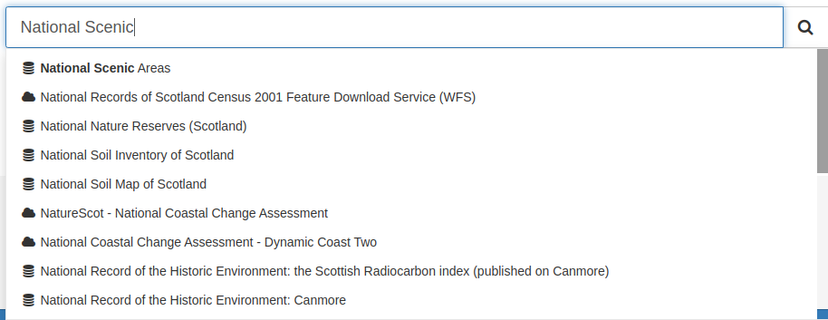
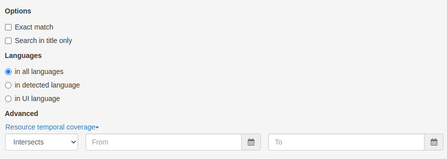
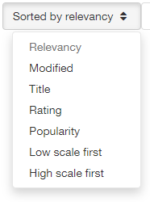
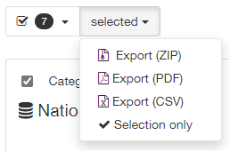
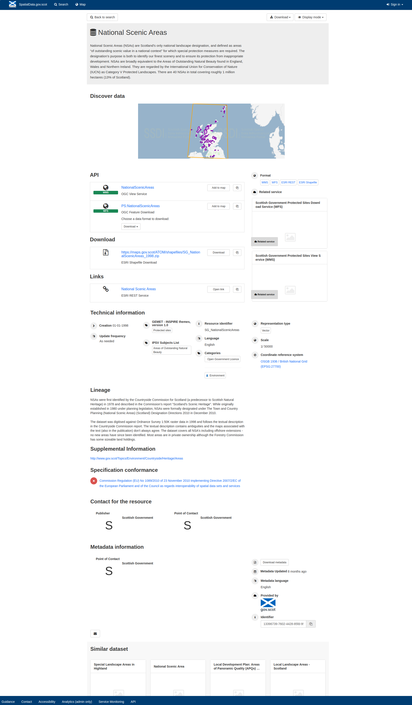

Searching for Metadata
======================

This section will guide users and guests to the site on how to search and filter metadata provided by data publishers to `spatialdata.gov.scot <https://www.spatialdata.gov.scot>`__.

Accessing the portal
--------------------

The portal can be accessed from the following link:

`https://www.spatialdata.gov.scot <https://www.spatialdata.gov.scot>`__

The home page of the portal comprises a basic search bar at the top, and also provides the option to browse by topic category (default) or 
by INSPIRE theme. Visitors can also browse the newest entries to the site or the most popular using the tabs lower down the page. Tabs in the header 
menu give access to the main **search** page, **map** viewer and **sign in** page (for registered users). Clicking the portal name on the header menu will 
return the user to the home page.

|userdoc_fig_2_1_1_Home|

**Figure 2.1.1:** Home page

When logged in, registered users of the site will be presented with further buttons on the header menu for |button_contribute| and |button_adminconsole| (for user and site administrators). 
The |button_contribute| menu gives options to navigate to the **Editor board**, `add a new record <UserDoc_Chap5_Create.html#creating-metadata-from-a-template>`__, 
`import new records <UserDoc_Chap5_Create.html#importing-existing-metadata>`__, `manage directory <UserDoc_Chap5_Create.html#creating-directory-metadata>`__, 
`batch editing <UserDoc_Chap6_Edit.html#batch-editing>`__ and access rights.

Basic searching
---------------

Quick searches on the portal can be performed directly from the home page using the search box and clicking the search button (|button_search_icon|).

*Note: wildcard characters, such as the asterisk key, can also be used.*

|userdoc_fig_2_2_1_BasicSearch|

**Figure 2.2.1:** A basic search from the home page

This will take the user to the main search panel, showing the resulting records in the centre of the page, with additional filtering options to the 
left. The user can also access the main search panel by clicking |button_search| on the top menu of the home page. To the bottom right of the 
page is a small map view showing the geographic extents of the queried results. This can be minimised by clicking the collapse button on the right of the map.

|userdoc_fig_2_2_2_SearchResults|

**Figure 2.2.2:** Search results displayed on the main search panel

Advanced searching
------------------

Other search options are available from the vertical ellipses icon to the right of the main search box. This expands to show **What** and **When** 
options. **What** allows users to search by Categories, Keywords, and Resource Contact. **When** allows users to limit the search temporally based 
on the metadata change date of an interactive resource (service) or dataset record. 

To perform an advanced search:

	**1|** Click |button_search| to access the search page.

	**2|** Click the |button_search_advanced| next to the search text box to access advanced options.
	
	**3|** Provide additional search criteria (e.g. constraining by category, keyword, contacts or time).
	
	**4|** Click |button_search_icon| to run the search based on the selected options. Results will be displayed in the list below.
	
	*Note: search options can be cleared by clicking* |button_search_reset|.

|userdoc_fig_2_3_1_AdvancedSearch|

**Figure 2.3.1:** Advanced search options

Filter and sort options
-----------------------

Search results can be limited using the options available in the left-hand panel. Each search filter shows the number of records returned next to 
it. Filtering options available are as follows:

* **Type of resources** (i.e. datasets or services)
* **Licence Type**
* **Topics**
* **INSPIRE Theme**
* **Keywords**
* **Contact for the resource**
* **Years**
* **Formats**
* **Available Actions**
* **Representation Types** (i.e. raster or vector)
* **Update Frequencies**
* **Service Types**
* **Scale**
* **Resolution**

At the top right of the search results list is a menu to sort results by **title**, **relevance**, **date of change**, **rating**, **popularity**,
and **scale**. At the top left of the results list users can select all results, all results on the current page, or none to deselect. Upon
selection users can choose to export the results to a zip, pdf or csv file. Note that registered users will be able to perform additional actions, 
such as `publish <UserDoc_Chap6_Edit.html#publishing-metadata>`__ (if they have Reviewer privileges) or `delete <UserDoc_Chap6_Edit.html#deleting-metadata>`__ 
(if they have Editor privileges), on selected records.

|userdoc_fig_2_4_1_SortOptions| |userdoc_fig_2_4_1_SelectOptions|

**Figure 2.4.1:** Sort and select options

.. |userdoc_fig_2_2_2_SearchResults| image:: media/userdoc_fig_2_2_2_SearchResults.png

.. |button_contribute| image:: media/button_contribute.png

.. |button_search| image:: media/button_search.png

