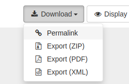
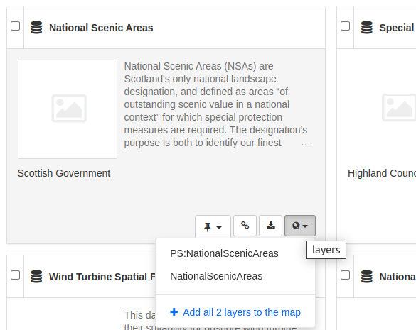
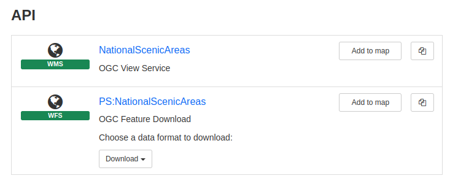
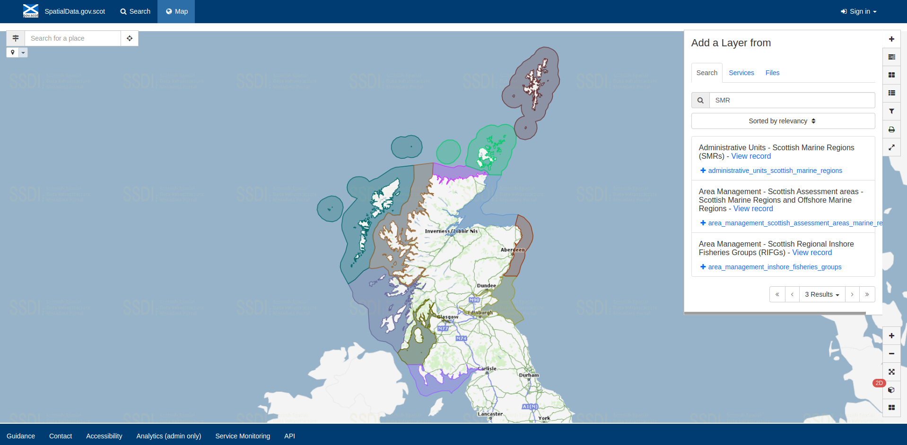

Viewing Metadata and Data
=========================

This section will guide users and visitors to the site on viewing metadata and previewing data using the interactive map.

Viewing metadata records
------------------------

Clicking on the title of a record (from either the search results or those presented on the main page) will allow the user to view the metadata 
record. Below the record title, the **abstract** provides a brief description of what the dataset (or service) is and what it is used for. The 
spatial **extent** of the resource can be seen in the map to the right. Access to the data itself can be gained from the options listed in the 
**Download and links** section.

|userdoc_fig_3_1_1_DefaultViewA|

**Figure 3.1.1:** Default record view

Scrolling down the page, the **About this resource** and **Technical information** headings details on topic categories and keywords, licencing 
information, contacts, maintenance frequency, coordinate systems and data formats are provided. Information on the history of a resource and how 
it was created can be found in the **lineage** section.

Note that the default view for a metadata record displays a summary of the information in the record. To change the display view of the metadata 
record:

	**1|** Click on |button_view_display| at the top right of the record.

	**2|** Choose form either ‘full’ or ‘XML’ view. Full view will display a detailed view of the record while XML view will display the raw XML for the record.

For detailed descriptions of each of the elements included in the metadata record, consult the `Metadata Elements <#metadata-elements>`__ section.

Exporting metadata records
--------------------------

Metadata records can be exported from the SSDI via the download icon menu at the top right of the record. To export a record:

	**1|** Click on |button_view_download| at the top right of the record.

	**2|** Choose the format to export (ZIP, PDF, XML, or RDF). The permalink option will provide a URL for the record that can be copy and pasted.

|userdoc_fig_3_2_1_ExportMetadata|

**Figure 3.2.1:** Export metadata menu
	
Previewing data in the map
--------------------------

Spatial data can be previewed in the interactive map using the web services referenced in the metadata. This capability can be accessed either from
the search results page, the metadata record view, or from the interactive map page.

To add a layer to the map from the search results page:

	**1|** Click on |button_view_globe| visible at the bottom right of the record.

	**2|** If there are multiple layers in the service, click the desired layer or choose to add all layers to the map.

	**3|** Click on |button_map| in the header menu to view the layer in the map.

	|userdoc_fig_3_3_1_AddtoMapSearch|

	**Figure 3.3.1:** Adding a layer to the map via the search results page

To add a layer from the main map page:

	**1|** Click on |button_map| in the header menu to navigate to the main map page.

	**2|** On the right-hand side of the map, click |button_map_addlayer| at the top of the menu to open the **Add a Layer** dialog.

	**3|** On the **Search** tab of the **Add a Layer** dialog, enter text in the search box to find a layer. Alternately, copy and paste a URL for a service into the **WMS**, **WMTS**, **WFS** or **KML** tabs.
 
	**4|** Click |button_map_addicon| beside the layer to add it to the map. If adding from a URL, click on the layer name to add it to the map.	 
	
	*Note: when adding straight from the map page, using the search tab, you may see layers with no name. This is caused by the 
	web service layers not being referenced properly in the associated resources part of the metadata record. Contributors to the SSDI should 
	update their metadata records so their WMS resources in the dataset metadata are named with the layer name as it appears in the service. 
	See the `Associated Resources <#associated-resources>`__ section for guidance on how to set up associated resources.*

	|userdoc_fig_3_3_3_AddtoMapMapPage|

	**Figure 3.3.3:** Adding a layer to the map via the map interface
	
To add a layer to the map from the metadata record view:

	**1|** Scroll to the **Downloads and links** section of the record. Services that can be added to the map will have |button_view_addtomap| beside them.

	**2|** For view services (i.e. WMS), Click on |button_view_addtomap|. The user will be automatically taken to the map page.

	**3|** For download services (i.e. WFS), select the layer from the drop down menu then click on |button_view_addtomap|.
	
	|userdoc_fig_3_3_2_AddtoMapRecordView|

	**Figure 3.3.2:** Adding a layer to the map from the metadata record view	

	*Note: with respect to WFS, users may experience occasions where the layer appears to have been added to the map, yet does not display. This 
	occurs when the Access-Control-Allow-Orgin header (CORS access policy) is missing from the remote server, and thus the request is blocked by 
	the browser. This is out of the control of the SSDI as it is dependent on the organisations' server configuration, however, a request 
	has been submitted to GeoNetwork to include an error message when this occurs, rather than to fail silently.*
	
Managing layers in the map
--------------------------

Available tools for the map are arranged down the right-hand side of the page.

To manage layers displayed in the map:

	**1|** Click |button_map_managelayers| on the right-hand side of the map. This will display a list of layers currently added to the map.
	
	*Note: those with scale-dependent visibility that are not currently visible will be greyed out. Layers that cannot be added for some other reason, such as an error with the service, will display an exclamation icon (|button_map_exclamationicon|).*

	**2|** To toggle a layer on or off, click on the layer name or check/uncheck the box.
	
	**3|** Click the cog icon (|button_map_cogicon|) to access a menu to zoom to the extent of the layer, adjust the opacity, or remove the layer from the map.
	
	**4|** To toggle the layer legend on or off, click the |button_map_legendicon| icon.

|userdoc_fig_3_4_1_ManageLayers|

**Figure 3.4.1:** Manage layers menu

Annotate and print the map
--------------------------

To add annotation to the map:

	**1|** Click |button_map_anno| to access the **Annotations** tab.

	**2|** Click |button_map_annoadd| and choose **text** from the dropdown menu.

	**3|** Enter text for the label in the text box below, and choose desired styling (size, fill and stroke colour, and stroke width).
	
	**4|** Move the mouse pointer over the map and click in the desired location to place the label.
	
	**5|** Use either the |button_map_annomodify| or |button_map_annoremove| buttons to change or delete the label.

	*Note: the annotation dialog can also be used to add basic shapes to the map. Under the add button choose either point, line or polygon.
	Add to the map using a single click to add a node and double clicking to finish.*

|userdoc_fig_3_5_1_AnnotateMap|

**Figure 3.5.1:** Adding annotation to the map	

To print the current map:

	**1|** Click |button_map_print| from the menu on the right-hand side of the map.

	**2|** In the appropriate boxes, enter text for the title of the map and a description or credit for the map if desired.
	
	**3|** Choose the desired layout (landscape, portrait or thumbnail).
	
	**4|** Choose the auto option for scale, or uncheck and select the desired scale from the dropdown list.
	
	**5|** Check the print legend box to include the legend on the map.
	
	**6|** Select the desired format (either PDF, PNG or JPEG) and click |button_map_printcurrent|.

	*Note: the print area will be highlighted on the map.*

|userdoc_fig_3_5_2_PrintMap|

**Figure 3.5.2:** Printing the current map	
	
Other map functions
-------------------

Other functionality available from the tabs on the main map page is as follows:

:|button_map_default| Maps: allows the user to reload the default map settings (removes all layers, added annotations etc.), load a map context file, or download the current map as an xml record. 
:|button_map_measure| Measure: allows the user to draw a line on the map to measure it's length. Single-click to create a node and double-click to finish.
:|button_map_projection| Change projection: change the projection of the map to one of the supported projections in the dropdown list.
:|button_map_zoomin| |button_map_zoomout| Zoom in and out: zoom in or out on the map.
:|button_map_zoomextent| Zoom to initial map extent: zoom to the full extent of the map.
:|button_map_zoomlocation| Zoom to your position: zoom to your location on the map (note: this will only work if your location can be calculated by the browser).
:|button_map_graticules| Graticule: adds a grid to the map (in lat/long).

.. |userdoc_fig_3_5_2_PrintMap| image:: media/userdoc_fig_3_5_2_PrintMap.png
