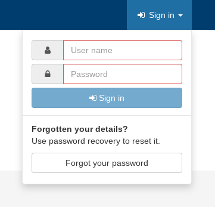
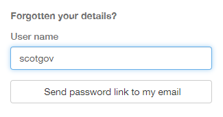
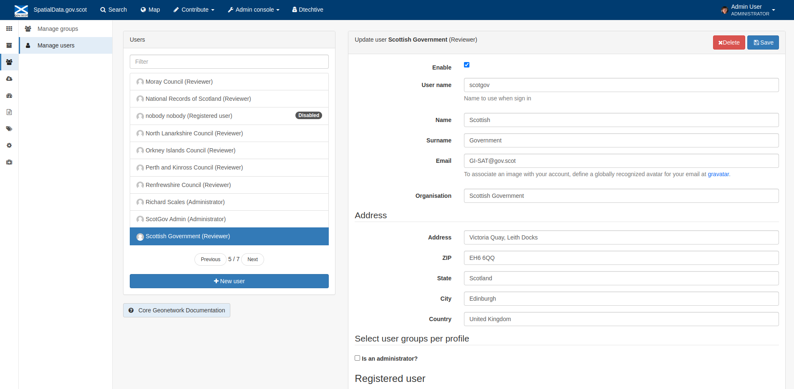
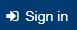
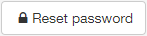

Registered Users
================

This section will guide registered users on how to sign in and manage their accounts.

Becoming a registered user
--------------------------
To add or edit metadata on `SpatialData.gov.scot <https://spatialdata.gov.scot>`__, your organisation must be registered on the site. The portal does not currently allow self registration, and therefore 
interested parties should contact (`SSDI.Metadata@gov.scot <mailto:SSDI.Metadata@gov.scot>`__). Currently, user accounts are created for organisations 
as a whole rather than individuals.

Registered user obligations
---------------------------

When an organisation becomes a registered user and submits metadata to `SpatialData.gov.scot <https://spatialdata.gov.scot>`__, they commit to the following **operational and service requirements**:

-  Maintaining the discovery metadata added by the organisation:

   -  by **assuring its quality** against appropriate standards

   -  by reviewing it, **updating it regularly**, and ensuring it is updated when new versions of data, data series or on-line services are published.

   -  **maintaining metadata file identifiers** (GUID) throughout the life of the metadata resource (new GUIDs should only be created when new resources are published, to prevent duplicate metadata resources).

-  Adopting a process of **continuous improvement** for the resources published by the organisation, based on the feedback received.

-  **Compliance with the INSPIRE** Metadata Regulation operational requirements, as set out in this guide.

-  To publish INSPIRE compliant **view services** for a given dataset or data series and reference them appropriately in the metadata, as set out in this guide.

-  Legal compliance with the INSPIRE Directive when publishing data that comes under an **INSPIRE Theme** and contains features listed in the INSPIRE Data Specifications.

-  Compliance with the INSPIRE Network Services Regulation when publishing INSPIRE Network Services.

Signing in
----------

To sign in to an existing account:

	**1|** Click the |button_signin| in the header menu.

	**2|** Enter your organisations' account user name and password.
	
	**3|** Click the |button_signin_confirm| button.
	
	*Note: user names and passwords are case sensitive.*

|userdoc_fig_4_3_1_SignIn|

**Figure 4.3.1:** Signing in to a registered account	

To recover a forgotten password:

	**1|** Click the |button_signin| in the header menu.
	
	**2|** Click the |button_signin_forgotten| at the bottom of dropdown window.
	
	**3|** Enter the account user name at the bottom of the page that opens (below the Sign in section).
	
	**4|** Click the |button_signin_sendlink| button. This will send an email to the address registered to that user account providing a link to reset the password.

	*Note: user names are case sensitive. The password recovery function requires that a valid email address (accessible by the user) is registered 
	with the user account in question. If you have not registered an email address or do not have access to the relevant mailbox, you will not be 
	able to receive password reset emails.*

|userdoc_fig_4_3_2_ResetPassword|

**Figure 4.3.2:** Resetting a forgotten password

User account management
-----------------------

Once logged in, users can manage their account details by clicking on their profile name displayed in the header. This will take the user to the 
account admin page. From this page users can enter or change contact details for themselves and other users and reset passwords.

*Note: a user can only reset its own password, not other users' passwords.*

To reset an account password:

	**1|** Click on either the user profile name or the user name in the header. By default the |button_account_manageusers| page should be presented. Click the user name on the left hand side under 'Users' to display the user account information.
	
	**2|** Click the |button_account_resetpass| button.
	
	**3|** Enter a new password in the Password text box. Repeat the password in the box below.
	
	**4|** Click the |button_account_resetpassconfirm| button to confirm the change.
	
	*Note: passwords are case sensitive and must be at least 8 characters long.*
	
When amending details, users should click the |button_account_save| button to save changes.

|userdoc_fig_4_4_1_ManageAccount|

**Figure 4.4.1:** The account management page

Note that there is also a |button_account_managegroups| tab. Generally each user account is an administrator for a group of the same name. On this tab users can manage group names and contacts as wells as assign logos for the group (which will appear on record view) - groups can be thought of as the 'publishing body'. Groups can have multiple user accounts associated with them, and users may be a part of a number of groups.

Users and groups
----------------

`SpatialData.gov.scot <https://spatialdata.gov.scot>`__ employs the concept of users, groups and profiles. *Users* are those accounts registered on the portal, and can be part of one or more 
*groups* (which are collections of users corresponding to logical units, such as teams within an organisation). The *group* and *profile* (or role)
of a user defines what tasks they can perform on the portal or on specific metadata records.

The rights associated with the various profiles are as follows:

:1) Administrator Profile:
	The Administrator has special privileges that give access to all available functions. These include:
		- Full rights for creating new groups and new users
		- Rights to change users/groups profiles
		- Full rights for creating/editing/deleting new/old metadata
		- Perform system administration and configuration tasks.
:2) User Administrator Profile:
	The User Administrator is the administrator of his/her own group with the following privileges:
		- Full rights on creating new users within the own group
		- Rights to change users profiles within the own group
		- Full rights on creating/editing/ deleting new/old data within the own group
:3) Content Reviewer Profile:
	The content reviewer is the only person allowed to give final clearance on the metadata publication on the Intranet and/or on the Internet:
		- Rights on reviewing metadata content within the own group and authorising its publication
:4) Editor Profile:
	The editor works on metadata with following privileges:
		- Full rights on creating/editing/ deleting new/old data within the own group
:5) Registered User Profile:
	The Registered User has more access privileges than non-authenticated Guest users:
		- Right to download protected data

*Note: profiles (or roles) are hierarchicaland based on inheritance. This means that a user with an Editor profile can create and modify new 
metadata records, but can also use all functions a Registered user can use.*

Normally, organisations registered on the site are given the role of *Content Reviewer* for the purpose of managing their metadata records.

