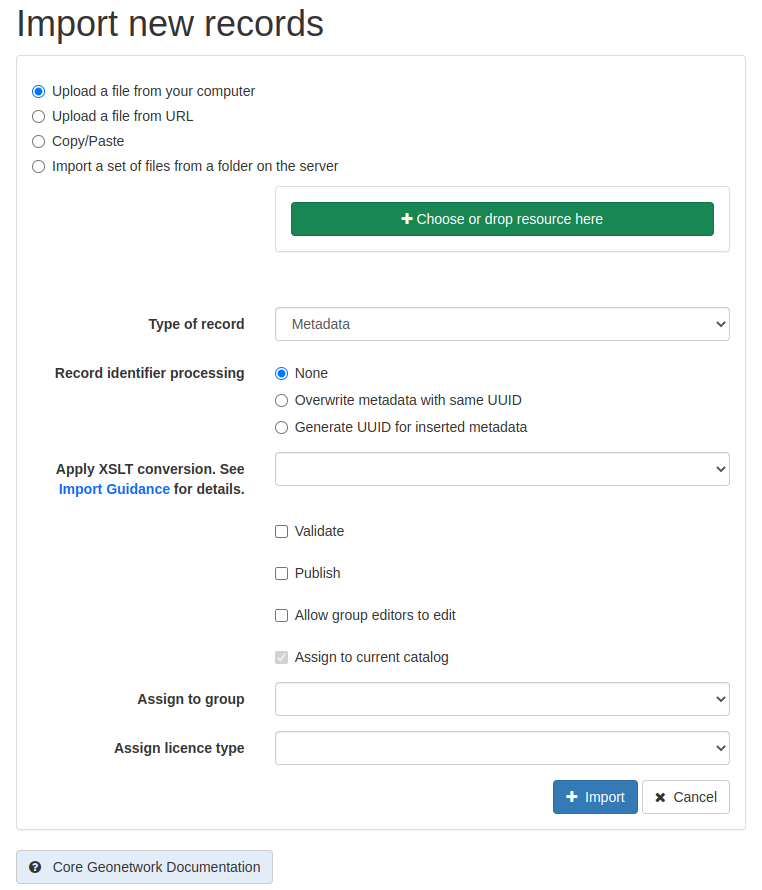
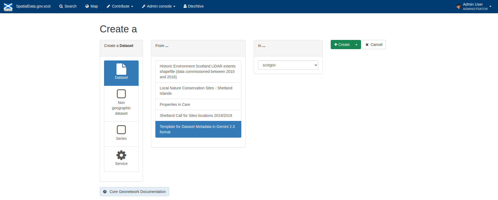
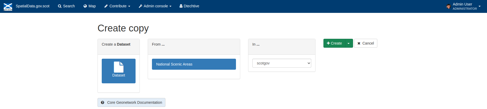
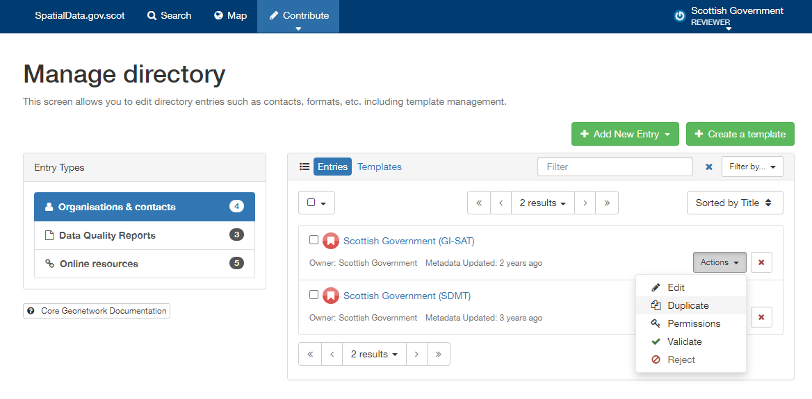
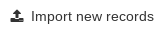
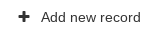
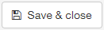

Creating Discovery Metadata
===========================

This section will guide the user through the process of creating discovery metadata records on `spatialdata.gov.scot <https://spatialdata.gov.scot>`__. Discovery metadata can be added to the 
portal by `importing an existing metadata <#import-existing-metadata>`__ XML file, `creating a new record from a template <#creating-metadata-from-a-template>`__, 
`duplicating an existing record <#duplicating-existing-metadata>`__, or `harvesting records <#harvesting-metadata>`__ from other metadata portals. 

Importing existing metadata
---------------------------

Prior to following the steps below to import an existing metadata record, please review `Annex 1 <UserDoc_Chap8_Annex1.html#annex-1-requirements-for-metadata-to-be-correctly-identified-as-uk-gemini>`__.

To import an existing XML metadata record:

	**1|** Click the |button_contribute| button in the header menu and choose |button_contribute_import|. This will take the user to the **Import new records** menu board.

	**2|** Select where to import the record from. Options are from your computer (default), a URL, by copy/paste, or from a server.
	
	**3|** Select **Metadata** from the type of record dropdown.
	
	**4|** Indicate how the unique identifier for the record (UUID) should be treated. If you are uploading in order to refine or change an existing record, then choose the **Overwrite metadata with the same UUID** option. If you are uploading to create a new metadata record then choose the **Generate UUID for inserted metadata** option. If the XML contains a UUID that does not already exist on the portal but you would like to keep this UUID then the **None** option should be selected.

	*Note: The UUID is a generated automatically by whatever internal system (i.e. ESRI ArcGIS) was used to write and manage your metadata. In xml, it can be found at the top of the page under the file identifier section. Within the portal, the UUID or File Identifier can be found at the bottom of the metadata record display. This UUID, together with the metadata date stamp, are used to ensure records are unique within* `spatialdata.gov.scot <https://spatialdata.gov.scot>`__, `data.gov.uk <http://data.gov.uk/>`__ *and other metadata catalogues.*

	**5|** Under the **Apply XSLT conversion** menu, select the appropriate translation to convert the metadata to the UK Gemini format.
	
	*Note: For an xml file that is already in Gemini 2.3 format and recognised as such (see* `Annex 1 <UserDoc_Chap8_Annex1.html#annex-1-requirements-for-metadata-to-be-correctly-identified-as-uk-gemini>`__), *the* **Apply XSLT conversion** *option can be set to 'None'. Select 'GEMINI 2.2 to GEMINI 2.3' to convert an existing Gemini 2.2 record to 2.3, select 'ESRI to GEMINI 2.3 to convert records created using the ESRI ArcGIS platform. Users providing data in MEDIN format should select the MEDIN to GEMINI conversion.*
	
	**6|** Optionally, select whether to validate the record on import.
	
	*Note: it is recommended that the validate option be left un-ticked, and users perform a validation of the record after import. If the validation option is ticked and an error is found, the record will fail to import.*

	**7|** Optionally, select whether to publish the record on import.
	
	**8|** Leave the **Assign to current catalog** option ticked.
	
	**9|** Assign the record to a user group.
	
	**10|** Assign the record to the appropriate licence type (i.e. OGL, NCGL, INSPIRE or other). This will allow for filtered searching based on the licence conditions.
	
	*Note: Licence types can also be amended at a later date. See* `assigning a licence category <UserDoc_Chap6_Edit.html#assigning-a-licence-category>`__.
	
	**11|** Click the |button_contribute_importconfirm| button.
	
|userdoc_fig_5_1_1_ImportMetadata|

**Figure 5.1.1:** Importing an existing XML metadata record

When the import operation has finished, an **Import Report** will be displayed on the right-hand side of the screen, indicating whether or not the 
import has been successful. Following a successful import, users should verify that their records are valid. Consult the 
`Validating metadata <UserDoc_Chap6_Edit.html#validating-metadata>`__ section for details. Amendments to the record may be required to make it fully Gemini compliant.

Creating metadata from a template
---------------------------------

Basic templates are available for users to create metadata directly on `spatialdata.gov.scot <https://spatialdata.gov.scot>`__.

To create a metadata record using an available template:

	**1|** Click the |button_contribute| button in the header menu. This will enable the **Contribute** board, where all records the user has access to will be listed.
	
	**2|** Click the |button_contribute_addrecord| button.
	
	**3|** Choose the type of record to be created based on the type of resource that is being documented, i.e. a dataset, series or service record. When selected available templates for that type are displayed.
	
	*Note: templates for dataset and service metadata are slightly different. Metadata for a service has extra elements for the spatial data service type (i.e. view, download, etc.) and for coupled resources. You must choose the correct template for the type of record being documented as it is not possible to change once the record has been created.*
	
	**4|** Click on the template to be used.

	**5|** Click the |button_contribute_create| button to create the new record. This will automatically take the user to the editing board where elements of the new record can be modified. See `Editing a metadata record <UserDoc_Chap6_Edit.html#editing-metadata>`__ for guidance on documenting the resource.
	
	*Note: if the user is an editor for multiple groups or an administrator to the site, they may be presented with multiple templates of the same name. Additionally, they will be required to select which group folder to create the metadata record in.*

|userdoc_fig_5_2_1_CreateTemplate|

**Figure 5.2.1:** Creating a metadata record from a template

Duplicating existing metadata
-----------------------------

One of the easiest ways to create metadata on the portal is to duplicate an existing record. This is particularly useful for organisations where many
of the metadata elements are the same for all records (e.g. points of contact, etc.)

To create a metadata record by duplicating and existing record:

	**1|** Click the |button_contribute| button in the header menu. 
	
	**2|** Click the |editor_board| button. This will enable the **Contribute** board, where all records the user has access to will be listed.

	**3|** Click the duplicate icon (|button_contribute_duplicate|) next to the record name.
	
	**4|** Click the |button_contribute_create| button to create the new record. This will automatically take the user to the **editing** board where elements of the new record can be modified. See `Editing a metadata record <UserDoc_Chap6_Edit.html#editing-metadata>`__ for guidance on documenting the resource.

	*Note: if the user is an editor for multiple groups or an administrator to the site, they will be required to select which group folder to create the duplicate metadata record in.*

|userdoc_fig_5_3_1_Duplicate|

**Figure 5.3.1:** Duplicating an existing metadata record

Harvesting metadata
-------------------

`Spatialdata.gov.scot <https://spatialdata.gov.scot>`__ has the capability to automatically consume metadata from external services on a scheduled basis. Organisations that maintain their own
spatial data portals which are interested in having their records automatically harvested should contact `SSDI.Metadata@gov.scot <mailto:SSDI.Metadata@gov.scot>`__.

Creating directory metadata
---------------------------

Directory records are a means of automatically populating fields such as those for the `point of contact <UserDoc_Chap7_Elements.html#point-of-contact>`__ section of a 
metadata record with pre-written values. This is useful if you have to create multiple records that share the same point of contact.

To create a directory entry:

	**1|** Click the |button_contribute| button in the header menu.

	**2|** Click either |button_contribute_managedirectory| from the contribute drop down, or the button below the header of the **Contribute** board. This will bring the user to the manage directories page.

	**3|** On the entries tab are previously created directory entries. Under the **Actions** drop menu, users can choose to edit or duplicate an existing record. Alternately, users can create a blank directory entry using a template by first clicking on the **Templates** tab, and then choosing duplicate from the **Actions** menu of the 'TEMPLATE TO DUPLICATE' entry.
	
	**4|** Amend the entry as appropriate and click |button_contribute_savedirectory| to save changes.
	
	**5|** Click |button_contribute_saveclosedirectory| to save and exit.

	*Note: The individual name field is not mandatory for the UK Gemini standard, however, for directories it can be used to identify teams/business areas if you have a number of different contact details within an organisation (e.g. GIS, Planning, etc.)*

|userdoc_fig_5_5_1_DirectoryEntry|
 
**Figure 5.5.1:** Creating a directory entry

.. |button_contribute| image:: media/button_contribute.png

.. |button_contribute_savedirectory| image:: media/button_contribute_savedirectory.png
