Editing Metadata
================

This section will guide the user through editing a metadata record on `spatialdata.gov.scot <https://www.spatialdata.gov.scot>`__, compliant to the `UK Gemini standard <https://www.agi.org.uk/agi-groups/standards-committee/uk-gemini>`__. 
In most cases, the basic functionality provided by the *default view* of an editing sessions will be sufficent for the users need, however, in 
some instances additional functionality from the *advanced view* may be required. For detailed information on completing each of the individual 
metadata elements, refer to the `Metadata Elements <UserDoc_Chap7_Elements.html#metadata-elements>`__ section.

Starting an editing session
---------------------------

Users will be able to edit any records they have contributed to the portal, or if they have appropriate privileges to edit records submitted by 
others (e.g. administrators).

To begin an editing session:

	**1|** `Sign in <UserDoc_Chap4_Users.html#signing-in>`__ using your account credentials.

	**2|** Either search for a particular record direct from the home page or click |button_contribute| in the header and select |button_editor_board| to open the **Editor** board and search or scroll for the record.

	*Note: if the 'only my records' box at the top left of the Editor board is checked, this will limit the record list to only those belonging to that user.*
	
	**3|** Click the pencil icon (|button_contribute_pencil|) visible in the search results list, or next to the record name on the **Editor** board. This will enter the user into an editing session.
	
	*Note: users can also start an editing session from the record view page by clicking* |button_view_edit| *at the top of the page.*

Editing basics
--------------

Once in an editing session, the user is presented with the simple *default* editing view. In the header menu, buttons are available for modifying 
the categories, group that the record belongs to, validation, cancelling the edit session, and saving the record. On the right side of the page, 
the `Associated resources <#associated-resources>`__ panel is visible, showing all related online resources and service records related to the 
record being edited.

The form displays the metadata elements grouped into relevant sections. The user can navigate through the form using the *table of contents* 
visible in the lower right of the screen (click |button_edit_toc| to display). Clicking an element section will take the user to the relevant section of the form. The user can 
collapse all elements of the form by clicking the |button_edit_collapse| button visible just below the header. Clicking on a section title will 
re-expand that section. The |button_edit_arrowup| and |button_edit_arrowdown| buttons allow the user to place the section further up or down the document order. 
Note that UK Gemini is only concerned with whether the elements (or sections) are present and correct, not with the order they are displayed. For 
detailed guidance on filling out each element, users should consult the `Metadata Elements <UserDoc_Chap7_Elements.html#metadata-elements>`__ section.

Mandatory fields (e.g. `Abstract <UserDoc_Chap7_Elements.html#abstract>`__) are highlighted with a red asterisk. Note that for sub-elements, this only indicates that the 
sub-element is mandatory within its context. For example, the `vertical extent <UserDoc_Chap7_Elements.html#extent-vertical-extent>`__ is an optional element, but if the 
record requires one, then the minimum and maximum values are mandatory.

Where a |button_edit_plus| button is displayed, the user can click this to add another occurrence of an element or section. For example, a record 
could have more than one `alternative title <UserDoc_Chap7_Elements.html#alternative-title>`__. When the user hovers over a section and a |button_edit_delete| appears, 
clicking the cross will delete that element or section.

|userdoc_fig_6_2_1_DefaultEdit|

**Figure 6.2.1:** The default view of the editing session interface

Changing the editing view
-------------------------

Sometimes it will be necessary for the user to change the view to enable additional functionality. For example, to add a new occurrence of an element 
when the |button_edit_plus| is not visible in the default view.

To change the view of editing session:

	**1|** Click on |button_edit_view| on the top right of the editing board.
	
	**2|** From the dropdown menu, choose either INSPIRE, simple, full or XML. Advanced (full) view is a more detailed version of the default (simple) view, where as XML view allows the user to edit the raw XML.
	
	*Note: users can also enable tool tips from the view menu.*
	
|userdoc_fig_6_3_1_AdvancedEdit| |userdoc_fig_6_3_1_XMLEdit|

**Figure 6.3.1:** Advanced editing and XML view

Assigning a licence category
----------------------------

Records can be classified based on their licence type (i.e. Open Government, Non-commercial Government, INSPIRE or other) using the 
assign category function. This classification can be done either in an editing session, via the contribute board, or when a record is imported 
into `spatialdata.gov.scot <https://www.spatialdata.gov.scot>`__.

To assign or change the licence category in an editing session:

	**1|** Click on |button_edit_category| in the header.
	
	**2|** From the dropdown menu, check the appropriate licence type (Open Government, Non-commercial, INSPIRE or other).
	
	**3|** Click anywhere to dismiss the menu.

|userdoc_fig_6_4_1_LicenceCategory|

**Figure 6.4.1:** Assigning a licence category in an editing session

To assign or change the licence category via the contribute board:

	**1|** Click on |button_contribute| in the header.
	
	**2|** Click the |button_editor_board| button. This will enable the **Editor** board, where all records the user has access to will be listed.
	
	**3|** In the record list, select the record(s) for which the licence category will assigned or amended.
	
	*Note: the licence category can be updated for multiple records at a time.*
	
	**4|** Click the dropdown labelled 'selected' at the top left of the record list and choose 'Update licence' from the list. This will display the licence categories dialog.
	
	**5|** From the menu, check the appropriate licence type (Open Government, Non-commercial, INSPIRE or other).
	
	**6|** Click |button_contribute_replace| to apply the changes.

The licence category can also be assigned using the appropriate option when importing a record. For those organisations which harvest 
their metadata records into the portal, a default licence type can be selected for all records, though any records that differ from the default setting
would need to be amended post harvest.

Associated resources
--------------------

The Associated Resources panel allows users to add online resources to their metadata and create relationships between dataset and service records 
(i.e. coupled resources). When in an editing session, the associated resources panel can be found at the top right of the page.

To add an online resource to *dataset* metadata where a corresponding *service* record exists:

	**1|** Click on the |button_edit_addassocresource| button at the top of the Associated Resources panel.
	
	**2|** From the dropdown menu select 'Link to a service'. This will display the Link resources dialog.
	
	**3|** Search using the free text box and click on the service record in the results list to select it (when selected it will be highlighted in blue).
	
	**4|** This will display the layers available in the service. Click on the appropriate layer to select it (when selected it will be highlighted in green).
	
	**5|** Click on the |button_edit_linkservice| to link the service to the dataset metadata. This creates a link between the dataset and service records and adds an online resource element to the dataset record.

	**6|** If required, amendments can be made by clicking on the pencil icon beside the newly added online resource in the associated resources panel. Alternately scroll to the element in the main editing board and amend manually.

	**7|** Click |button_edit_updatelink|.
	
	*Note: For web services (i.e. WMS and WFS) to correctly display in the map, you must ensure that the protocol and layer name are correctly entered for the online resource. For dataset records the URL for for a WMS or WFS should* **not** *include the GetCapabilities request. While these elements are not required for Gemini compliance, the are needed to enable previewing on the map.*

|userdoc_fig_6_5_1_AssocDatasetService|

**Figure 6.5.1:** Adding an online resource to a dataset by associating with a service record

To add an online resource to *dataset* metadata where **no** corresponding *service* record exists:
 
	**1|** Click on the |button_edit_addassocresource| button at the top of the Associated Resources panel.
	
	**2|** From the dropdown menu, select the first option, 'Link and online resource'. This will display the Link resources dialog.
	
	**3|** Ensure the 'Add online resource' radio button is clicked.
	
	**4|** Add the URL to ensure it points at the service (e.g. www.mapdata.scot/ServiceName/MapServer/WMSServer?). For dataset records the URL for for a WMS or WFS should **not** include the GetCapabilities request.
	
	**5|** Set the correct protocol for the service from the drop down (e.g. OGC-WMS Web Map Service). This will then display the layers available in the service.
	
	**6|** Click on the appropriate layer to select it (it will highlight in green).
	
	**7|** Click |button_edit_addlink|.
	
	*Note: For web services (i.e. WMS and WFS) to correctly display in the map, you must ensure that the protocol and layer name are correctly entered for the online resource (steps 5 and 6 above). While these elements are not required for Gemini compliance, the are needed to enable previewing on the map.*

|userdoc_fig_6_5_2_OnlineResourceDataset|

**Figure 6.5.2:** Adding an online resource to a dataset record

To add an online resource (e.g. WMS or WFS) to a *service* metadata record:
 
	**1|** Click on the |button_edit_addassocresource| at the top of the Associated Resources panel.
	
	**2|** From the dropdown menu, select the first option, 'Link and online resource'. This will display the Link resources dialog.
	
	**3|** Ensure the 'Add online resource' radio button is clicked.
	
	**4|** Select the appropriate protocol for the online resource (e.g. for a WMS, select OGC-WMS Capabilities service)
	
	**5|** Enter the URL for the service.
	
	*Note: A service may contain multiple layers and these will be displayed when the service URL is entered. As this is a service record, it is not necessary to select a single layer to link to (this is only required for dataset records).*
	
	**6|** Optionally, provide a name and description for the resource.
	
	**7|** Click |button_edit_addlink|.
	
|userdoc_fig_6_5_3_OnlineResourceService|

**Figure 6.5.3:** Adding an online resource to a service record

Validating metadata
-------------------

Once all elements for a new record have been completed or changes have been made to an existing record, it should be validated against the UK Gemini
standard rules.

To validate a metadata record:

	**1|** In an editing session, click on the |button_edit_validate| button in the header bar.
	
	**2|** Errors will be highlighted in the validation panel. Click the red thumbs-down icon (|button_edit_thumbsdown|)to see details of the error(s) organised by schematron.
	
	**3|** Correct errors as necessary and repeat steps 1 and 2 until no errors are returned by the validator.
	
	*Note: users can save an invalid record and return at a later date to correct.*

|userdoc_fig_6_6_1_ValidationPanel|

**Figure 6.6.1:** Validation panel

The validation check should be repeated once amendments have been made until no errors are detected. Error descriptions given by the validator are
often complex and difficult for the lay user to understand. Consult the `Metadata Elements <UserDoc_Chap7_Elements.html#metadata-elements>`__ section for guidance on how to
complete specific elements.

Saving and exiting an editing session
-------------------------------------

As the user works through the editing form, it is recommended that progress be saved periodically as the session will time-out after a period of 
inactivity.

To save a metadata record:

	**1|** Click |button_edit_save| to save the record and continue editing, or click |button_edit_saveclose| to save the record and exit the editing session.
	
	*OR*
	
	**1|** Click |button_edit_cancel| to exit the editing session without saving the record.
	
Users should note that a saved record will be stored on the server only (not locally). The server is periodically backed up, though it is 
recommended that users store master copies of their metadata records within their own systems. To export copies of metadata created on the portal, 
consult the `exporting metadata <UserDoc_Chap3_Viewing.html#exporting-metadata-records>`__ section.

Publishing metadata
-------------------

Once a metadata record has been successfully `validated <#validating-metadata>`__, it can then be published, making it publicly viewable and available for harvesting by other data portals, such as `data.gov.uk <http://data.gov.uk/>`__.

To publish a metadata record:

	**1|** Click on |button_contribute| in the header.
	
	**2|** Click the |button_editor_board| button. This will enable the **Editor** board, where all records the user has access to will be listed.
	
	**3|** Locate the metadata record in the list below.
	
	**4|** Click on the |button_contribute_locked| next to the record name to access the Privileges dialog.
	
	**5|** To make publicly viewable, tick the 'Set all privileges' box next to the row marked 'All' in the group column.
	
	**6|** Click on |button_contribute_replace| to update the privileges for the record.

Once the record is published, the padlock icon displayed on the Editor board should appear unlocked (|button_contribute_unlocked|).

|userdoc_fig_6_8_1_PrivilegesPanel|

**Figure 6.8.1:** Publishing via the contribute page

Alternatively, there is a shortcut method to publish a record directly from the record's page on `spatialdata.gov.scot <https://www.spatialdata.gov.scot>`__:

	**1|** Click on the |button_view_managerecord| button at the top right of the record view.
	
	**2|** From the dropdown menu, click on |button_view_publish| to publish the record.
	
	*Note: the privileges dialog can also be accessed from this dropdown menu.*

|userdoc_fig_6_8_2_PrivilegesRecordView|

**Figure 6.8.2:** Publishing via record view

Batch editing
-------------

Administrators will have the privileges to perform batch editing on records. See the `Administrator Guidance <ssdi_adminguidance.html#batch-process>`__ for more information.

Deleting metadata
-----------------

Users with the appropriate privileges will be able to edit or delete records from the portal.

To delete a metadata record:

	**1|** Click on |button_contribute| in the header.
	
	**2|** Click the |button_editor_board| button. This will enable the **Editor** board, where all records the user has access to will be listed.
	
	**3|** Locate the metadata record in the list below.
	
	**4|** Click on the |button_contribute_delete| in the row for the record.
	
	**5|** A conformation prompt will be displayed. Click 'OK' to confirm the deletion.

	*Note: the record may still appear in the list until the page is refreshed.*
	
|userdoc_fig_6_10_1_DeleteRecordConfirm|

**Figure 6.10.1:** Confirmation requested to delete a metadata record

Alternatively, the user can delete a record directly from the record's page by clicking the |button_view_delete| button.

Users should note that when deleting a record that had previously been published, that record will not be deleted from other portals which may have 
harvested the record, such as `data.gov.uk <http://data.gov.uk/>`__. Users should contact `SSDI.Metadata@gov.scot <mailto:SSDI.Metadata@gov.scot>`__
to have records deleted from `data.gov.uk <http://data.gov.uk/>`__.

.. |userdoc_fig_6_2_1_DefaultEdit| image:: media/userdoc_fig_6_2_1_DefaultEdit.png
.. |userdoc_fig_6_3_1_AdvancedEdit| image:: media/userdoc_fig_6_3_1_AdvancedEdit.png
.. |userdoc_fig_6_3_1_XMLEdit| image:: media/userdoc_fig_6_3_1_XMLEdit.png
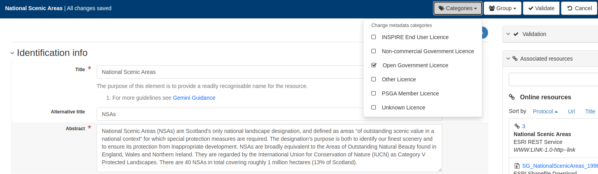
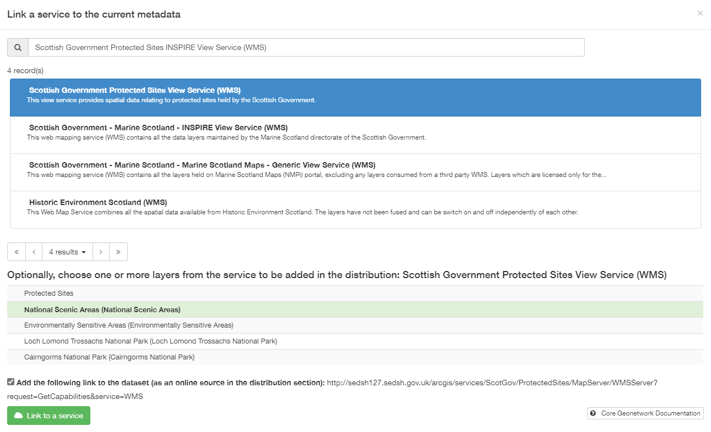
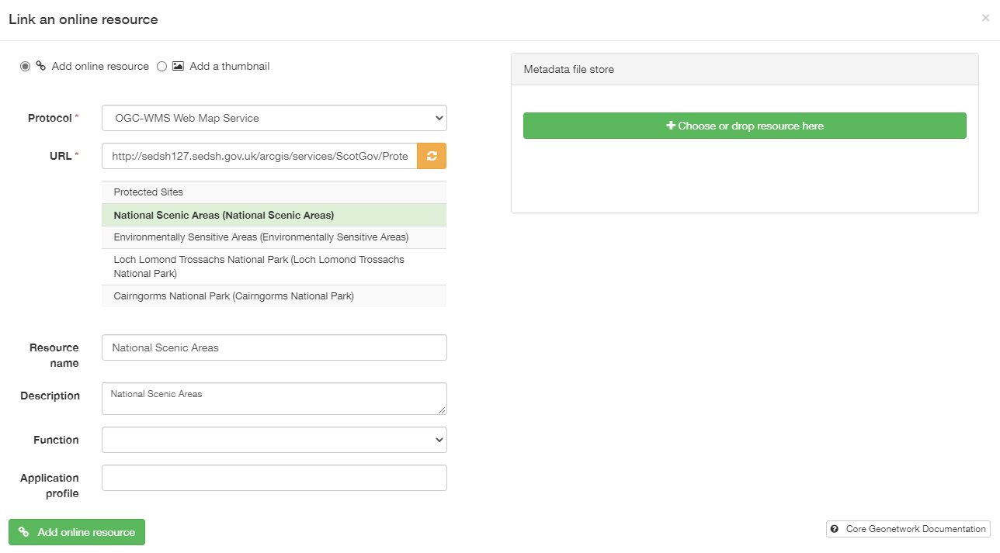
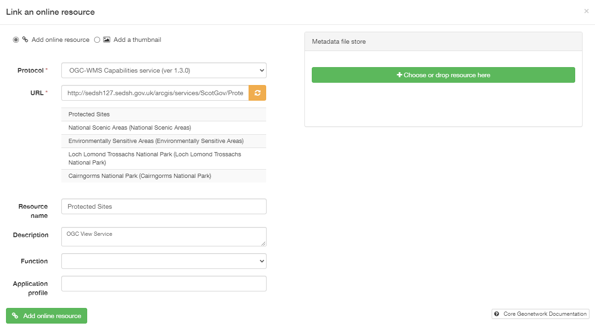
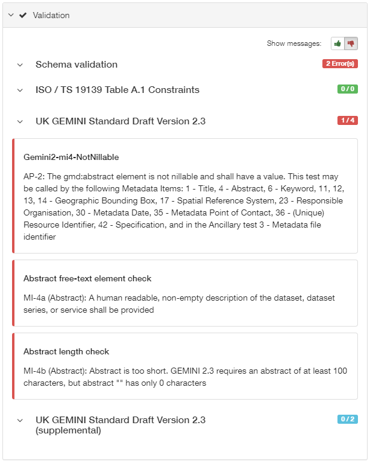
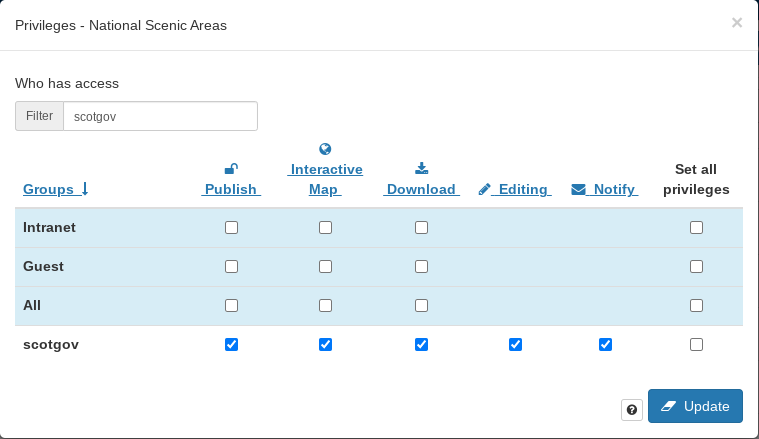
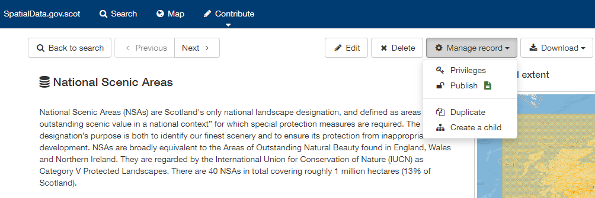

.. |button_contribute| image:: media/button_contribute.png
.. |button_contribute_pencil| image:: media/button_contribute_pencil.png

.. |button_edit_plus| image:: media/button_edit_plus.png
.. |button_edit_delete| image:: media/button_edit_delete.png

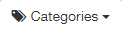

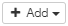

.. |button_edit_validate| image:: media/button_edit_validate.png

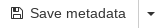
.. |button_edit_saveclose| image:: media/button_edit_saveclose.png

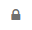
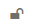
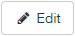
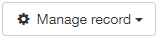
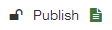

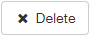

