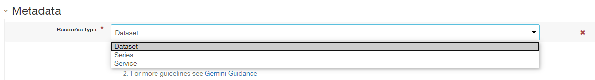
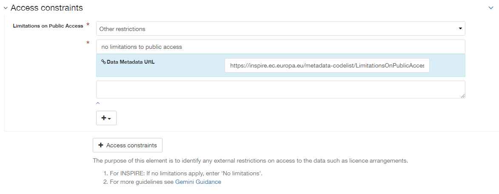
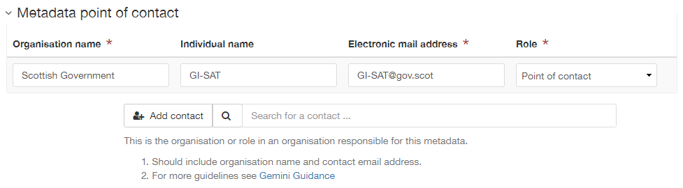
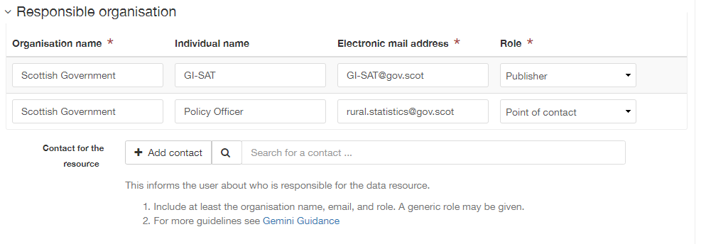
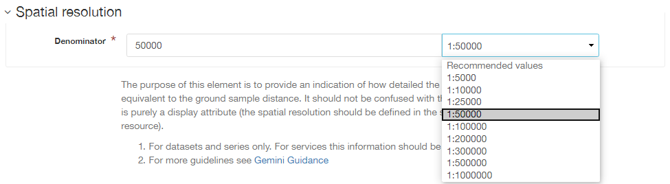

Metadata Elements
=================

This section provides guidance with respect to each of the UK Gemini elements. Section headings refer to the label present in the editing form of 
`spatialdata.gov.scot <https://www.spatialdata.gov.scot>`__, however, UK Gemini and INSPIRE equivalents are also provided. Links to full element guidance from the AGI are given, which includes information
on known common errors. Images show examples for each of the elements.

Users may also wish to consult the full UK Gemini 2.2 guidance `UK Gemini 2.2 specification <https://www.agi.org.uk/about/resources/category/81-gemini?download=18:gemini-2-2>`__.

Defining INSPIRE compliance
---------------------------

To define within the metadata if a dataset is compliant with INSPIRE, users should ensure the **Keyword** section is completed. If the dataset is 
covered by INSPIRE (e.g. parts of it are within the Scope of an INSPIRE Annex data specification), then the **first keyword** should be from the 
`GEMET INSPIRE themes <http://www.eionet.europa.eu/gemet/en/inspire-themes/>`__.

If another controlled vocabulary is used as the first keyword, such as the `Integrated Public Sector Vocabulary (IPSV) <http://id.esd.org.uk/list/subjects>`__, 
then the dataset is not covered by INSPIRE. That said, the dataset and service metadata will still be required to comply with the operation and 
service commitments, as set out in the `Registered user obligations <UserDoc_Chap4_Users.html#registered-user-obligations>`__ section.

Abstract
--------
:Gemini: `Abstract <https://www.agi.org.uk/gemini/40-gemini/1068-uk-inspire-v2-2-datasets-and-dataset-series-requirements-and-guidelines#4>`__
:INSPIRE: Abstract
:ISO19115:  MD_DataIdentification.abstract
:Obligation: Mandatory
:Occurance: One

:Definition:
	A brief narrative summary of the data resource.

:Guidance:
	Provide a clear and concise statement of the content of the dataset and its purpose (i.e. the 'what' and 'why' aspect of the dataset). General 
	background information should not be included, and unexplained abbreviations and jargon should be avoided. The abstract description should be 
	understood by non-experts. 

|userdoc_fig_7_1_1_Abstract|

Alternative title
-----------------
:Gemini: `Alternative title <https://www.agi.org.uk/gemini/40-gemini/1068-uk-inspire-v2-2-datasets-and-dataset-series-requirements-and-guidelines#2>`__
:INSPIRE: n/a
:ISO19115: MD_DataIdentification.citation > CI_Citation.alternateTitle
:Obligation: Optional
:Occurance: Many

:Definition:
	Any short name, other name, acronym or alternative language title by which the data resource is known.

:Guidance:
	This element should be used to record alternative titles by which the data resource is known, such as historical names, commonly used 
	abbreviations and acronyms. It can also be helpful to include title with spatial or temporal coverage if applicable. Entries should remain short
	and concise.
	
	If the element is not visible in the default view of the editing form, it can be added by `switching to advanced view <UserDoc_Chap6_Edit.html#changing-the-editing-view>`__ 
	and clicking the |button_edit_plus| button.

|userdoc_fig_7_2_1_AlternativeTitle|

Citation identifier
-------------------
:Gemini: `Unique resource identifier <https://www.agi.org.uk/gemini/40-gemini/1068-uk-inspire-v2-2-datasets-and-dataset-series-requirements-and-guidelines#36>`__
:INSPIRE: Unique resource identifier
:ISO19115: MD_DataIdentification.citation > CI_Citation.identifier
:Obligation: Mandatory (datasets), Optional (services)
:Occurance: Many

:Definition:
	A value uniquely identifying the data resource within your organisation (i.e. how your organisation references the dataset).

:Guidance:
	The *Code* element is mandatory, and should be a recognisable identifier within the context of your organisation (i.e. a unique	code of numbers, 
	letters or combination of referring to a single dataset).  If it is not guaranteed to be unique across the UK and the wider EU (INSPIRE), 
	then the *Codespace* sub-element must be specified; this should be the internet domain of the data provider/owner.

|userdoc_fig_7_3_1_CitationIdentifier|

Data Quality - Conformance result
---------------------------------
:Gemini: `Conformity <https://www.agi.org.uk/gemini/40-gemini/1068-uk-inspire-v2-2-datasets-and-dataset-series-requirements-and-guidelines#41>`__
:INSPIRE: Conformity - degree
:ISO19115: DQ_DataQuality > DQ_Element.result > DQ_ConformanceResult
:Obligation: Conditional (required if claiming conformance to INSPIRE)
:Occurance: Many

:Definition:
	Nested within *Data quality*, this is the degree of conformity with the product specification or user requirement against which the data is 
	being evaluated (i.e. degree of conformity to INSPIRE).

:Guidance:
	To be conformant to INSPIRE data specifications, provide the title and date for the specification, and an explanation of the degree of 
	conformance. If claiming full conformance, click the check box marked *pass*.
	
	At present a dataset is unlikely to be fully conformant, until mapping of the data to an INSPIRE data specification schema (i.e. mapping to GML) 
	has occurred for full interoperability, which will come in future phases of INSPIRE implementation. If the resource is not an INSPIRE dataset, or
	conformity is not being claimed, then this element can be removed by clicking the |button_edit_delete| button at the domain consistency level.

|userdoc_fig_7_4_1_ConformanceResult|

Data Quality - Hierarchy level
------------------------------
:Gemini: n/a see `Hierarchy level <https://www.agi.org.uk/gemini/40-gemini/1068-uk-inspire-v2-2-datasets-and-dataset-series-requirements-and-guidelines#hierarchy_level>`__
:INSPIRE: Hierarchy level
:ISO19115: MD_Metadata.hierarchyLevel
:Obligation: Mandatory
:Occurance: One

:Definition:
	Scope to which the metadata applies (i.e. dataset, series, service).

:Guidance:
	This is not a UK GEMINI element, but required in ISO 19115 encoding.  For metadata created on `spatialdata.gov.scot <https://www.spatialdata.gov.scot>`__, this element is set by the 
	choice of template and should not be changed.

|userdoc_fig_7_5_1_HierarchyLevel|

Date
----
:Gemini: `Dataset reference date <https://www.agi.org.uk/gemini/40-gemini/1068-uk-inspire-v2-2-datasets-and-dataset-series-requirements-and-guidelines#8>`__
:INSPIRE: Date of publication
:ISO19115: MD_Identification.citation > CI_Citation.date
:Obligation: Mandatory
:Occurance: Many

:Definition:
	Reference date for the data resource, indicating the date of publication, creation and/or last revision. Note that for services, this 
	date relates to the creation, publication, and/or revision of the service, not the dataset(s) within it.)

:Guidance:
	This element is a notional date of publication of the data resource. It is different from the `temporal extent <#extent-temporal-extent>`__, 
	which is the date of currency of the resource. Multiple dataset reference dates can be defined but there can only be one creation date. Dates 
	may be to any degree of precision, from century (YY) to full date and time. The extended date format (YYYY-MM-DD) should be used, where YYYY is 
	the year, MM the month, and DD the day. If required, time (HH:MM:SS, where HH is the hour, MM the minute, and SS the second) may be added, with 
	'T' separating the two parts.

|userdoc_fig_7_6_1_ReferenceDate|

Distribution format
-------------------
:Gemini: `Data format <https://www.agi.org.uk/gemini/40-gemini/1068-uk-inspire-v2-2-datasets-and-dataset-series-requirements-and-guidelines#21>`__
:INSPIRE: n/a
:ISO19115: MD_Distribution.distributionFormat > MD_Format
:Obligation: Conditional
:Occurance: Many

:Definition:
	The format(s) in which the digital data is available.

:Guidance:
	The name of the format and the version can be selected from common options listed in the drop down menu. Otherwise, entries should 
	be recognised formats for data transfer, either standard or proprietary. If the data is not transferable (e.g. view only), then this should be 
	stated. Recommended best practice is to select a value from a controlled vocabulary, such as `PRONOM <http://www.nationalarchives.gov.uk/PRONOM/Default.aspx>`__. 

|userdoc_fig_7_7_1_DistributionFormat|

Extent - Geographic bounding box
--------------------------------
:Gemini: `Bounding box <https://www.agi.org.uk/gemini/40-gemini/1068-uk-inspire-v2-2-datasets-and-dataset-series-requirements-and-guidelines#44>`__
:INSPIRE: Geographic bounding box
:ISO19115: MD_DataIdentification.extent > EX_Extent > EX_GeographicExtent > EX_GeographicBoundingBox
:Obligation: Mandatory
:Occurance: One

:Definition:
	Rectangle enclosing the extent of the data resource described in latitude and longitude, to enable the resource to be located geographically. 
	It has four sub-elements: west bounding longitude, east bounding longitude, south bounding latitude, and north bounding latitude.

:Guidance:
	A pre-defined extent can be chosen using the drop down menu, or bounding coordinates can be manually enetered in the corresponding boxes. The 
	west bounding longitude should be less than the east bounding longitude, and the north boundaing latitude must be greater than the south.

|userdoc_fig_7_8_1_GeogBoundingBox|

Extent - Geographic description
-------------------------------
:Gemini: `Extent <https://www.agi.org.uk/gemini/40-gemini/1068-uk-inspire-v2-2-datasets-and-dataset-series-requirements-and-guidelines#15>`__
:INSPIRE: n/a
:ISO19115: MD_DataIdentification.extent > EX_Extent > EX_GeographicExtent > EX_GeographicDescription.geographicIdentifier
:Obligation: Optional
:Occurance: Many

:Definition:
	The geographical extent of the data resource relative to an administrative hierarchy. Note that it is the coverage of the data resource, not 
	the individual objects in the data resource. Thus if the data resource was national parks in Scotland, the extent would be 'Scotland', even 
	though many parts of Scotland do not have National Parks. Sub-elements of the geographic description are the code identifying the extent and 
	the designating authority (optional).

:Guidance:
	Select a pre-defined extent of country or Local Authority based on ISO 3166-2 (sub divisions of countries) from the recommended values list. 
	The default is Scotland. Note that this element may also be populated using a linked data register entry, for example `http://statistics.gov.scot/id/statistical-geography/S92000003 <http://statistics.gov.scot/id/statistical-geography/S92000003>`__.

|userdoc_fig_7_9_1_GeogDescription|

Extent - Temporal extent
------------------------
:Gemini: `Temporal extent <https://www.agi.org.uk/gemini/40-gemini/1068-uk-inspire-v2-2-datasets-and-dataset-series-requirements-and-guidelines#7>`__
:INSPIRE: Temporal extent
:ISO19115: EX_Extent > EX_TemporalExtent.extent
:Obligation: Mandatory (dataset), Conditional (service)
:Occurance: Many

:Definition:
	This is the date(s) that describes the time period covered by the content of the dataset.  It may refer to (a) the period of collection of the 
	data or (b) the date at which it is deemed to be current. Temporal extent is the date of the validity of the data, and is different from the 
	`dataset reference date <#date>`__ (i.e. publication).

:Guidance:
	The user may need to add the temporal element if it is not visible in the editing form.

	To add the temporal element to the editing form:

	**1|** Change the editing form display to `advanced editor view <UserDoc_Chap6_Edit.html#changing-the-editing-view>`__.
	
	**2|** Scroll to the extent section (identification tab) and click the |button_edit_plusdrop| button next to the **Temporal element** label.
	
	**3|** From the dropdown menu, select **Temporal Extent**. This will present a further |button_edit_plusdrop| button labeled **Extent**.
	
	**4|** From the dropdown menu, select the extent type from either time edge, instant, node or period.
	
	*Note: if the temporal extent is composed of a begining and an end date, select time period. If it is a single date (e.g. census day) choose time instant. The time edge and node options are not often used.*

	**5|** If the time period option is chosen, use the |button_edit_plusdrop| buttons to add begining and end dates.
	
	Enter a date, or two dates defining the duration of the period, as defined by BS ISO 8601. Dates may be to any degree of precision, from year 
	(YYYY) to full date and time. The extended date format (YYYY-MM-DD) should be used, where YYYY is the year, MM the month, and DD the day. If 
	required, time (HH:MM:SS, where HH is the hour, MM the minute, and SS the second) may be added, with 'T' separating the two parts. Periods are 
	recorded as {fromdate/todate} (e.g. 2006-04-01/2007-03-31).  Either the from date or the to date (but not both) of the time period may be left 
	blank to indicate uncertainty.

|userdoc_fig_7_10_1_TemporalExtent|

Extent - Vertical extent
------------------------
:Gemini: `Vertical extent information <https://www.agi.org.uk/gemini/40-gemini/1068-uk-inspire-v2-2-datasets-and-dataset-series-requirements-and-guidelines#16>`__
:INSPIRE: n/a
:ISO19115: MD_DataIdentification.extent > EX_Extent > EX_VerticalExtent
:Obligation: Optional
:Occurance: Many

:Definition:
	Describes the vertical domain (height range) of the data resource. The element is composed of the minimum value, maximum value and the vertical 
	coordinate reference system (recorded as a name or code from a recognised thesaurus, i.e. `EPSG Geodetic Parameter Registry <http://www.epsg-registry.org/>`__).

:Guidance:
	This element should be completed only where the vertical extent is relevant (e.g. geology, mining, etc.). The user may need to add the temporal 
	element if it is not visible in the editing form.
	
	To add the vertical extent element to the editing form:

	**1|** Change the editing form display to `advanced editor view <UserDoc_Chap6_Edit.html#changing-the-editing-view>`__.
	
	**2|** Scroll to the extent section (identification tab) and click the |button_edit_plus| button next to the **Vertical element** label. This will present the minimum and maximum elements.
	
	**3|** To document a Coordinate Reference System for the vertical extent, click the  |button_edit_plusdrop| button labeled **Vertical CRS**.
	
	**4|** From the dropdown menu, select **Vertical CRS**.
	
	**5|** Add further sub-elements as necessary.

|userdoc_fig_7_11_1_VerticalExtent|

Keywords
--------
:Gemini: `Keyword <https://www.agi.org.uk/gemini/40-gemini/1068-uk-inspire-v2-2-datasets-and-dataset-series-requirements-and-guidelines#6>`__
:INSPIRE: Keyword
:ISO19115: MD_Identification.descriptiveKeywords > MD_Keywords
:Obligation: Mandatory
:Occurance: Many

:Definition:
	Terms covering the subject of the data resource which are more specific than those entered under `topic category <#topic-category>`__.  Ideally, 
	these will be standardised keywords originating from a controlled vocabulary, so that resources can be identified in any search.

:Guidance:
	It is recommended that keyword values be taken from a standardised subject vocabularies, such as `General Environmental Multi-Lingual Thesaurus (GEMET) <http://www.eionet.europa.eu/gemet/en/themes/>`__ or the `Integrated Public Sector Vocabulary (IPSV) <http://id.esd.org.uk/list/subjects>`__,
	and the formal citation provided (including the date, version and any amendments where appropriate). This will enable other users to perform 
	more efficient searches and eliminate resources that are of no interest more easily.
	
	If the dataset is covered under INSPIRE, then the **first** keyword should be from the `General Environmental Multi-Lingual Thesaurus (GEMET) - INSPIRE Spatial Data Themes <http://www.eionet.europa.eu/gemet/en/inspire-themes/>`__ list. 
	Service records must include a keyword from the INSPIRE `Classification of spatial data services <http://inspire.ec.europa.eu/metadata-codelist/SpatialDataServiceCategory>`__ code list.
	
	To add new keywords from a controlled vocabulary to the editing form:

	**1|** Click the |button_edit_selectthesaurus| button below the keywords element.
	
	**2|** Select the desired thesaurus (e.g. GEMET - INSPIRE themes, version 1.0). This will add a search box for the thesaurus.
	
	**3|** Click to select the relevant keyword. The citiation for the originating vocabulary will be pre-populated.
	
	*Note: alternately, free text keywords can be added by clicking the* |button_edit_addkeyword| *button.*

|userdoc_fig_7_12_1_Keywords|

Language
--------
:Gemini: `Dataset language <https://www.agi.org.uk/gemini/40-gemini/1068-uk-inspire-v2-2-datasets-and-dataset-series-requirements-and-guidelines#3>`__
:INSPIRE: Resource language
:ISO19115: MD_DataIdentification.language
:Obligation: Conditional
:Occurance: Many

:Definition:
	The language used within the dataset (assuming the data resource contains text/written information, e.g. in attribute tables).

:Guidance:
	Select a language from the drop down menu listing entries from the ISO 639-2 code list.  For INSPIRE compliance, this has to be an 
	`official language of the European Community <http://ec.europa.eu/languages/policy/linguistic-diversity/official-languages-eu_en.htm>`__, 
	of which English (eng) is the only one in common use across the UK (and is the default). For non-INSPIRE metadata records, it can 
	be any ISO 639-2 three letter code, of which the relevant entries for the UK are English (eng), Welsh (cym), Gaelic (Irish) (gle), Gaelic 
	(Scottish) (gla), Cornish (cor), Ulster Scots (sco).

|userdoc_fig_7_13_1_DatasetLanguage|

Limitations on public access
----------------------------
:Gemini: `Limitations on public access <https://www.agi.org.uk/gemini/40-gemini/1068-uk-inspire-v2-2-datasets-and-dataset-series-requirements-and-guidelines#25>`__
:INSPIRE: Limitations on public access
:ISO19115: MD_Identification > MD_Constraints > MD_LegalConstraints.otherConstraints
:Obligation: Mandatory
:Occurance: Many

:Definition:
	Restrictions imposed on **access** to the data resource for security and other reasons (i.e. who can see the data). Sub-elements are *Access 
	constraints* and *Other constraints*.

:Guidance:
	Limitations on public access is different from the `use constraints <#use-constraints>`__ element which describes limitations on using the data, 
	such as fees or licencing restrictions, rather than the access to it. A data resource can be openly accessible (which all INSPIRE data should 
	be), but have restrictions on its use such as licensing, fees, or usage limitations.
	
	For INSPIRE purposes the *Access constraints* dropdown box must be set to '**other restrictions**'. The *Other constraints* free text box must 
	then be populated with an appropriate label from the `INSPIRE code list for Limitations on public access <http://inspire.ec.europa.eu/metadata-codelist/LimitationsOnPublicAccess/>`__.
	If there are no restrictions on access, the text box should be populated with '**no limitations on public access**'.
	
	This element shall **only** include information regarding access to the resource (not the use of the data, which is documented under the `Use constraints <#use-constraints>`__ section). 
	When Member States limit public access to spatial data sets and spatial data services under Article 13 of Directive 2007/2/EC, this metadata 
	element shall provide information on the limitations and the reasons for them. If there are no limitations on public access, this metadata 
	element shall indicate that fact.

	Article 13 of the Directive contains a list of cases where limitations on public access can be set. With regards to providing the metadata for 
	the datasets and services through discovery services, the limitations on public access can be set on the base of reasons of international 
	relations, public security or national defence. Concerning providing View, Download or Transformation Services, or e-commerce services, 
	limitations on public access can be set on the base of the following reasons:

	* the confidentiality of the proceedings of public authorities, where such confidentiality is provided for by law;
	* international relations, public security or national defence;
	* the course of justice, the ability of any person to receive a fair trial or the ability of a public authority to conduct an enquiry of a criminal or disciplinary nature;
	* the confidentiality of commercial or industrial information, where such confidentiality is provided for by national or Community law to protect a legitimate economic interest, including the public interest in maintaining statistical confidentiality and tax secrecy;
	* intellectual property rights;
	* the confidentiality of personal data and/or files relating to a natural person where that person has not consented to the disclosure of the information to the public, where such confidentiality is provided for by national or Community law;
	* the interests or protection of any person who supplied the information requested on a voluntary basis without being under, or capable of being put under, a legal obligation to do so, unless that person has consented to the release of the information concerned;
	* the protection of the environment to which such information relates, such as the location of rare species.

|userdoc_fig_7_14_1_LimitationsPublicAccess|

Lineage
--------
:Gemini: `Lineage <https://www.agi.org.uk/gemini/40-gemini/1068-uk-inspire-v2-2-datasets-and-dataset-series-requirements-and-guidelines#10>`__
:INSPIRE: Lineage
:ISO19115: DQ_DataQuality.lineage > LI_Lineage.statement
:Obligation: Mandatory (dataset), Optional (service)
:Occurance: One

:Definition:
	A sub-element of *Data quality* that should provide information about the events or source data used in the creation of the data resource.   This will be useful in determining whether the data is fit for purpose.

:Guidance:
	The lineage differs from the `abstract <#abstract>`__ in that it covers 'how' the dataset was created as opposed the 'what' and 'why' of the 
	dataset. A brief technical description should be given noting any sources and processes used. Any procedures or protocol associated with the 
	update of the dataset should also be noted, along with notes on previous updates.

|userdoc_fig_7_15_1_Lineage|

Maintenance and update frequency
--------------------------------
:Gemini: `Frequency of update <https://www.agi.org.uk/gemini/40-gemini/1068-uk-inspire-v2-2-datasets-and-dataset-series-requirements-and-guidelines#24>`__
:INSPIRE: n/a
:ISO19115: MD_MaintenanceInformation.maintenanceAndUpdateFrequency
:Obligation: Mandatory (dataset), Conditional (service)
:Occurance: One

:Definition:
	Describes the frequency with which modifications and deletions are made to the data resource. Note that this identifies how often the updated 
	data resource is made available to the user (for instance a data resource may be updated continuously, but released to the user only monthly).

:Guidance:
	Choose the appropriate frequency from the drop down list. If the update cycle is unknown, please choose '**Unknown**' from the list.

|userdoc_fig_7_16_1_UpdateFrequency|

Metadata Contact
----------------
:Gemini: `Metadata point of contact <https://www.agi.org.uk/gemini/40-gemini/1068-uk-inspire-v2-2-datasets-and-dataset-series-requirements-and-guidelines#33>`__
:INSPIRE: Metadata point of contact
:ISO19115: MD_Metadata.contact > CI_ResponsibleParty
:Obligation: Mandatory
:Occurance: Many

:Definition:
	This element records the details of the organisation(s) responsible for the creation and maintenance of the metadata record. The structure of 
	this element is the same as the `Point of contact <#point-of-contact>`__ element. There are eight sub-elements:
	
	* Organisation name
	* Position name (i.e. job role or position of the responsible person or business area)
	* Voice (i.e. telephone number)
	* Facsimile (i.e. facsimile number)
	* Address (i.e. postal address as defined by Royal Mail)
	* Electronic mail address (i.e. email address)
	* Resource locator (i.e. web address of the organisation)
	* Role (of the responsible party with respect to the metadata)

:Guidance:
	Of the eight sub-elements, only the **organisation name**, **email address** and **role** are mandatory. All other sub-elements are optional. 
	With regards to the *organisation name*, this should be provided in full without abbreviations. In terms of the *role*, for INSPIRE purposes
	this must be set to *point of contact*.
	
	For *position name*, a general job title (e.g. Data Manager) should be identified rather than individuals which are subject to change without 
	notice and difficult to maintain. Likewise, email addresses should be provided for branch or team (i.e. shared) mailboxes where possible rather 
	than for individuals.
	
	If the user has stored contact details in a `directory entry <UserDoc_Chap5_Create.html#creating-directory-metadata>`__ on the portal, details can be auto-populated by 
	searching for the contact in the search box below the element. 
	
|userdoc_fig_7_17_1_MetadataContact|

Metadata Date stamp
-------------------
:Gemini: `Metadata date <https://www.agi.org.uk/gemini/40-gemini/1068-uk-inspire-v2-2-datasets-and-dataset-series-requirements-and-guidelines#30>`__
:INSPIRE: Metadata date
:ISO19115: MD_Metadata.dataStamp
:Obligation: Mandatory
:Occurance: One

:Definition:
	The date on which the metadata was last updated.

:Guidance:
	This element is not editable and is set by the editor when the file is saved. It is used by `spatialdata.gov.scot <https://www.spatialdata.gov.scot>`__ and `data.gov.uk <https://data.gov.uk>`__ to determine if metadata 
	with the same field identifier (UUID) has been changed. A single date is specified in the extended format YYYY-MM-DD, where YYYY is the year, 
	MM is the month and DD is the day.

|userdoc_fig_7_18_1_MetadataDate|

Metadata Hierarchy level
------------------------
:Gemini: n/a see `Hierarchy level name <https://www.agi.org.uk/gemini/40-gemini/1068-uk-inspire-v2-2-datasets-and-dataset-series-requirements-and-guidelines#hierarchy_level_name>`__
:INSPIRE: Resource type
:ISO19115: MD_Metadata.hierarchyLevelName
:Obligation: Mandatory
:Occurance: One

:Definition:
	Name of the hierarchy levels for which the metadata is provided.

:Guidance:
	This is not a UK GEMINI element, but required in ISO 19115 encoding.  For metadata created on `spatialdata.gov.scot <https://www.spatialdata.gov.scot>`__, this element is set by the 
	choice of template and should not be changed.

|userdoc_fig_7_19_1_MetadataHierarchyLevel|

Metadata Metadata language
--------------------------
:Gemini: `Metadata language <https://www.agi.org.uk/gemini/40-gemini/1068-uk-inspire-v2-2-datasets-and-dataset-series-requirements-and-guidelines#33>`__
:INSPIRE: Metadata language
:ISO19115: MD_Metadata.language
:Obligation: Mandatory
:Occurance: One

:Definition:
	The language used to document the metadata. The purpose of this element is to identify the language used in a multi-lingual metadata service, 
	for example in the INSPIRE geo-portal.

:Guidance:
	Selected a language from the drop down menu listing entries from the ISO 639-2 code list.  For INSPIRE compliance, this has to be an 
	`official language of the European Community <http://ec.europa.eu/languages/policy/linguistic-diversity/official-languages-eu_en.htm>`__, 
	of which English (eng) is the only one in common use across the UK (and is the default in the SSDI). For non-INSPIRE metadata records, it can 
	be any ISO 639-2 three letter code, of which the relevant entries for the UK are English (eng), Welsh (cym), Gaelic (Irish) (gle), Gaelic 
	(Scottish) (gla), Cornish (cor), Ulster Scots (sco).

|userdoc_fig_7_20_1_MetadataLanguage|

OnLine resource
---------------
:Gemini: `Resource locator <https://www.agi.org.uk/gemini/40-gemini/1068-uk-inspire-v2-2-datasets-and-dataset-series-requirements-and-guidelines#19>`__
:INSPIRE: Resource locator
:ISO19115: MD_Distribution > MD_DigitalTransferOptions.online > CI_OnlineResource.linkage
:Obligation: Conditional
:Occurance: Many

:Definition:
	Location (address) for on-line access to the resource using a Uniform Resource Locator (URL). This element should point to where the dataset 
	may be accessed, and may be different from where it may be ordered online (which should be included in the web address of the distributor).  

:Guidance:
	This element should primarily be used to enter URLs for web services (i.e. WMS, WFS, etc.), however, links to web pages offering more 
	information or other services (e.g. interactive mapping applications) can also be added. To add an online resource, follow the instructions 
	provided in the `Associated resources <UserDoc_Chap6_Edit.html#associated-resources>`__ section. Once an online resource has been added, it can be edited as normal
	in the editing form. Note that for web services to be displayed in the interactive map, the **protocol**, **layer name** and **description** 
	must be entered. The layer name **must** match that as defined in the GetCapabilities request of the service.
	
|userdoc_fig_7_21_1_OnLineResource|

Point of contact
----------------
:Gemini: `Responsible organisation <https://www.agi.org.uk/gemini/40-gemini/1068-uk-inspire-v2-2-datasets-and-dataset-series-requirements-and-guidelines#23>`__
:INSPIRE: Responsible party
:ISO19115: MD_Identification.pointOfContact
:Obligation: Mandatory
:Occurance: Many

:Definition:
	This element records the details of the organisation(s) responsible for the creation, maintenance and distribution of the data resource. The 
	structure of this element is the same as the `Metadata contact <#metadata-contact>`__ element. There are eight sub-elements:
	
	* Organisation name
	* Position name (i.e. job role or position of the responsible person)
	* Voice (i.e. telephone number)
	* Facsimile (i.e. facsimile number)
	* Address (i.e. postal address as defined by Royal Mail)
	* Electronic mail address (i.e. email address)
	* Resource locator (i.e. web address of the organisation)
	* Role (of the responsible party with respect to the resource)

:Guidance:
	Of the eight sub-elements, only the **orgnaisation name**, **email address** and **role** are mandatory. All other sub-elements are optional. 
	With regards to the *organisation name*, this should be provided in full without abbreviations. In terms of the *role*, if a responsible party
	is both the creator, publisher and distributor of the resource then the role should be set to *Publisher*. If the resource was created by a 
	party other than the provider this should also be recorded, using the role value *Originator*.
	
	For *position name*, a general job title (e.g. Data Manager) should be identified rather than individuals which are subject to change without 
	notice and difficult to maintain. Likewise, email addresses should be provided for branch or team (i.e. shared) mailboxes where possible rather 
	than for individuals.

	If the user has stored contact details in a `directory entry <UserDoc_Chap5_Create.html#creating-directory-metadata>`__ on the portal, details can be auto-populated by 
	searching for the contact in the search box below the element.

|userdoc_fig_7_22_1_PointofContact|

Reference system information
----------------------------
:Gemini: `Spatial reference system <https://www.agi.org.uk/gemini/40-gemini/1068-uk-inspire-v2-2-datasets-and-dataset-series-requirements-and-guidelines#17>`__
:INSPIRE: n/a
:ISO19115: MD_ReferenceSystem.referenceSystemIdentifier > RS_Identifier.code
:Obligation: Mandatory
:Occurance: Many

:Definition:
	Identifier, name or description of the system of spatial referencing, whether by coordinates or geographic identifiers, used in the data 
	resource.

:Guidance:
	The reference system should be recorded using its associated code in the `EPSG Geodetic Parameter Registry <http://epsg-registry.org/>`__. For
	metadata created on `spatialdata.gov.scot <https://www.spatialdata.gov.scot>`__, the two most common spatial reference systems have been pre-populated in the templates: OSGB 1936 and ETRS89. Users 
	should select their required reference system and remove the other. If another spatial reference system is required, this can be added by 
	accessing the `advanced editor view <UserDoc_Chap6_Edit.html#changing-the-editing-view>`__ and searching for the coordinate system tab in the search box below the element.

|userdoc_fig_7_23_1_ReferenceSystem|

Spatial resolution - Distance
-----------------------------
:Gemini: `Spatial resolution <https://www.agi.org.uk/gemini/40-gemini/1068-uk-inspire-v2-2-datasets-and-dataset-series-requirements-and-guidelines#18>`__
:INSPIRE: Spatial resolution
:ISO19115: MD_Identification.spatialResolution > MD_Resolution.distance
:Obligation: Conditional
:Occurance: Many

:Definition:
	A distance measure of the granularity (in metres), providing an indication of how detailed the data is. It is equivalent to the ground sample 
	distance and should not be confused with the scale of a map (which is purely a display attribute).

:Guidance:
	Enter values that are real numbers, greater than 0, and specified in metres. Commonly used distances can be added from the recommended values 
	drop down next to the element. For data captured in the field, it is the precision at which the data is captured (this may be the accuracy for 
	topographic surveys, or the average sampling distance in an environmental survey). For data taken from maps, it is the positional accuracy of 
	the map, while for image data it is the resolution of the image.

|userdoc_fig_7_24_1_SpatialResDistance|

Spatial resolution - Equivalent scale
-------------------------------------
:Gemini: `Equivalent scale <https://www.agi.org.uk/gemini/40-gemini/1068-uk-inspire-v2-2-datasets-and-dataset-series-requirements-and-guidelines#43>`__
:INSPIRE: Equivalent scale
:ISO19115: MD_Identification.spatialResolution > MD_Resolution.equivalentScale > MD_RepresentativeFraction.denominator
:Obligation: Optional
:Occurance: Many

:Definition:
	The level of detail expressed as the scale denominator of a comparable hardcopy map or chart.

:Guidance:
	Where the data is captured from a map, the scale of that map should be recorded as a positive integer. Note that `distance <#spatial-resolution-equivalent-scale>`__
	is the preferred expression for spatial resolution. The equivalent scale should only be given when the distance cannot be determined.
	
|userdoc_fig_7_25_1_SpatialResEqScale|

Supplemental information
------------------------
:Gemini: `Additional information source <https://www.agi.org.uk/gemini/40-gemini/1068-uk-inspire-v2-2-datasets-and-dataset-series-requirements-and-guidelines#27>`__
:INSPIRE: n/a
:ISO19115: MD_Identification > MD_DataIdentification.supplementalInformation
:Obligation: Optional
:Occurance: One

:Definition:
	Other descriptive information about the data resource held externally (e.g. a URL to background information).

:Guidance:
	This should be used to link to other sources of descriptive information about the resource. It should **not** be used to record links to 
	`online resources <#online-resource>`__ such as web services.

|userdoc_fig_7_26_1_SupplementalInformation|

Title
-----
:Gemini: `Title <https://www.agi.org.uk/gemini/40-gemini/1068-uk-inspire-v2-2-datasets-and-dataset-series-requirements-and-guidelines#1>`__
:INSPIRE: Resource title
:ISO19115: MD_DataIdentification.citation > CI_Citation.title
:Obligation: Mandatory
:Occurance: One

:Definition:
	The name given to the data resource.  

:Guidance:
	This should be the formal or product name if one exists. Otherwise the title should be created that is short, encapsulates the subject, 
	temporal and spatial coverage of the data resource, and does not contain terms or jargon that make it incomprehensible.

|userdoc_fig_7_27_1_Title|

Topic category
--------------
:Gemini: `Topic category <https://www.agi.org.uk/gemini/40-gemini/1068-uk-inspire-v2-2-datasets-and-dataset-series-requirements-and-guidelines#5>`__
:INSPIRE: Resource topic category
:ISO19115: MD_DataIdentification.topicCategory
:Obligation: Mandatory (datasets), N/A (services)
:Occurance: Many

:Definition:
	Describes the main theme(s) of the data resource, using `topic categories in accordance with ISO 19115 standard <http://inspire.ec.europa.eu/metadata-codelist/TopicCategory>`__.

:Guidance:
	Select from the drop down list one or more categories that most closely represent the topic of the data resource. This element is only meant to 
	represent the general theme of the information. `Keywords <#keywords>`__ should be used to provide greater detail on the nature of the dataset.
	While more than one topic category can be applied, only a limited number of most relevant should be chosen (e.g. topographic maps should not 
	be classified as farming). Additional topic categories can be added by clicking the |button_edit_plus| button below the element.
	
	Note that the choice of topic category will dictate which categories the data resource is listed under on the **Browse by topics** section of 
	the homepage.

|userdoc_fig_7_28_1_TopicCategory|
	
Use constraints
---------------
:Gemini: `Use constraints <https://www.agi.org.uk/gemini/40-gemini/1068-uk-inspire-v2-2-datasets-and-dataset-series-requirements-and-guidelines#26>`__
:INSPIRE: Conditions applying to access and use
:ISO19115: MD_Identification > MD_Constraints.useLimitation
:Obligation: Mandatory
:Occurance: Many

:Definition:
	Restrictions and legal constraints on **using** the data resource. This can be entered as a free text statement, or link to a URL containing 
	the information.
	
:Guidance:
	Use constraints are different from `limitations on public access <#limitations-on-public-access>`__ which describe limitations on access to the 
	data. A data resource can be openly accessible (which all INSPIRE data should be), but have restrictions on its use such as licensing, fees, or 
	usage limitations. 
	
	To add an additional use constraint element, click the |button_edit_plusdrop| button and choose either the *anchor* or *text* option. All records 
	on `spatialdata.gov.scot <https://www.spatialdata.gov.scot>`__ should document the licencing arrangements for the data resource using the anchor type. Where possible, this should link to a URL 
	such as the `Open Government Licence <http://www.nationalarchives.gov.uk/doc/open-government-licence/>`__, 
	`Non-Commercial Government Licence <http://www.nationalarchives.gov.uk/doc/non-commercial-government-licence/>`__,
	or `INSPIRE (Scotland) End User Licence <https://www.ordnancesurvey.co.uk/business-and-government/public-sector/mapping-agreements/inspire-eul-scotland.html>`__. 
	Users can further categorise their records in terms of licence type by following the guidance in the `assigning a licence category <UserDoc_Chap6_Edit.html#assigning-a-licence-category>`__ section.

|userdoc_fig_7_29_1_UseConstraints|

.. |userdoc_fig_7_1_1_Abstract| image:: media/userdoc_fig_7_1_1_Abstract.png
.. |userdoc_fig_7_2_1_AlternativeTitle| image:: media/userdoc_fig_7_2_1_AlternativeTitle.png
.. |userdoc_fig_7_3_1_CitationIdentifier| image:: media/userdoc_fig_7_3_1_CitationIdentifier.png
.. |userdoc_fig_7_4_1_ConformanceResult| image:: media/userdoc_fig_7_4_1_ConformanceResult.png

.. |userdoc_fig_7_6_1_ReferenceDate| image:: media/userdoc_fig_7_6_1_ReferenceDate.png
.. |userdoc_fig_7_7_1_DistributionFormat| image:: media/userdoc_fig_7_7_1_DistributionFormat.png

.. |userdoc_fig_7_9_1_GeogDescription| image:: media/userdoc_fig_7_9_1_GeogDescription.png

.. |userdoc_fig_7_11_1_VerticalExtent| image:: media/userdoc_fig_7_11_1_VerticalExtent.png
.. |userdoc_fig_7_12_1_Keywords| image:: media/userdoc_fig_7_12_1_Keywords.png
.. |userdoc_fig_7_13_1_DatasetLanguage| image:: media/userdoc_fig_7_13_1_DatasetLanguage.png

.. |userdoc_fig_7_15_1_Lineage| image:: media/userdoc_fig_7_15_1_Lineage.png
.. |userdoc_fig_7_16_1_UpdateFrequency| image:: media/userdoc_fig_7_16_1_UpdateFrequency.png

.. |userdoc_fig_7_18_1_MetadataDate| image:: media/userdoc_fig_7_18_1_MetadataDate.png
.. |userdoc_fig_7_19_1_MetadataHierarchyLevel| image:: media/userdoc_fig_7_19_1_MetadataHierarchyLevel.png
.. |userdoc_fig_7_20_1_MetadataLanguage| image:: media/userdoc_fig_7_20_1_MetadataLanguage.png
.. |userdoc_fig_7_21_1_OnLineResource| image:: media/userdoc_fig_7_21_1_OnLineResource.png

.. |userdoc_fig_7_23_1_ReferenceSystem| image:: media/userdoc_fig_7_23_1_ReferenceSystem.png
.. |userdoc_fig_7_24_1_SpatialResDistance| image:: media/userdoc_fig_7_24_1_SpatialResDistance.png

.. |userdoc_fig_7_26_1_SupplementalInformation| image:: media/userdoc_fig_7_26_1_SupplementalInformation.png
.. |userdoc_fig_7_27_1_Title| image:: media/userdoc_fig_7_27_1_Title.png

.. |userdoc_fig_7_29_1_UseConstraints| image:: media/userdoc_fig_7_29_1_UseConstraints.png

.. |button_edit_selectthesaurus| image:: media/button_edit_selectthesaurus.png
.. |button_edit_addkeyword| image:: media/button_edit_addkeyword.png
