Metadata Elements
=================

This section provides guidance with respect to each of the UK Gemini elements. Section headings refer to the label present in the editing form of 
`spatialdata.gov.scot <https://www.spatialdata.gov.scot>`__, however, UK Gemini and INSPIRE equivalents are also provided. Links to full element guidance from the AGI are given, which includes information
on known common errors. Images are provided showing example entries for each of the elements.

Users may also wish to consult the full `UK Gemini 2.3 specification <https://www.agi.org.uk/agi-groups/standards-committee/uk-gemini/40-gemini/1062-gemini-datasets-and-data-series>`__.

Defining INSPIRE compliance
---------------------------

To define within the metadata if a dataset is compliant with INSPIRE, users should ensure the **Keyword** section is completed. If the dataset is 
covered by INSPIRE (e.g. parts of it are within the Scope of an INSPIRE Annex data specification), then the **first keyword** should be from the 
`GEMET INSPIRE themes <http://www.eionet.europa.eu/gemet/en/inspire-themes/>`__ keyword list.

If another controlled vocabulary is used as the first keyword, such as the `Integrated Public Sector Vocabulary (IPSV) <http://id.esd.org.uk/list/subjects>`__, 
then the dataset is not covered by INSPIRE. That said, the dataset and service metadata will still be required to comply with the operation and 
service commitments, as set out in the `Registered user obligations <UserDoc_Chap4_Users.html#registered-user-obligations>`__ section.

Abstract
--------
:Gemini: `Abstract <https://www.agi.org.uk/agi-groups/standards-committee/uk-gemini/40-gemini/1062-gemini-datasets-and-data-series#4>`__
:INSPIRE: Resource abstract
:ISO19115:  MD_Identification.abstract
:Obligation: Mandatory
:occurrence: One

:Definition:
	A brief narrative summary of the data resource.

:Guidance:
	Provide a clear and concise statement of the content of the dataset and its purpose (i.e. the 'what' and 'why' aspect of the dataset). General 
	background information should not be included, and unexplained abbreviations and jargon should be avoided. The abstract description should be 
	understood by non-experts. 
	
	*Note: with Gemini 2.3 there is now a requirement for the abstract to be at least 100 characters long, and to be different from the* `title <#title>`__ *element. Validation will display an error if these conditions are not met.*

|userdoc_fig_7_1_1_Abstract|

Additional information
----------------------
:Gemini: `Additional information <https://www.agi.org.uk/agi-groups/standards-committee/uk-gemini/40-gemini/1062-gemini-datasets-and-data-series#27>`__
:INSPIRE: supplemental information
:ISO19115:  MD_Identification > MD_DataIdentification.supplementalInformation
:Obligation: Optional
:occurrence: One

:Definition:
	Other descriptive information about the data resource.

:Guidance:
	Record relevant information that does not clearly belong in any other element. A URL may be entered to reference other documents. Do **not** use it to describe how to access the resource (this should be in the `resource locator <#resource-locator>`__ element), or for any restrictions on access or use (use the `limitations on public access <#limitations-on-public-access>`__ and `use constraints <#use-constraints>`__ elements). If this element is not visible in the editor, switch to advanced editing view, and the Identification info tab, and use the "Additional information" button at the bottom of the page.

|userdoc_fig_7_26_1_SupplementalInformation|

Alternative title
-----------------
:Gemini: `Alternative title <https://www.agi.org.uk/agi-groups/standards-committee/uk-gemini/40-gemini/1062-gemini-datasets-and-data-series#2>`__
:INSPIRE: n/a
:ISO19115: MD_DataIdentification.citation > CI_Citation.alternateTitle
:Obligation: Optional
:occurrence: Many

:Definition:
	Any short name, other name, acronym or alternative language title by which the data resource is known.

:Guidance:
	This element should be used to record alternative titles by which the data resource is known, such as historical names, commonly used 
	abbreviations and acronyms. It can also be helpful to include title with spatial or temporal coverage if applicable. Entries should remain short
	and concise.
	
	If the element is not visible in the default view of the editing form, it can be added by `switching to advanced view <UserDoc_Chap6_Edit.html#changing-the-editing-view>`__ 
	and clicking the |button_edit_plus| button.

|userdoc_fig_7_2_1_AlternativeTitle|

Character encoding
------------------
:Gemini: `Character encoding <https://www.agi.org.uk/agi-groups/standards-committee/uk-gemini/40-gemini/1062-gemini-datasets-and-data-series#51>`__
:INSPIRE: Character encoding (metadata/2.0/req/isdss/character-encoding)
:ISO19115: MD_DataIdentification.characterSet 
:Obligation: Conditional (mandatory if not UTF-8)
:occurence: Many

:Definition:
	The character encoding used in the dataset.

:Guidance:
	This element enables data in non-standard character encodings to be handled. By default the encoding is set to UTF8, but other options are available using the dropdown list. The majority of users will not need to change this element.

|userdoc_fig_7_30_1_CharacterEncoding|

Data format
-------------------
:Gemini: `Data format <https://www.agi.org.uk/agi-groups/standards-committee/uk-gemini/40-gemini/1062-gemini-datasets-and-data-series#21>`__
:INSPIRE: Data encoding
:ISO19115: MD_Distribution.distributionFormat > MD_Format
:Obligation: Mandatory
:occurrence: Many

:Definition:
	The format(s) in which the digital data is available.

:Guidance:
	The name of the format and the version can be selected from common options listed in the drop down menu. Otherwise, entries should 
	be recognised formats for data transfer, either standard or proprietary. If the data is not transferable (e.g. view only), then this should be 
	stated. Recommended best practice is to select a value from a controlled vocabulary, such as `PRONOM <http://www.nationalarchives.gov.uk/PRONOM/Default.aspx>`__. 

|userdoc_fig_7_7_1_DistributionFormat|

Data quality
---------------------------------
:Gemini: `Data quality <https://www.agi.org.uk/agi-groups/standards-committee/uk-gemini/40-gemini/1062-gemini-datasets-and-data-series#52>`__
:INSPIRE: Topological consistency. Other types are specified in the data specifications
:ISO19115: DQ_DataQuality.report->DQ_Element
:Obligation: Conditional. Consult Gemini Guidance.
:occurrence: Many

:Definition:
	Quantitative aspects of data quality. To allow quantitative description of the completeness, consistency, accuracy, and correctness of the data

:Guidance:
	This element comprises two sub-elements:

	**1|** `Scope <#data-quality-scope>`__ - the specific data to which the data quality information applies.

	**2|** `Conformity <#data-quality-conformity>`__ - the product specification being assessed against (e.g. conformance to INSPIRE).

	At least one data quality element must be scoped to the entire data set or series that the metadata refers to. Other quality measures, for example relating to specific feature types may be provided in addition. To add additional Data Quality elements, `switch to advanced view <UserDoc_Chap6_Edit.html#changing-the-editing-view>`__ 
	and click the |button_edit_plus| button at the base of the page.
	

Data quality - Conformity
---------------------------------
:Gemini: `Conformity <https://www.agi.org.uk/agi-groups/standards-committee/uk-gemini/40-gemini/1062-gemini-datasets-and-data-series#41>`__
:INSPIRE: Conformity - degree
:ISO19115: DQ_DataQuality > DQ_Element.result > DQ_ConformanceResult
:Obligation: Mandatory
:occurrence: Many

:Definition:
	A sub-element of `Data quality <#data-quality>`__, this is the degree of conformity with the product specification or user requirement against which the data is 
	being evaluated (i.e. degree of conformity to INSPIRE).

:Guidance:
	At least one conformity statement shall be to an INSPIRE specification, even if to simply say that the data set is not conformant or not tested. Template snippets for INSPIRE Spatial data sets, Network services and Spatial data services have been provided. Use the *Search for a quality report...* search box at the bottom of the element to choose the appropriate one.

	To record that a data set or service has not been evaluated, for the Degree choose ***Not evaluated***. Otherwise choose ***Conformant*** or ***Not conformant*** as appropriate.

	To record conformance against an additional report, switch to the Advanced editing view, change to the Quality tab and add a new report using the plus button within the appropriate `Data quality <#data-quality>`__ element.

Data quality - Quality scope
---------------------------------
:Gemini: `Quality Scope <https://www.agi.org.uk/agi-groups/standards-committee/uk-gemini/40-gemini/1062-gemini-datasets-and-data-series#48>`__
:INSPIRE: metadata/2.0/req/datasets-and-series/one-data-quality-element
:ISO19115: DQ_DataQuality.scope
:Obligation: Mandatory
:occurrence: Many

:Definition:
	A sub-element of `Data quality <#data-quality>`__, this is specific scope to which the data quality assessment applies.

:Guidance:	
    At least one `Data quality <#data-quality>`__ element scoped to the entire dataset or series to which the metadata record refers. For a dataset, set quality scope to ***dataset***, for a dataset series, set quality scope ***series***.
    
    If using a `Data quality <#data-quality>`__ element to describe something other than the whole dataset or series, then provide additional data quality elements with their scope set appropriately. Switch to the Advanced editing view, change to the Quality tab, and Data Quality info element using the plus button at the base of the page. Set the quality scope to the appropriate level using the dropdown list.

|userdoc_fig_7_4_1_ConformanceResult|
	
	
Dataset language
----------------
:Gemini: `Dataset language <https://www.agi.org.uk/agi-groups/standards-committee/uk-gemini/40-gemini/1062-gemini-datasets-and-data-series#3>`__
:INSPIRE: Resource language
:ISO19115: MD_DataIdentification.language
:Obligation: Conditional
:occurrence: Many

:Definition:
	The language used within the dataset (assuming the data resource contains text/written information, e.g. in attribute tables).

:Guidance:
	Select a language from the drop down menu listing entries from the ISO 639-2 code list.  For INSPIRE compliance, this has to be an 
	`official language of the European Community <http://ec.europa.eu/languages/policy/linguistic-diversity/official-languages-eu_en.htm>`__, 
	of which English (eng) is the only one in common use across the UK (and is the default). For non-INSPIRE metadata records, it can 
	be any ISO 639-2 three letter code, of which the relevant entries for the UK are English (eng), Welsh (cym), Gaelic (Irish) (gle), Gaelic 
	(Scottish) (gla), Cornish (cor), Ulster Scots (sco).

|userdoc_fig_7_13_1_DatasetLanguage|

Dataset reference date
----------------------
:Gemini: `Dataset reference date <https://www.agi.org.uk/agi-groups/standards-committee/uk-gemini/40-gemini/1062-gemini-datasets-and-data-series#8>`__
:INSPIRE: Date of publication
:ISO19115: MD_Identification.citation > CI_Citation.date
:Obligation: Mandatory
:occurrence: Many

:Definition:
	Reference date for the data resource, indicating the date of publication, creation and/or last revision. Note that for services, this 
	date relates to the creation, publication, and/or revision of the service, not the dataset(s) within it.)

:Guidance:
	This element is a notional date of publication of the data resource. It is different from the `temporal extent <#extent-temporal-extent>`__, 
	which is the date of currency of the resource. Multiple dataset reference dates can be defined, but there must only be one of type *creation* and only one of type *revision*.
	
	Dates may be to any degree of precision, from year (YYYY) to full date and time. The extended date format (YYYY-MM-DD) should be used, where YYYY is 
	the year, MM the month, and DD the day. If required, time (HH:MM:SS, where HH is the hour, MM the minute, and SS the second) may be added, with 
	'T' separating the two parts.

|userdoc_fig_7_6_1_ReferenceDate|

Extent - Geographic bounding box
--------------------------------
:Gemini: `Bounding box <https://www.agi.org.uk/agi-groups/standards-committee/uk-gemini/40-gemini/1062-gemini-datasets-and-data-series#44>`__
:INSPIRE: Geographic bounding box
:ISO19115: MD_DataIdentification.extent > EX_Extent > EX_GeographicExtent > EX_GeographicBoundingBox
:Obligation: Mandatory
:occurrence: Many

:Definition:
	Rectangle enclosing the extent of the data resource described in latitude and longitude, to enable the resource to be located geographically. 
	It has four sub-elements: *west bounding longitude*, *east bounding longitude*, *south bounding latitude*, and *north bounding latitude*.

:Guidance:
	A pre-defined extent can be chosen from the drop down menu, or bounding coordinates can be manually entered in the corresponding boxes. The 
	west bounding longitude should be less than the east bounding longitude, and the north bounding latitude must be greater than the south.

|userdoc_fig_7_8_1_GeogBoundingBox|

Extent - Geographic description
-------------------------------
:Gemini: `Extent <https://www.agi.org.uk/agi-groups/standards-committee/uk-gemini/40-gemini/1062-gemini-datasets-and-data-series#15>`__
:INSPIRE: n/a
:ISO19115: MD_DataIdentification.extent > EX_Extent > EX_GeographicExtent > EX_GeographicDescription.geographicIdentifier
:Obligation: Optional
:occurrence: Many

:Definition:
	The geographical extent of the data resource relative to an administrative hierarchy. Note that it is the coverage of the data resource, not 
	the individual objects in the data resource. Thus if the data resource was national parks in Scotland, the extent would be 'Scotland', even 
	though many parts of Scotland do not have National Parks. Sub-elements of the geographic description are the *code* identifying the extent and 
	the *designating authority* (optional).

:Guidance:
	Enter a pre-defined extent of country or Local Authority using one of the controlled lists available in the drop down above the bounding box element (e.g. Geonames). 
	Note that this element may also be populated using a linked data register entry, for example `http://statistics.gov.scot/id/statistical-geography/S92000003 <http://statistics.gov.scot/id/statistical-geography/S92000003>`__.

|userdoc_fig_7_9_1_GeogDescription|

Extent - Temporal extent
------------------------
:Gemini: `Temporal extent <https://www.agi.org.uk/agi-groups/standards-committee/uk-gemini/40-gemini/1062-gemini-datasets-and-data-series#7>`__
:INSPIRE: Temporal extent
:ISO19115: EX_Extent > EX_TemporalExtent.extent
:Obligation: Mandatory (dataset), Conditional (service)
:occurrence: Many

:Definition:
	This is the date(s) that describes the time period covered by the content of the dataset.  It may refer to (a) the period of collection of the 
	data or (b) the date at which it is deemed to be current. Temporal extent is the date of the validity of the data, and is different from the 
	`dataset reference date <#date>`__ (i.e. publication).

:Guidance:
	Enter a Begin date and/or End date as required. Click on |button_edit_calendar| to activate the calendar selector. To add additional temporal extents, use the `advanced editor view <UserDoc_Chap6_Edit.html#changing-the-editing-view>`__.
	
	**2|** Scroll to the extent section (identification tab) and click the |button_edit_plusdrop| button next to the **Temporal element** label.
	
	**3|** From the dropdown menu, select **Temporal Extent**. This will present a further |button_edit_plusdrop| button labeled **Extent**.
	
	**4|** From the dropdown menu, select the extent type from either time edge, instant, node or period.
	
	*Note: if the temporal extent is composed of a begining and an end date, select time period. If it is a single date (e.g. census day) choose time instant. The time edge and node options are not often used.*

	**5|** If the time period option is chosen, use the |button_edit_plusdrop| buttons to add begining and end dates.
	
	Enter a date, or two dates defining the duration of the period, as defined by BS ISO 8601. Dates may be to any degree of precision, from year 
	(YYYY) to full date and time. The extended date format (YYYY-MM-DD) should be used, where YYYY is the year, MM the month, and DD the day. If 
	required, time (HH:MM:SS, where HH is the hour, MM the minute, and SS the second) may be added, with 'T' separating the two parts. Periods are 
	recorded as {fromdate/todate} (e.g. 2006-04-01/2007-03-31).  Either the from date or the to date (but not both) of the time period may be left 
	blank to indicate uncertainty.

|userdoc_fig_7_10_1_TemporalExtent|

Extent - Vertical extent
------------------------
:Gemini: `Vertical extent information <https://www.agi.org.uk/agi-groups/standards-committee/uk-gemini/40-gemini/1062-gemini-datasets-and-data-series#16>`__
:INSPIRE: n/a
:ISO19115: MD_DataIdentification.extent > EX_Extent > EX_VerticalExtent
:Obligation: Optional
:occurrence: Many

:Definition:
	Describes the vertical domain (height range) of the data resource. The element is composed of the ***minimum value***, ***maximum value*** and the ***vertical 
	coordinate reference system*** (recorded as a name or code from a recognised thesaurus, i.e. `EPSG Geodetic Parameter Registry <http://www.epsg-registry.org/>`__).

:Guidance:
	This element should be completed only where the vertical extent is relevant (e.g. geology, mining, etc.). If it is relevant, then all sub-elements are mandatory.
	
	To add the vertical extent:
	
	**1|** In default (simple) view, scroll to the extent element and click |button_edit_verticalextent|.
	
	**2|** Enter a minimum value in metres.

	**3|** Enter a maximum value in metres.

	**4|** Choose the appropriate vertical CRS from the recommended values dropdown list.

|userdoc_fig_7_11_1_VerticalExtent|

File identifier
-------------------
:Gemini: `File identifier <https://www.agi.org.uk/agi-groups/standards-committee/uk-gemini/40-gemini/1062-gemini-datasets-and-data-series#45>`__
:INSPIRE: metadata/2.0/rec/common/fileIdentifier
:ISO19115: MD_Metadata.fileIdentifier
:Obligation: Mandatory
:occurrence: One

:Definition:
	Unique identifier for this metadata file.

:Guidance:
	To support the operation of UK Location and INSPIRE, discovery metadata records must include a File Identifier for the resource. This will be auto-generated by a metadata creation tool (e.g. the metadata portal itself or an external metadata editor) and once created cannot be changed.

	File identifier should not be confused with the UK GEMINI2 metadata item `Resource identifier <#resource-identifier>`__, which identifies the data resource being described.

|userdoc_fig_7_31_1_FileIdentifier|	

Hierarchy level name
--------------------
:Gemini: `Hierarchy level name <https://www.agi.org.uk/agi-groups/standards-committee/uk-gemini/40-gemini/1062-gemini-datasets-and-data-series#47>`__
:INSPIRE: Hierarchy level
:ISO19115: MD_Metadata.hierarchyLevelName
:Obligation: Mandatory for series and services, optional for datasets
:occurrence: One

:Definition:
	The name of the hierarchy level for which the metadata is provided (eg dataset, series, service).

:Guidance:
	Set to "service", "series", "dataset" as appropriate. Note that in UK Gemini this element is conditional for datasets.

|userdoc_fig_7_19_1_MetadataHierarchyLevel|

Keyword
-------
:Gemini: `Keyword <https://www.agi.org.uk/agi-groups/standards-committee/uk-gemini/40-gemini/1062-gemini-datasets-and-data-series#6>`__
:INSPIRE: Keyword
:ISO19115: MD_Identification.descriptiveKeywords > MD_Keywords
:Obligation: Mandatory
:occurrence: Many

:Definition:
	Terms covering the subject of the data resource that are more specific than those entered under `topic category <#topic-category>`__.  Ideally, 
	these will be standardised keywords originating from a controlled vocabulary, so that resources can be identified in any search.

:Guidance:
	It is recommended that keyword values be taken from a standardised subject vocabularies, such as `General Environmental Multi-Lingual Thesaurus (GEMET) <http://www.eionet.europa.eu/gemet/en/themes/>`__ or the `Integrated Public Sector Vocabulary (IPSV) <http://id.esd.org.uk/list/subjects>`__,
	and the formal citation provided (including the date, version and any amendments where appropriate). This will enable other users to perform 
	more efficient searches and eliminate resources that are of no interest more easily.
	
	If the dataset is covered under INSPIRE, then the **first** keyword should be from the `General Environmental Multi-Lingual Thesaurus (GEMET) - INSPIRE Spatial Data Themes <http://www.eionet.europa.eu/gemet/en/inspire-themes/>`__ list. 
	Service records must include a keyword from the INSPIRE `Classification of spatial data services <http://inspire.ec.europa.eu/metadata-codelist/SpatialDataServiceCategory>`__ code list.
	
	To add new keywords from a controlled vocabulary to the editing form:

	**1|** Click the |button_edit_selectthesaurus| button below the keywords element.
	
	**2|** Select the desired thesaurus (e.g. GEMET - INSPIRE themes, version 1.0). This will add a search box for the thesaurus.
	
	**3|** Click to select the relevant keyword. The citiation for the originating vocabulary will be pre-populated.
	
	*Note: alternately, free text keywords can be added by clicking the* |button_edit_addkeyword| *button.*

|userdoc_fig_7_12_1_Keywords|

Limitations on public access
----------------------------
:Gemini: `Limitations on public access <https://www.agi.org.uk/agi-groups/standards-committee/uk-gemini/40-gemini/1062-gemini-datasets-and-data-series#25>`__
:INSPIRE: Limitations on public access
:ISO19115: MD_Identification.resourceConstraints > MD_LegalConstraints.accessConstraints & otherConstraints
:Obligation: Mandatory
:occurrence: Many

:Definition:
	Restrictions imposed on **access** to the data resource for security and other reasons (i.e. who can see the data). 

:Guidance:
	Limitations on public access is different from the `use constraints <#use-constraints>`__ element, which describes limitations on using the data, 
	such as fees or licencing restrictions, rather than the access to it. A data resource can be openly accessible (which all INSPIRE data should 
	be), but have restrictions on its use such as licensing, fees, or usage limitations.
	
	For INSPIRE purposes, the *Limitations on public access* dropdown box must be set to '**other restrictions**'. The anchor element below must then be populated with an appropriate label from the `INSPIRE code list for Limitations on public access <http://inspire.ec.europa.eu/metadata-codelist/LimitationsOnPublicAccess/>`__. Change the anchor label to the appropriate entry from the code list, and ensure the URL points to the corresponding code list URI.

	Article 13 of the Directive contains a list of cases where limitations on public access can be set. With regards to providing the metadata for 
	the datasets and services through discovery services, the limitations on public access can be set on the base of reasons of international 
	relations, public security or national defence. Concerning providing View, Download or Transformation Services, or e-commerce services, 
	limitations on public access can be set on the base of the following reasons:

	* the confidentiality of the proceedings of public authorities, where such confidentiality is provided for by law;
	* international relations, public security or national defence;
	* the course of justice, the ability of any person to receive a fair trial or the ability of a public authority to conduct an enquiry of a criminal or disciplinary nature;
	* the confidentiality of commercial or industrial information, where such confidentiality is provided for by national or Community law to protect a legitimate economic interest, including the public interest in maintaining statistical confidentiality and tax secrecy;
	* intellectual property rights;
	* the confidentiality of personal data and/or files relating to a natural person where that person has not consented to the disclosure of the information to the public, where such confidentiality is provided for by national or Community law;
	* the interests or protection of any person who supplied the information requested on a voluntary basis without being under, or capable of being put under, a legal obligation to do so, unless that person has consented to the release of the information concerned;
	* the protection of the environment to which such information relates, such as the location of rare species.

	This element shall **only** include information regarding access to the resource (not the use of the data, which is documented under the `Use constraints <#use-constraints>`__ section). When Member States limit public 	access to spatial data sets and spatial data services under Article 13 of Directive 2007/2/EC, this metadata element shall provide information on the limitations and the reasons for them. If there are no limitations on public access, this metadata element shall indicate that fact.
	
|userdoc_fig_7_14_1_LimitationsPublicAccess|

Lineage
--------
:Gemini: `Lineage <https://www.agi.org.uk/agi-groups/standards-committee/uk-gemini/40-gemini/1062-gemini-datasets-and-data-series#10>`__
:INSPIRE: Lineage
:ISO19115: DQ_DataQuality.lineage > LI_Lineage.statement
:Obligation: Mandatory
:occurrence: One

:Definition:
	A sub-element of `data quality <#data-quality>`__ that should provide information about the events or source data used in the creation of the data resource.   This will be useful in determining whether the data is fit for purpose.

:Guidance:
	The lineage differs from the `abstract <#abstract>`__ in that it covers 'how' the dataset was created as opposed the 'what' and 'why' of the 
	dataset. A brief technical description should be given noting any sources and processes used. Any procedures or protocol associated with the 
	update of the dataset should also be noted, along with notes on previous updates.

|userdoc_fig_7_15_1_Lineage|

Maintenance information
--------------------------------
:Gemini: `Maintenance information <https://www.agi.org.uk/agi-groups/standards-committee/uk-gemini/40-gemini/1062-gemini-datasets-and-data-series#53>`__
:INSPIRE: Maintenance information
:ISO19115: MD_MaintenanceInformation.maintenanceAndUpdateFrequency
:Obligation: Optional
:occurrence: One

:Definition:
	Information about the scope and frequency of updating. Note that this identifies how often the updated 
	data resource is made available to the user (for instance a data resource may be updated continuously, but released to the user only monthly).

:Guidance:
	Choose the appropriate frequency from the drop down list. If the update cycle is unknown, please choose '**Unknown**' from the list.

|userdoc_fig_7_16_1_UpdateFrequency|

Metadata date stamp
-------------------
:Gemini: `Metadata date <https://www.agi.org.uk/agi-groups/standards-committee/uk-gemini/40-gemini/1062-gemini-datasets-and-data-series#30>`__
:INSPIRE: Metadata date
:ISO19115: MD_Metadata.dataStamp
:Obligation: Mandatory
:occurrence: One

:Definition:
	The date on which the metadata was last updated.

:Guidance:
	This element is not editable and is set by the editor when the file is saved. It is used by `spatialdata.gov.scot <https://www.spatialdata.gov.scot>`__ and `data.gov.uk <https://data.gov.uk>`__ to determine if metadata 
	with the same field identifier (UUID) has been changed. A single date is specified in the extended format YYYY-MM-DD, where YYYY is the year, 
	MM is the month and DD is the day.

|userdoc_fig_7_18_1_MetadataDate|

Metadata language
-----------------
:Gemini: `Metadata language <https://www.agi.org.uk/agi-groups/standards-committee/uk-gemini/40-gemini/1062-gemini-datasets-and-data-series#33>`__
:INSPIRE: Metadata language
:ISO19115: MD_Metadata.language
:Obligation: Mandatory
:occurrence: One

:Definition:
	The language used to document the metadata. The purpose of this element is to identify the language used in a multi-lingual metadata service, 
	for example in the INSPIRE geo-portal.

:Guidance:
	Selected a language from the drop down menu listing entries from the ISO 639-2 code list.  For INSPIRE compliance, this has to be an 
	`official language of the European Community <http://ec.europa.eu/languages/policy/linguistic-diversity/official-languages-eu_en.htm>`__, 
	of which English (eng) is the only one in common use across the UK (and is the default in the SSDI). For non-INSPIRE metadata records, it can 
	be any ISO 639-2 three letter code, of which the relevant entries for the UK are English (eng), Welsh (cym), Gaelic (Irish) (gle), Gaelic 
	(Scottish) (gla), Cornish (cor), Ulster Scots (sco).

|userdoc_fig_7_20_1_MetadataLanguage|

Metadata point of contact
-------------------------
:Gemini: `Metadata point of contact <https://www.agi.org.uk/agi-groups/standards-committee/uk-gemini/40-gemini/1062-gemini-datasets-and-data-series#35>`__
:INSPIRE: Metadata point of contact
:ISO19115: MD_Metadata.contact > CI_ResponsibleParty
:Obligation: Mandatory
:occurrence: Many

:Definition:
	This element records the details of the organisation(s) responsible for the creation and maintenance of the metadata record. The structure of 
	this element is the same as the `Point of contact <#point-of-contact>`__ element. There are eight sub-elements:
	
	* Organisation name
	* Position name (i.e. job role or position of the responsible person or business area)
	* Voice (i.e. telephone number)
	* Facsimile (i.e. facsimile number)
	* Address (i.e. postal address as defined by Royal Mail)
	* Electronic mail address (i.e. email address)
	* Resource locator (i.e. web address of the organisation)
	* Role (of the responsible party with respect to the metadata)

:Guidance:
	Of the eight sub-elements, only the **organisation name**, **email address** and **role** are mandatory. All other sub-elements are optional. 
	With regards to the *organisation name*, this should be provided in full without abbreviations. In terms of the *role*, for INSPIRE purposes
	this must be set to *point of contact*.
	
	For *position name*, a general job title (e.g. Data Manager) should be identified rather than individuals which are subject to change without 
	notice and difficult to maintain. Likewise, email addresses should be provided for branch or team (i.e. shared) mailboxes where possible rather 
	than for individuals.
	
	If the user has stored contact details in a `directory entry <UserDoc_Chap5_Create.html#creating-directory-metadata>`__ on the portal, details can be auto-populated by 
	searching for the contact in the search box below the element. 
	
|userdoc_fig_7_17_1_MetadataContact|

Metadata standard name
----------------------
:Gemini: `Metadata standard name <https://www.agi.org.uk/agi-groups/standards-committee/uk-gemini/40-gemini/1062-gemini-datasets-and-data-series#54>`__
:INSPIRE: N/A
:ISO19115: MD_Metadata.metadataStandardName
:Obligation: Optional in GEMINI but required in `spatialdata.gov.scot <https://www.spatialdata.gov.scot>`__
:occurence: One

:Definition:
	Name of the metadata standard or profile used, cited with a reference to the appropriate register entry. 

:Guidance:
	This element is required in `spatialdata.gov.scot <https://www.spatialdata.gov.scot>`__ and must be set to `UK GEMINI <http://vocab.nerc.ac.uk/collection/M25/current/GEMINI/>`__ when importing metadata records into the portal. For records created within the portal from templates, this element will be automatically filled in, and will not be editable in the default editing view.
	
	
Metadata standard version
-------------------------
:Gemini: `Metadata standard version <https://www.agi.org.uk/agi-groups/standards-committee/uk-gemini/40-gemini/1062-gemini-datasets-and-data-series#55>`__
:INSPIRE: N/A
:ISO19115: MD_Metadata.metadataStandardVersion
:Obligation: Optional in GEMINI but required in `spatialdata.gov.scot <https://www.spatialdata.gov.scot>`__
:occurence: One

:Definition:
	Version of the metadata standard (profile) used.

:Guidance:
	This element is required in `spatialdata.gov.scot <https://www.spatialdata.gov.scot>`__ and must be set to **2.3** when importing metadata records into the portal. For records created within the portal from templates, this element will be automatically filled in, and will not be editable in the default editing view.

|userdoc_fig_7_32_1_MetadataStandard|
	
	
Parent identifier
-----------------
:Gemini: `Parent identifier <https://www.agi.org.uk/agi-groups/standards-committee/uk-gemini/40-gemini/1062-gemini-datasets-and-data-series#49>`__
:INSPIRE: N/A
:ISO19115: MD_parentidentifier.scope
:Obligation: Optional
:occurrence: One

:Definition:
	File identifier of the metadata that is a parent to this child metadata. It supports parent-child relationships in metadata and allows navigation from a dataset record to the series record of which it forms a part. 

:Guidance:
	Only to be used if the dataset is part of a series. To add a parent identifier, click |button_edit_addparent| and add the Unique Identifier for the parent record.

|userdoc_fig_7_33_1_ParentIdentifier|

Resource identifier
-------------------
:Gemini: `Resource identifier <https://www.agi.org.uk/agi-groups/standards-committee/uk-gemini/40-gemini/1062-gemini-datasets-and-data-series#36>`__
:INSPIRE: Unique resource identifier
:ISO19115: MD_DataIdentification.citation > CI_Citation.identifier
:Obligation: Mandatory (datasets), Optional (services)
:occurrence: Many

:Definition:
	A value uniquely identifying the data resource within your organisation (i.e. how your organisation references the dataset).

:Guidance:
	The *Code* element is mandatory, and should be a recognisable identifier within the context of your organisation (i.e. a unique	code of numbers, 
	letters or combination of referring to a single dataset).  If it is not guaranteed to be unique across the UK and the wider EU (INSPIRE), 
	then the *Codespace* sub-element must be specified; this should be the internet domain of the data provider/owner.

|userdoc_fig_7_3_1_CitationIdentifier|

Resource locator
----------------
:Gemini: `Resource locator <https://www.agi.org.uk/agi-groups/standards-committee/uk-gemini/40-gemini/1062-gemini-datasets-and-data-series#19>`__
:INSPIRE: Resource locator
:ISO19115: MD_Distribution > MD_DigitalTransferOptions.online > CI_OnlineResource.linkage
:Obligation: Conditional
:occurrence: Many

:Definition:
	Location (address) for on-line access to the resource using a Uniform Resource Locator (URL). This element should point to where the dataset 
	may be accessed, and may be different from where it may be ordered online (which should be included in the web address of the distributor).  

:Guidance:
	This element should primarily be used to enter URLs for web services (i.e. WMS, WFS, etc.), however, links to web pages offering more 
	information or other services (e.g. interactive mapping applications) can also be added. To add an online resource, follow the instructions 
	provided in the `Associated resources <UserDoc_Chap6_Edit.html#associated-resources>`__ section. Once an online resource has been added, it can be edited as normal
	in the editing form. Note that for web services to be displayed in the interactive map, the **protocol**, **layer name** and **description** 
	must be entered. The layer name **must** match that as defined in the GetCapabilities request of the service.
	
|userdoc_fig_7_21_1_OnLineResource|

Resource type
---------------
:Gemini: `Resource type <https://www.agi.org.uk/agi-groups/standards-committee/uk-gemini/40-gemini/1062-gemini-datasets-and-data-series#39>`__
:INSPIRE: Resource type
:ISO19115: MD_Metadata.hierarchyLevel
:Obligation: Mandatory
:occurrence: One

:Definition:
	Scope to which the metadata applies (i.e. dataset, series, service).

:Guidance:
	Identify whether resource is a dataset or a series (collection of datasets with a common specification). For metadata created on `spatialdata.gov.scot <https://www.spatialdata.gov.scot>`__, this element is set by the 
	choice of template and should not be changed.

|userdoc_fig_7_5_1_HierarchyLevel|

Responsible organisation
------------------------
:Gemini: `Responsible organisation <https://www.agi.org.uk/agi-groups/standards-committee/uk-gemini/40-gemini/1062-gemini-datasets-and-data-series#23>`__
:INSPIRE: Responsible party
:ISO19115: MD_Identification.pointOfContact
:Obligation: Mandatory
:occurrence: Many

:Definition:
	This element records the details of the organisation(s) responsible for the creation, maintenance and distribution of the data resource. The 
	structure of this element is the same as the `Metadata contact <#metadata-contact>`__ element. There are eight sub-elements:
	
	* Organisation name
	* Position name (i.e. job role or position of the responsible person)
	* Voice (i.e. telephone number)
	* Facsimile (i.e. facsimile number)
	* Address (i.e. postal address as defined by Royal Mail)
	* Electronic mail address (i.e. email address)
	* Resource locator (i.e. web address of the organisation)
	* Role (of the responsible party with respect to the resource)

:Guidance:
	Of the eight sub-elements, only the **orgnaisation name**, **email address** and **role** are mandatory. All other sub-elements are optional. 
	With regards to the *organisation name*, this should be provided in full without abbreviations. In terms of the *role*, if a responsible party
	is both the creator, publisher and distributor of the resource then the role should be set to *Publisher*. If the resource was created by a 
	party other than the provider this should also be recorded, using the role value *Originator*.
	
	For *position name*, a general job title (e.g. Data Manager) should be identified rather than individuals which are subject to change without 
	notice and difficult to maintain. Likewise, email addresses should be provided for branch or team (i.e. shared) mailboxes where possible rather 
	than for individuals.

	If the user has stored contact details in a `directory entry <UserDoc_Chap5_Create.html#creating-directory-metadata>`__ on the portal, details can be auto-populated by 
	searching for the contact in the search box below the element.

|userdoc_fig_7_22_1_PointofContact|

Spatial reference system
----------------------------
:Gemini: `Spatial reference system <https://www.agi.org.uk/agi-groups/standards-committee/uk-gemini/40-gemini/1062-gemini-datasets-and-data-series#17>`__
:INSPIRE: n/a
:ISO19115: MD_ReferenceSystem.referenceSystemIdentifier > RS_Identifier.code
:Obligation: Mandatory
:occurrence: Many

:Definition:
	Identifier, name or description of the system of spatial referencing, whether by coordinates or geographic identifiers, used in the data 
	resource.

:Guidance:
	The reference system should be recorded using its associated code in the `EPSG Geodetic Parameter Registry <http://epsg-registry.org/>`__. For
	metadata created on `spatialdata.gov.scot <https://www.spatialdata.gov.scot>`__, the two most common spatial reference systems have been pre-populated in the templates: OSGB 1936 and ETRS89. Users 
	should select their required reference system and remove the other. If another spatial reference system is required, this can be added by 
	accessing the `advanced editor view <UserDoc_Chap6_Edit.html#changing-the-editing-view>`__ and searching for the coordinate system tab in the search box below the element.

|userdoc_fig_7_23_1_ReferenceSystem|

Spatial representation type
----------------------------
:Gemini: `Spatial representation type <https://www.agi.org.uk/agi-groups/standards-committee/uk-gemini/40-gemini/1062-gemini-datasets-and-data-series#50>`__
:INSPIRE: Spatial representation type
:ISO19115: MD_DataIdentification.spatialRepresentationType 
:Obligation: Mandatory
:occurrence: Many

:Definition:
	The method used to spatially represent geographic information.

:Guidance:
	This element uses the MD_SpatialRepresentationTypeCode from ISO 19115. Available options are *vector* (the defualt), *grid* (for images and coverage data), *tin* (surface data), and *text, table* (for datasets with an indirect spatial reference).

|userdoc_fig_7_34_1_SpatialRepresentationType|

Spatial resolution - Distance
-----------------------------
:Gemini: `Spatial resolution <https://www.agi.org.uk/agi-groups/standards-committee/uk-gemini/40-gemini/1062-gemini-datasets-and-data-series#18>`__
:INSPIRE: Spatial resolution
:ISO19115: MD_Identification.spatialResolution > MD_Resolution.distance
:Obligation: Conditional
:occurrence: Many

:Definition:
	A distance measure of the granularity (in metres), providing an indication of how detailed the data is. It is equivalent to the ground sample 
	distance and should not be confused with the scale of a map (which is purely a display attribute).

:Guidance:
	Enter values that are real numbers, greater than 0, and specified in metres. Commonly used distances can be added from the recommended values 
	drop down next to the element. For data captured in the field, it is the precision at which the data is captured (this may be the accuracy for 
	topographic surveys, or the average sampling distance in an environmental survey). For data taken from maps, it is the positional accuracy of 
	the map, while for image data it is the resolution of the image.

|userdoc_fig_7_24_1_SpatialResDistance|

Spatial resolution - Equivalent scale
-------------------------------------
:Gemini: `Equivalent scale <https://www.agi.org.uk/agi-groups/standards-committee/uk-gemini/40-gemini/1062-gemini-datasets-and-data-series#43>`__
:INSPIRE: Equivalent scale
:ISO19115: MD_Identification.spatialResolution > MD_Resolution.equivalentScale > MD_RepresentativeFraction.denominator
:Obligation: Optional
:occurrence: Many

:Definition:
	The level of detail expressed as the scale denominator of a comparable hardcopy map or chart.

:Guidance:
	Where the data is captured from a map, the scale of that map should be recorded as a positive integer. Note that `distance <#spatial-resolution-equivalent-scale>`__
	is the preferred expression for spatial resolution. The equivalent scale should only be given when the distance cannot be determined.
	
|userdoc_fig_7_25_1_SpatialResEqScale|

Title
-----
:Gemini: `Title <https://www.agi.org.uk/agi-groups/standards-committee/uk-gemini/40-gemini/1062-gemini-datasets-and-data-series#1>`__
:INSPIRE: Resource title
:ISO19115: MD_DataIdentification.citation > CI_Citation.title
:Obligation: Mandatory
:occurrence: One

:Definition:
	The name given to the data resource.  

:Guidance:
	This should be the formal or product name if one exists. Otherwise the title should be created that is short, encapsulates the subject, 
	temporal and spatial coverage of the data resource, and does not contain terms or jargon that make it incomprehensible.

|userdoc_fig_7_27_1_Title|

Topic category
--------------
:Gemini: `Topic category <https://www.agi.org.uk/agi-groups/standards-committee/uk-gemini/40-gemini/1062-gemini-datasets-and-data-series#5>`__
:INSPIRE: Resource topic category
:ISO19115: MD_DataIdentification.topicCategory
:Obligation: Mandatory (datasets), N/A (services)
:occurrence: Many

:Definition:
	Describes the main theme(s) of the data resource, using `topic categories in accordance with ISO 19115 standard <http://inspire.ec.europa.eu/metadata-codelist/TopicCategory>`__.

:Guidance:
	Select from the drop down list one or more categories that most closely represent the topic of the data resource. This element is only meant to 
	represent the general theme of the information. `Keywords <#keywords>`__ should be used to provide greater detail on the nature of the dataset.
	While more than one topic category can be applied, only a limited number of most relevant should be chosen (e.g. topographic maps should not 
	be classified as farming). Multiple topic categories can be added.
	
	Note that the choice of topic category will dictate which categories the data resource is listed under on the **Browse by topics** section of 
	the homepage.

|userdoc_fig_7_28_1_TopicCategory|
	
Use constraints
---------------
:Gemini: `Use constraints <https://www.agi.org.uk/agi-groups/standards-committee/uk-gemini/40-gemini/1062-gemini-datasets-and-data-series#26>`__
:INSPIRE: Conditions applying to access and use
:ISO19115: MD_Identification.resourceConstraints > MD_LegalConstraints.useConstraints & otherConstraints
:Obligation: Mandatory
:occurrence: Many

:Definition:
	Restrictions and legal constraints on **using** the data resource. This can be entered as a free text statement, or link to a URL containing 
	the information.
	
:Guidance:
	Use constraints are different from `limitations on public access <#limitations-on-public-access>`__ which describe limitations on access to the 
	data. A data resource can be openly accessible (which all INSPIRE data should be), but have restrictions on its use such as licensing, fees, or 
	usage limitations. 

	This element comprises two sub-elements: the 'use constraints' which should be set to *other restrictions*, and 'other constraints' which can be free text or a URL link.

	**1|** useConstraints- should contain an MD_RestrictionCode element with code list value "otherRestrictions"

	**2|** otherConstraints- a free text element describing the usage restrictions or link to a URL, as below.
	
	To link to a URL in the otherConstraints element, click the |button_edit_plusdrop| button and choose either the *anchor* option. All records 
	on `spatialdata.gov.scot <https://www.spatialdata.gov.scot>`__ should document the licencing arrangements for the data resource using the anchor type. Where possible, this should link to a URL 
	such as the `Open Government Licence <http://www.nationalarchives.gov.uk/doc/open-government-licence/>`__, 
	`Non-Commercial Government Licence <http://www.nationalarchives.gov.uk/doc/non-commercial-government-licence/>`__,
	or `INSPIRE End User Licence <https://www.ordnancesurvey.co.uk/documents/licensing/inspire-end-user-licence.pdf>`__. 
	Users can further categorise their records in terms of licence type by following the guidance in the `assigning a licence category <UserDoc_Chap6_Edit.html#assigning-a-licence-category>`__ section.

|userdoc_fig_7_29_1_UseConstraints|

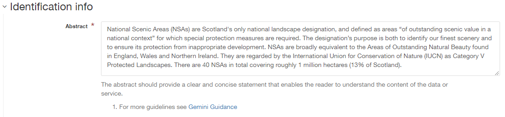
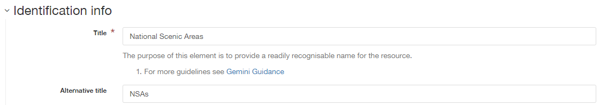
.. |userdoc_fig_7_3_1_CitationIdentifier| image:: media/userdoc_fig_7_3_1_CitationIdentifier.png
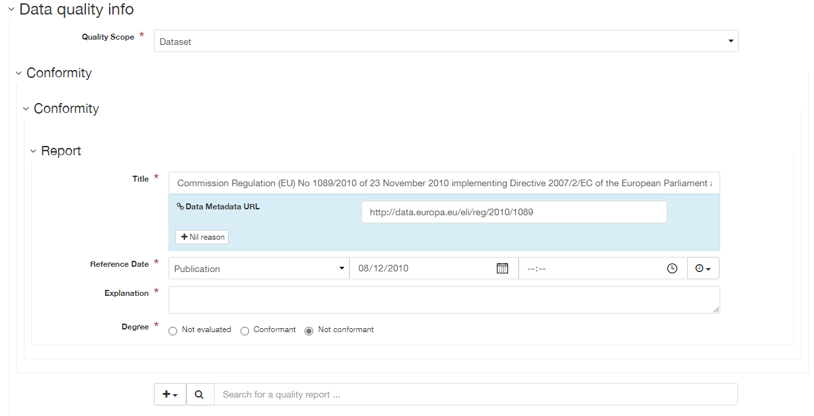
.. |userdoc_fig_7_5_1_HierarchyLevel| image:: media/userdoc_fig_7_5_1_HierarchyLevel.png
.. |userdoc_fig_7_6_1_ReferenceDate| image:: media/userdoc_fig_7_6_1_ReferenceDate.png
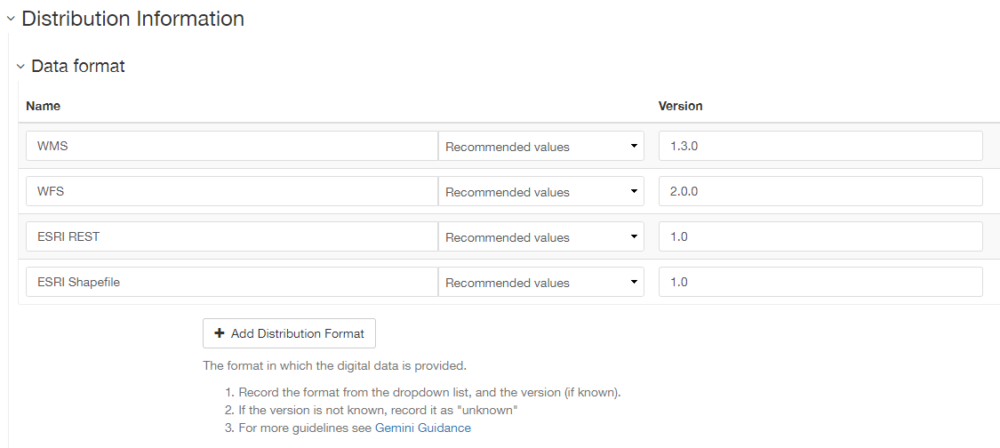
.. |userdoc_fig_7_8_1_GeogBoundingBox| image:: media/userdoc_fig_7_8_1_GeogBoundingBox.png
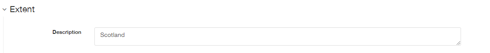
.. |userdoc_fig_7_10_1_TemporalExtent| image:: media/userdoc_fig_7_10_1_TemporalExtent.png
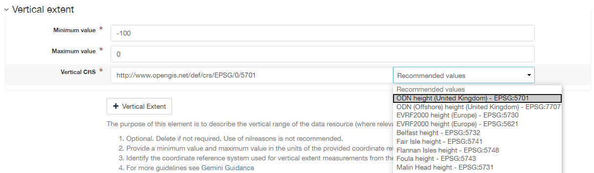
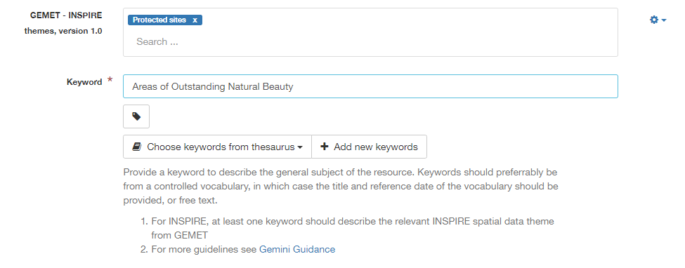
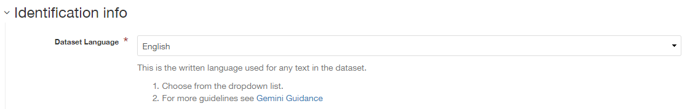
.. |userdoc_fig_7_14_1_LimitationsPublicAccess| image:: media/userdoc_fig_7_14_1_LimitationsPublicAccess.png
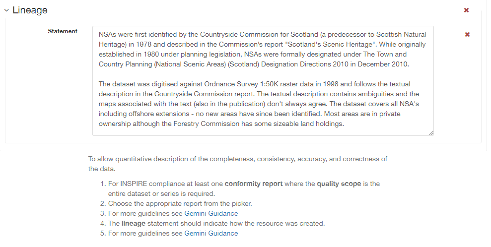
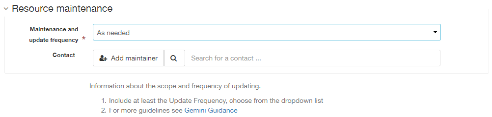
.. |userdoc_fig_7_17_1_MetadataContact| image:: media/userdoc_fig_7_17_1_MetadataContact.png
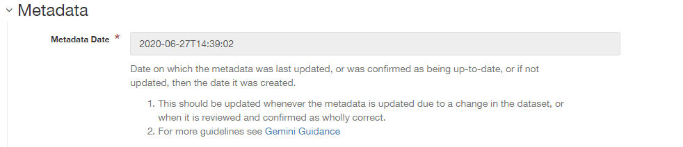
.. |userdoc_fig_7_19_1_MetadataHierarchyLevel| image:: media/userdoc_fig_7_19_1_MetadataHierarchyLevel.png
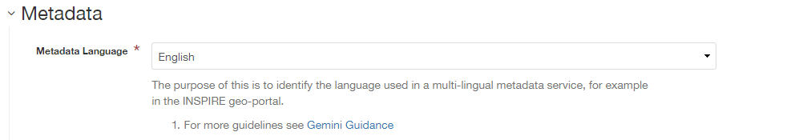
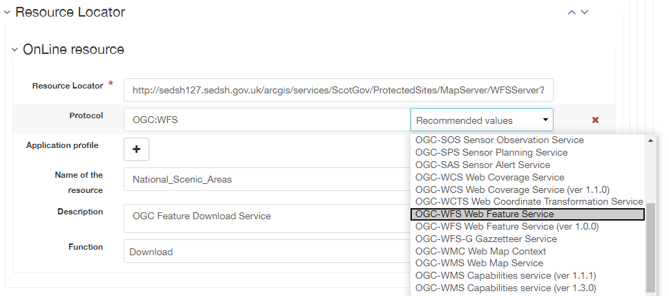
.. |userdoc_fig_7_22_1_PointofContact| image:: media/userdoc_fig_7_22_1_PointofContact.png

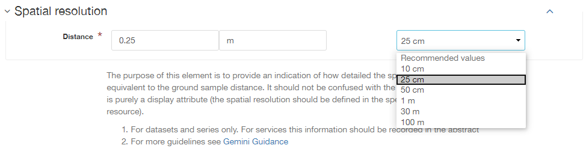
.. |userdoc_fig_7_25_1_SpatialResEqScale| image:: media/userdoc_fig_7_25_1_SpatialResEqScale.png
.. |userdoc_fig_7_26_1_SupplementalInformation| image:: media/userdoc_fig_7_26_1_SupplementalInformation.png
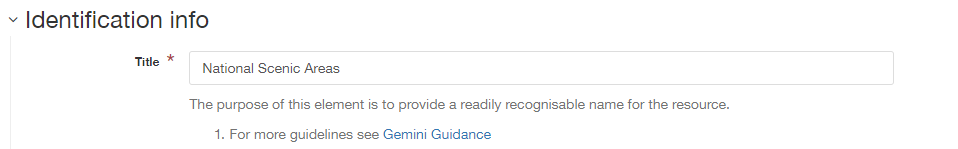
.. |userdoc_fig_7_28_1_TopicCategory| image:: media/userdoc_fig_7_28_1_TopicCategory.png
.. |userdoc_fig_7_29_1_UseConstraints| image:: media/userdoc_fig_7_29_1_UseConstraints.png

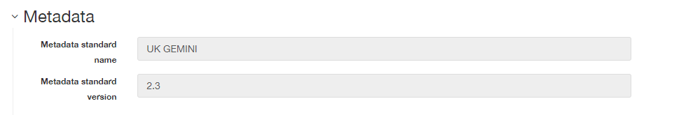
.. |userdoc_fig_7_33_1_ParentIdentifier| image:: media/userdoc_fig_7_33_1_ParentIdentifier.png
.. |userdoc_fig_7_34_1_SpatialRepresentationType| image:: media/userdoc_fig_7_33_1_SpatialRepresentationType.png
.. |button_edit_plus| image:: media/button_edit_plus.png
.. |button_edit_delete| image:: media/button_edit_delete.png
.. |button_edit_plusdrop| image:: media/button_edit_plusdrop.png
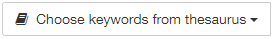

