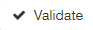

Annex 2: Upgrading to UK Gemini 2.3
===================================

`SpatialData.gov.scot <https://www.spatialdata.gov.scot>`__ has now implemented `UK GEMINI <https://www.agi.org.uk/agi-groups/standards-committee/uk-gemini>`__ 2.3. All new metadata created on the portal will conform to version 2.3, and metadata publishers are strongly encouraged to upgrade their existing 2.2 records as soon as possible. This section provides guidance on how users can upgrade their existing metadata via a number of methods. For detail on what has changed from version 2.2 to 2.3, please see information provided by the `Association of Geographic Information (AGI) <https://www.agi.org.uk/agi-groups/standards-committee/uk-gemini/40-gemini/1055-uk-gemini-major-changes-since-1-0>`__.

The conversion tools will make the following changes to 2.2 records to make them compliant with Gemini 2.3:

* Add or otherwise update the **MetadataStandardName** to UK GEMINI and the **MetadataStandardVersion** to 2.3.
* Change the encoding of the **Access Constraints** and **Use Limitations** elements to meet the new standard, either making a best guess at moving your existing constraints into the correct encoding, or adding the default "no limitations" constraints as appropriate.
* Adds the default INSPIRE **Conformance Report** for datasets or services if one does not already exist.	
* Replaces any references to `http://www.opengis.net/gml <http://www.opengis.net/gml>`__ with `http://www.opengis.net/gml/3.2 <http://www.opengis.net/gml/3.2>`__.
* Adds a default **Character Encoding** of UTF8.
	
Updating through an editing session
-----------------------------------

Existing records on `SpatialData.gov.scot <https://www.spatialdata.gov.scot>`__ can be converted to Gemini 2.3 through an editing session. Before users begin they should ensure that their existing metadata record contains the following tags which identify it as Gemini 2.2::

   	<gmd:metadataStandardName>
		<gco:CharacterString>UK GEMINI</gco:CharacterString>
	</gmd:metadataStandardName>
	<gmd:metadataStandardVersion>
		<gco:CharacterString>2.2</gco:CharacterString>
	</gmd:metadataStandardVersion>

To convert an existing record to Gemini 2.3:

	**1|** Follow the steps to `begin an editing session <UserDoc_Chap6_Edit.html#starting-an-editing-session>`__.

	**2|** On the right hand side of the editing board, run the suggestions wizard.

	*Note: if the if the record is currently recognised as Gemini 2.2, the following suggestion should appear: Metadata Schema is Gemini 2.2. Run this task to convert to Gemini 2.3.*
	
	**3|** Click the suggestion to run the transformation script.
	
	*Note: the record will be converted to Gemini 2.3 and the editing view will change to show the embedded 2.3 guidance.*
	
	**4|** Ensure the record is valid by clicking |button_edit_validate| in the header bar. See `validating metadata <UserDoc_Chap6_Edit.html#validating-metadata>`__ for more information.
	
	*Note: The conversion process will not automatically create valid metadata. Users must ensure that the record validates and correct any errors.*
	
	**5|** Click |button_edit_saveclose| to save and close the record.

Updating records on import
--------------------------

Metadata records can also be converted from 2.2 to 2.3 on import into `SpatialData.gov.scot <https://www.spatialdata.gov.scot>`__.

	**1|** Follow steps 1 to 4 of `importing an existing XML metadata record <UserDoc_Chap6_Edit.html#to-import-an-existing-XML-metadata-record>`__.
	
	**2|** For step 5, ensure that xml_gemini22gemini23 is chosen as the XSLT transformation.
	
	**3|** Follow the remaining steps to import the record.
	
	**4|** Users should ensure the imported metadata is valid. See `validating metadata <UserDoc_Chap6_Edit.html#validating-metadata>`__ for more information.

Updating harvested records
--------------------------

Some organisations maintain their own spatial data portals and have their metadata harvested on a scheduled basis by `SpatialData.gov.scot <https://www.spatialdata.gov.scot>`__. Depending on what version of metadata is being supplied, an xslt conversion may be required on each harvest. Publishers who maintain their records via harvest should contact `SSDI.metadata@gov.scot <mailto:SSDI.metadata@gov.scot>`__ with any queries.

Updating through a batch process
--------------------------------

Administrator users on `SpatialData.gov.scot <https://www.spatialdata.gov.scot>`__ will have the ability to convert records to Gemini 2.3 via a batch process. See the `administrator guidance <ssdi_adminguidance.html#batch-process>`__ for more information.

Common errors
-------------

The following is a list of common errors encountered when converting from Gemini 2.2. to 2.3 that cannot be addressed by the transformation script.

* **Abstract Length**: Gemini 2.3 requires and abstract with a minimum length of 100 characters.

