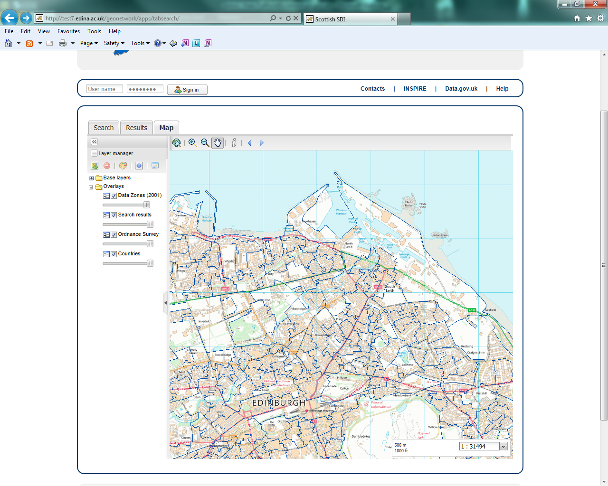
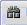

Introduction
============

Overview
--------

Metadata and Templates
======================

Harvesting
==========

Statistics and Status
=====================

Reports
=======

Classification Systems
======================

Standards
=========

Users and groups
================

Settings
========

Tools
=====

Editing online documentation
============================

Edit on github
--------------

ReStructured Text Syntax
------------------------

.. |image0| image:: media/image1.png
.. |image1| image:: media/image2.png
.. |image2| image:: media/image3.png
.. |image3| image:: media/image4.png

.. |image5| image:: media/image6.png
.. |image6| image:: media/image7.png
.. |image7| image:: media/image8.png
.. |image8| image:: media/image9.png
.. |image9| image:: media/image10.jpeg

.. |image11| image:: media/image12.gif
.. |image12| image:: media/image13.gif

.. |image14| image:: media/image15.png
.. |image15| image:: media/image16.png
.. |image16| image:: media/image17.png
.. |image17| image:: media/image18.png
.. |image18| image:: media/image19.png
.. |image19| image:: media/image20.png
.. |image20| image:: media/image21.png
