Introduction
============

How To Use This Guide
---------------------
This documentation has been written using Read The Docs. It can be navigated through 
by scrolling, or clicking the sections in the navigation bar. The subsections can be
explored by clicking the plus sign next to each section.
A PDF copy of this guidance can be exported by clicking on **'v: latest'** at the bottom
of the navigation panel, then you will see the options to download the document
in PDF and other formats.

The GeoNetwork framework also has `documentation <http://geonetwork-opensource.org/manuals/trunk/eng/users/index.html>`__ 
which is linked to within some pages of the SSDI. This is more generic guidance than you will find in the SSDI
documents, but may be of use if you can't find your answer here.

The Scottish SDI Metadata Catalogue (SSDI)
------------------------------------------

The Scottish SDI Metadata Catalogue (SSDI) underpins the coordinated and
regulated publishing of Scottish public sector spatial data to the
INSPIRE and UK Location specified standards. It provides the discovery
component for a set of on-line services that will allow users to
evaluate and use public sector spatial data.

If you have any questions regarding the SSDI please contact: `SSDI.metadata@gov.scot <mailto:SSDI.metadata@gov.scot>`__

This guide sets out detailed guidance on the creation, publishing and
maintenance of INSPIRE discovery metadata. It covers both spatial data
being published under INSPIRE and all other spatial data published
through the SSDI. The SSDI feeds into the UK public data publishing
platform `data.gov.uk <http://data.gov.uk/>`__.

Harvest of the metadata in the SSDI to the
`data.gov.uk <http://data.gov.uk/>`__ site is performed automatically on a daily basis, therefore record amendments should appear on `data.gov.uk <http://data.gov.uk/>`__ within 24 hours. Users should contact
`SSDI.metadata@gov.scot <mailto:SSDI.metadata@gov.scot>`__
if they believe their records are not being harvested correctly.

SSDI metadata requirements
--------------------------

If you publish spatial data on the SSDI then the following
**operational commitments** must be followed:

-  You will endeavour to adopt a process of continuous improvement for
   the resources you publish, based on the feedback you receive.

-  You will maintain your discovery metadata:

   -  assuring its quality against appropriate standards

   -  reviewing it, updating it regularly, and ensuring it is updated
      when new versions of data, data series or on-line services are
      published.

   -  maintaining metadata File Identifiers (UUID) throughout the life
      of the metadata resource (new UUIDs should only be created when
      new resources are published, to prevent duplicate metadata
      resources).

If you publish on the SSDI then the following **service commitments** must be followed:

-  For **all data**:

   -  compliance with the INSPIRE Metadata Regulation and the UK
      Location operational requirements, as set out in this guide.

   -  if publishing INSPIRE Network Services, compliance with the
      INSPIRE Network Services Regulation.

   -  the publishing of INSPIRE View Services for a given dataset or
      data series.

-  For **data that comes under an INSPIRE Theme** and contains features
   listed in the INSPIRE Data Specifications:

   -  legal compliance with the INSPIRE Directive

Where to obtain more information on INSPIRE
-------------------------------------------

The latest information, and additional resources, can be obtained by
visiting the `UK Location <http://data.gov.uk/location>`__ web site. Guidance that supports the implementation of INSPIRE can be found in the `Guidance and Tools <http://data.gov.uk/location/guidance_and_tools>`__ section.  If
you would like to contact the UK Location Coordination Unit, please use
the contact form at:

`http://data.gov.uk/location/contact_points <http://data.gov.uk/location/contact_points>`__

Further information on INSPIRE is also circulated on `Knowledge
Hub <https://knowledgehub.local.gov.uk/>`__, within the Scottish SDI
Strategy Group, SDI/Inspire forum. The Scottish Government has also
published guidance on the delivery of Inspire conformant web map
services. The first instalment of this guidance can be accessed at:

`http://www.scotland.gov.uk/Publications/2010/05/06161701/0 <http://www.scotland.gov.uk/Publications/2010/05/06161701/0>`__

Scottish marine data in the SSDI
--------------------------------

MEDIN is another format for metadata that relates to marine data and was
created for a domain specific purpose. The format of metadata held in
the SSDI is sufficient for MEDIN purposes, the additional metadata
elements included in MEDIN remain once the metadata has been added to
the SSDI). MEDIN metadata can be thought of as a superset of the
information held in the SSDI.

The SSDI and `data.gov.uk <http://data.gov.uk/>`__ can use MEDIN records (which come as slight but
valid and complete supersets of Gemini 2.2 records). It is recommended
that for Marine datasets that have metadata in MEDIN format, Scottish
organisations should provide the appropriate metadata to both the SSDI
and the MEDIN portal.

General Introduction to the SSDI
================================

Accessing the SSDI
------------------

The Scottish SDI Metadata catalogue can be accessed from the following
link:

`https://www.spatialdata.gov.scot <https://www.spatialdata.gov.scot>`__

The main page comprises a menu that allows you to reach the advanced search panel, 
the map interface, the sign in button and a dropdown for languages. The main body of 
the page comprises a simple search bar, the option to browse by topics (default) or 
inspire themes, and below that the latest and most popular datasets. Clicking the SSDI 
logo on the top menu will return the user to the home page.

|image0|

**Figure 2.1.1:** SSDI catalogue main page

Once a user of editor or reviewer profile or above has logged in, they will be presented 
with further buttons on the top menu for **Contribute**, **Admin Console** and **Sign out**. 
**Contribute** has a dropdown option that gives access to **Add new record**, **Import new records** 
and **Manage directory**.

*Unregistered users will not see the option to contribute, or the admin console.*

Searching for metadata in the SSDI
----------------------------------

Quick searches on the SSDI can be performed using the free text box in the centre of the home page and clicking the blue **Search**
icon. This will take the user to the advanced search panel, showing the resulting records in the centre of 
the page, with additional filtering options to the left. To the bottom right of the page is a small 
map view of the search results. Clicking the search button on the top menu of the home page will also bring the user to this page.

One of the main functions of the site is to allow users to
search for both dataset and service metadata. The results can be limited to either of these using top filtering option on the left-hand panel, '\ **Type of Resources**\ '. Below this are filters for '\ **Topics**\ ', '\ **INSPIRE Themes**\ ', 
'\ **Keywords**\ ', '\ **Contact for the resource**\ ', '\ **Provided by**\ ', '\ **Years**\ ', 
'\ **Formats**\ ', '\ **Representation Types**\ ', '\ **Update Frequencies**\ ', '\ **Service Types**\ ', 
'\ **Scale**\ ', and '\ **Resolutions**\ '. Each search filter shows the number of records returned next to it.

|image1|

**Figure 2.2.1:** SSDI catalogue search options

Other search options are available from the three vertical dots icon to the right of the main search 
text box. This expands to show **What** and
**When** options. Each section can be used to limit a user’s search criteria as
follows:

-  **What** – allows users to search by Categories, Keywords, and
   Resource Contact.

-  **When** – allows users to limit the search temporally based on the
   metadata change date. 

Clicking on the blue search icon will run a search based on the
user's selected options. To clear search options, hit the blue cross icon to the right of the search box.

Options to sort by title, relevance, date of change, rating, popularity,
and scale are available on the top right of the results window. Users
can also select records and perform a series of actions such as export,
add the layer to the map, update or delete.

Click the title of a record to view it.

Viewing Spatial Data on the SSDI
================================

Adding services to the main interactive map
-------------------------------------------

Another function of the site is to allow users to view spatial data as
Web Mapping Services (WMS) in the interactive map client. The viewing
function can be accessed in two ways:

1. When viewing search results, if a suitable layer or layers are available, an 
**Add to map** icon will be visible at the bottom of the record. This can be 
expanded to add one or all of the available layers to the map. Clicking on the service 
record title and viewing the metadata will also show the available layers with "Add to map" 
buttons next to them.

|image3|

**Figure 3.1.1:** The Add to Map dialogue accessed from search results

2. You can add layers to the map straight from the **Map** page. Using the the **Add a layer** button (the top button on the right-hand side), you can either **Search** for the service you want to add to map, or add the layer by typing a **WMS**, **WMTS** or **KML** service URL. If you use a service URL, the layers available within the service will appear in a dropdown list below the URL and can be selected to be added to the map.

|image4|

**Figure 3.1.2:** Adding a WMS service to the map using the URL

Using the interactive map
------------------------------

The available tools for the interactive map are arranged down the right-hand side of the 
map, with the exception of the place names search, which is accessed on the left. The available tools are as follows:

- **Add a layer**- for adding layers to the map either from searching the catalogue, a service (WMS or WMTS) or a KML file
- **Manage layers**- shows the list of layers currently added to the map. Those with scale-dependent visibility that are not currently visible will be greyed out. Layers that cannot be added for some other reason will show an exclamation icon. To the right of the layers are **Zoom to extent of layer** (not visible if you are currently zoomed to the extent) and **Layer information** (this expands to show options for changing the transparence of the layer, the legend, and the attribution for the metadata).
- **Maps**- this allows you to reload the default map settings, load a map context file, or download the current map as an xml record. It's also possible to save the current map as a metadata record within the current catalogue by filling in the map title and abstract and clicking "Save map"

|image5|

**Figure 3.2.1:** The Map dialog for the interactive map

- **Print current map**- Create a pdf of the current map. There are options to add a title and description,  plus the ability to change the layout and choose scale and legend options. The area that will be printed will be highlighted on the map.

|image6|

**Figure 3.2.2:** Printing the map

- **Measure**- draw a line on the map to measure it's length. Single-click to create a node and double-click to finish.
- **Annotations**- draw freehand on the map. Click the **Add** button to choose from Point, Line, Polygon or Text, activating a simple styling dialog for the type that you've chosen. Draw on the map, using a single click to draw a node (where appropriate) and a double click to finish. There are options to modify the annotation or remove it. The resulting annotation can be saved as a json file for use in other applications, or a json file can be loaded for use in this dialog.

|image7|

**Figure 3.2.3:** Annotating the map

- **Change projection**- select one of the supported projections from the dropdown list
- **Zoom in and out**
- **Zoom to initial map extent**- this will zoom to the entirety of Scotland
- **Zoom to your position**- this will only work if your location can be calculated by the browser
- **Graticule**- add a grid to the map (in lat/long)

Adding Discovery Metadata to the SSDI
=====================================

This section guides you through the process of adding new metadata
records into the SSDI catalogue using either the online metadata editor
or the metadata import tool, based on XML documents. To add or edit data
and metadata, you must be registered as an Editor in the SSDI catalogue.
Contact the Scottish Government SSDI Metadata email address
(`SSDI.Metadata@gov.scot <mailto:SSDI.Metadata@gov.scot>`__)
if you would like to become a registered editor for the SSDI.

To produce a good metadata record, always try to gather as many details
as possible on the resource that you want to describe, taking into
account the metadata elements that are explained in the next section
(`Metadata Elements <#metadata-elements>`__). The next step is to
properly fill out the fields provided by the metadata template, while at
the same time avoiding duplication of information throughout the form.

The table below indicates the mandatory and optional fields according to
the UK Gemini 2.2 standard.

**Table 4.0.1:** Mandatory and optional information for dataset metadata

+--------------------------------------+---------------------------------+
|  **Mandatory Fields**                |  **Optional Fields**            |
+======================================+=================================+
| Title                                | Alternative Title               |
|                                      |                                 |
| Abstract                             | Additional Information Source   |
|                                      |                                 |
| Unique Resource Identifier           | Geographic Location/Extent      |
|                                      |                                 |
| Dataset Language                     | Vertical Extent                 |
|                                      |                                 |
| Resource Locator (Online Resource)   | Equivalent Scale                |
|                                      |                                 |
| Spatial Reference System             | Data Format                     |
|                                      |                                 |
| Topic Category                       | Data Quality (Conformity)       |
|                                      |                                 |
| Keyword                              |                                 |
|                                      |                                 |
| Bounding Box                         |                                 |
|                                      |                                 |
| Temporal Extent                      |                                 |
|                                      |                                 |
| Dataset Reference Date               |                                 |
|                                      |                                 |
| Frequency of Update                  |                                 |
|                                      |                                 |
| Spatial Resolution                   |                                 |
|                                      |                                 |
| Lineage                              |                                 |
|                                      |                                 |
| Use Constraints                      |                                 |
|                                      |                                 |
| Limitations on Public Access         |                                 |
|                                      |                                 |
| Responsible Organisation             |                                 |
|                                      |                                 |
| Metadata Point of Contact            |                                 |
|                                      |                                 |
| Metadata Date                        |                                 |
|                                      |                                 |
| Metadata Language                    |                                 |
|                                      |                                 |
| Resource Type                        |                                 |
+--------------------------------------+---------------------------------+

To edit or import metadata records, you must be logged in. To log on to
the metadata tool, go to the top right-hand corner of the header menu.
Here you can enter the system credentials provided by the system
administrator and then click the **Sign In** button. You are now
logged on and the **Sign Out** button will now be visible, along
with a button **Contribute** that expands to **Add new record**, **Import new records**, and **Manage directory**.

Creating dataset and service metadata from a template
-----------------------------------------------------

To add dataset or service metadata to the SSDI, click on the **Contribute** button. This will enable the **Editing** board, where you can see all the records you have access to, the advanced search interface, and buttons on the right to **Add new record**, **Import new records**, and **Manage directory**.

Clicking **Contribute** in the header menu, and then clicking **Add new record** will display a list of available templates. Note there could be multiple with the same name if you are an editor for multiple groups. 
Select the appropriate template based on the type of resource that is being
documented. Then select your organisation's folder and click **Create**.

Users can then enter UK Gemini 2.2 compliant metadata in the form
provided. More help on the various meanings of the metadata elements can
be found in the next section (`Metadata
Elements <#metadata-elements>`__).

 **ADD IMAGE HERE: IMAGE_Template_For_Metadata_Record.png**

**Figure 4.1.1:** Blank dataset metadata template form

Note that the templates for dataset and service metadata are slightly
different. Metadata for a service has extra elements for the spatial
data service type (i.e. view, download, etc.) and for coupled resources.

Assigning a category
--------------------

A new Metadata record has to be categorised. This is done via **Categories** button, the left-most button of the menu at the top of the page.
All *dataset* records should be categorised as **Datasets** and all *service* records should be categorised as **Interactive resources**.
Once a category is selected it should appear highlighted, and a second click on the menu button will close the menu.

Creating a metadata record
--------------------------

The templates have a |image9| where you can add an element or another
occurrence of an element (or section). For example, you could have a
range of Alternative Titles. Where an |image10| appears, you can delete
the associated metadata element or section.

Mandatory fields (e.g. Abstract) that are highlighted with a red asterisk.
Note that for sub-elements, this only indicates that the sub-element is
mandatory within its context. For example, the Vertical Extent is an
optional element, but if you have one, then the minimum and maximum
values are mandatory.

The arrows (|image11| or |image12|) allow you to move that section up or
down the document order. Note that Gemini 2.2 is not concerned with the
order that sections appear in.

Content, such as keywords, can be added either manually by clicking **Add new keywords** or from pre-existing thesauri by clicking
on the the icon or **select them in a thesuarus**. Thesauri are available for INSPIRE themes (GEMET) or Regions.

Select the appropriate thesaurus. This will add a new section, with the title of the selected thesaurus.
Clicking the 'Search' box will display a drop-down list of keywords, which you simply click to add to your metadata record.

|image14|

**Figure 4.1.2:** Inspire theme thesaurus

Uploading metadata from an existing XML file
--------------------------------------------

To upload a record (such as an xml exported from ArcCatalog), click on
**Contribute** in the header menu and select **Import new records**.
This page gives you the option to upload from your computer, copy/paste or import a record from the server.
The page also gives you the option to select the file type, type of record,

|image15|

**Figure 4.2.1:** the Import Metadata Record menu

Users must consider the appropriate  **Import Actions**. If you are
uploading to create a new metadata record then choose the ‘Generate UUID
for inserted metadata’. If you are uploading in order to refine or
change an existing record on the SSDI, then choose the ‘Overwrite
metadata with the same UUID’. If the older version of the record has
already been deleted then the **None** option may be
selected.

The UUID is a generated automatically by whatever internal system (i.e.
ESRI ArcGIS ArcCatalog) was used to write and manage your metadata. In
xml, it can be found at the top of the page under the file identifier
section. Within the SSDI, the UUID or File Identifier can be found at
the bottom of the metadata record display (see Figure 4.2.2). This UUID,
together with the metadata date stamp, are used to ensure records are
unique within the SSDI, `data.gov.uk <http://data.gov.uk/>`__ and other
metadata catalogues like MEDIN.

Users should also consider an appropriate XSL Transformation.
For an xml that is already in Gemini 2.2 format, leave
**Apply XSLT conversion** option blank. To upload a non-Gemini 2.2 xml, select
from the  **Apply XSLT conversion** drop down box the appropriate converter
(e.g. ESRI-to-GEMINI\_21).

Users should **NOT** check the **Validate** box during upload - if
there are errors in the validation process, the metadata will not be
uploaded. The recommended validation technique is to upload without
validation, and then go through the SSDI validation process described in
the `next section <#saving-and-validating-metadata>`__.

Click **Import** and the record will be uploaded, generating an Import Report. 
Once the metadata has been uploaded you will still need to edit this record to make it fully Gemini
2.2 complaint. Common issues encountered when converting between ESRI
ISO and Gemini 2.2 can be found in the `Annex
2 <#annex-2-common-ssdi-validation-error-messages>`__.

|image16|

**Figure 4.2.2:** the UUID is located under the fileIdentifier tag in XML,
and at the bottom of the metadata entry on the SSDI

Saving and validating metadata
------------------------------

As the user works through the template filling in required elements, the
**Save metadata** button at the top right of the screen may be used to
save the record in progress. Once the record has been completed, the
user may click **Save and Close** to save the record and exit the
editing mode. Users should note that this action will not save a copy of
the metadata locally, only on the server. **It is recommended that all
master copies of metadata should be stored within the data provider’s
own system.**

Once all elements for a new record have been completed or changes have
been made to an existing record, it should be validated against the
Gemini 2.2 standard rules. This can be done by clicking on the **Validate** 
button at the top or bottom of the page, or refreshing the
validation report in the panel on the right hand side of the editor
window.

A Validation dialogue box will appear on the right of the screen
highlighting any errors that need to be corrected (Note: click on the red thumbs-down icon to see only errors). 
Solutions to errors are not always obvious
from the messages given; `Annex 2 <#annex-2-common-ssdi-validation-error-messages>`__ of this
document provides a list of common error messages encountered and how to
resolve them. Users can still save a metadata record that has not been
validated and come back to it later.

The validation check should be repeated once amendments have been made
until no errors are detected. Once validation is successfully completed,
click on the **Save and Close** button. When viewing the record (not
in an editing session) there is an option to save as an XML file
clicking on the actions drop down menu (top left) and selecting ‘save as
XML’. The metadata record will appear in a new tab in XML format and
users can then save by going to File then  **Save as**.

Publishing a metadata record
----------------------------

Once a metadata record has been saved and successfully validated, it can
then be published, making it publicly viewable on the SSDI.

Click on **Contribute** in the header menu, and locate your metadata record in the list below.
The **Privileges** pane is accessed by clicking on the grey padlock that appear in line with the title of the record.

|image18|

**Figure 4.4.1:** Publishing a metadata record

Alternatively, click on the record to go to its individual page in the SSDI.
**Privileges** can be selected from the drop down menu accessed by clicking the down-pointing arrow next to the 
Edit and Delete icons at the top right of the screen.

|image17|

**Figure 4.4.2:** Menu to alter privileges and access other settings

Within the **Privileges** pane, check each of the tick boxes in the row marked **All**. 
This means the record is now publicly viewable
on the SSDI and that the metadata record is available for harvesting to
`data.gov.uk <http://data.gov.uk/>`__.

Click **Submit** to complete the action.

Editing and deleting a metadata record
--------------------------------------

When you search for a metadata record, and assuming you have the login
rights, you will be able to edit or delete the record using the edit or
delete buttons at the top right hand side of the page.
Once in editing mode, the options are identical to those of metadata
creation. To delete the metadata record, select the Delete button and
you will be prompted to confirm.

|image19|

**Figure 4.6.1:** A confirmation screen is displayed when deleting a
metadata record

Users should note that the metadata record may continue to appear on the
screen until you move to another page (i.e. Home).

Associating resources
---------------------

An associated or related resource is used to link a **dataset's** metadata record 
to both the **service** directly and the corresponding **metadata record for the service**. 
Linking a **dataset** metadata record to a **service** metadata record automatically generates 
a related resource within the **service** metadata record. A **service** metadata record will 
therefore have one related resource per Dataset or layer in the **service**. 

Users should firstly link a Dataset metedata record to the related service metadata record 
by clicking firstly on the **Associated resources** menu and selecting the
**Link to a service** option. Use the search function to look up the metadata record for 
every service that the Dataset is included in. Once added these should appear under the 
**Service** heading at the right hand side.

 |image20|

**Figure 4.7.1:** Creating the coupled resource relationship
 
Secondly users should link the same dataset metadata record to the online resource.
**Associated resources** menu select **Add link**. This will open a new screen. Users
should firstly select the correct Protocol for their service, then enter in the url of 
their service. Then select the appropriate layer for the service from the **Resource name** field,
which should automatically populate with a list of service records. Finally click **Add Link**, and check that
the online resource has been added. This step should be repeated for every online resource affiliated
with the dataset.
 
 **ADD IMAGE HERE: IMAGE_Link_To_Online_Resource.png**
 
**Figure 4.7.2:** Linking an online resource to the current metadata
 
 
Note that if you add a non-WMS service then the SSDI won't automatically take the name of the service, so give it a 
suitable resource name.

You can check the relationship between shared resources by viewing the metadata record of the service related
through the steps above. Within the front page of the **Service** metadata record you should see the related
Dataset listed under **Associated resources**. The process above *does* work in reverse; individual Datasets
can be registered as related resources within the metadata record of a service.

Note also that for some dataset metadata records when using the **Add to map** function the layer name
may be blank. To resolve this you must delete and re-add the url to the WMS using the steps outlined above,
and select the correct resource name.

Managing directories
--------------------
The SSDI supports metadata records that are composed from fragments of metadata. 
The idea is that the fragments of metadata can be used in more than one metadata record.
Directories allow a user create records for individuals that can then be used
across multiple metadata records. Users may wish to create one or a number of directory
entries prior to creating any metadata records.

Directories are managed by clicking on the drop-down menu next to 
the **Contribute** button and clicking **Manage directory**.

To manage a directory entry, firstly duplicate an existing record. By then clicking on
the duplicate entry you can alter the fields with information relevant to an individual
within your organisation.

 **ADD IMAGE HERE: IMAGE_Duplicate_Directory_Entry.png **
 
**Figure 4.8.1:** Duplicate an existing directory entry

Metadata Elements
=================

The following sub-sections provide guidance on how to fill in each Gemini
2.2 metadata element. Use the navigation bar to jump to a particular element. 
Each section is named by the GEMINI element, but the INSPIRE and ISO 19115 elements are also named, along with the obligation, definition, guidance and examples.

It is recommended that users also consult the full
guidance on Gemini 2.2, which can be found at:

`http://www.agi.org.uk/about/resources/category/81-gemini?download=18:gemini-2-2 <http://www.agi.org.uk/about/resources/category/81-gemini?download=18:gemini-2-2>`__ 

The `How to define INSPIRE compliant data in the SSDI <#how-to-define-inspire-compliant-data-in-the-ssdi>`__ sub-section is important to note if your datasets are covered by the INSPIRE directive.

How to define INSPIRE compliant data in the SSDI
------------------------------------------------

To define within the metadata if a dataset is compliant with INSPIRE,
users should ensure the **Keyword** section is completed. If the
dataset is covered by INSPIRE (e.g. parts of it are within the Scope of
an INSPIRE Annex data specification), then the **first keyword**
should be from the GEMET INSPIRE themes which can be found at:

`http://www.eionet.europa.eu/gemet <http://www.eionet.europa.eu/gemet>`__

If another controlled vocabulary is used as the first keyword, such as
the IPVS – Integrated Public Sector Vocabulary (version 2), then the
dataset is not covered by INSPIRE. That said, the dataset and service
metadata will still be required to comply with the operation and service
commitments of the SSDI, as set out on `SSDI Metadata Requirements <#ssdi-metadata-requirements>`__.

Title
-----
**Equivalent INSPIRE element:** Resource title

**Equivalent ISO 19115 element:** MD_DataIdentification.citation > CI_Citation.title

**Dataset obligation:** Mandatory (one)

**Service obligation:** Mandatory (one)

**Definition:** A unique and readily recognisable name for the resource.  The title should be the formal name if one exists.  

**Guidance:** The *Title* will be a searchable field in both a UK and European context and as such should be clear and concise. 

**Example:** 

    *• Nitrate Vulnerable Zones*

Alternative title
-----------------
**Equivalent INSPIRE element:** *none*

**Equivalent ISO 19115 element:** MD_DataIdentification.citation > CI_Citation.alternateTitle

**Dataset obligation:** Optional (many)

**Service obligation:** Optional (many)

**Definition:** Any short name, other name, acronym or alternative language title for the resource.

**Guidance:** Should be provided when the data resource has more than one *Title*.  It can also be helpful to include title with spatial or temporal coverage if applicable. *Alternative titles* will be searchable in the UK context.

**Example:** 

    *• NVZ*

Abstract
--------
**Equivalent INSPIRE element:** Abstract

**Equivalent ISO 19115 element:**  MD_DataIdentification.abstract

**Dataset obligation:** Mandatory (one)

**Service obligation:** Mandatory (one)

**Definition:** A brief narrative summary of the data resource.

**Guidance:** The *Abstract* should provide a clear and concise statement of the content of the dataset (i.e. the ‘what’ aspect of the dataset), and not general background information. Jargon and abbreviations should be avoided, as this element should be understood by non-experts.

**Example:** 

    *•“Data zone centroids are point features that represent the population weighted centre of data zones – the key geography for the dissemination of small area statistics in Scotland. These centroids are used to link data zones to other (higher level) geographies and produce a 'best-fit' match. Data zones can then be aggregated to approximate this larger area of interest or higher level geography that statistics wouldn’t normally be available for. Data zones also represent a relatively stable geography that can be used to analyse change over time, with changes only occurring after a Census. Following the update to data zones using 2011 Census data, there are now 6,976 data zones covering the whole of Scotland.”*

Unique resource identifier
--------------------------
**Equivalent INSPIRE element:** Unique resource identifier

**Equivalent ISO 19115 element:** MD_DataIdentification.citation > CI_Citation.identifier

**Dataset obligation:** Mandatory (one)

**Service obligation:** Optional (one)

**Definition:** A value uniquely identifying the data resource within your organisation (i.e. how your organisation references the dataset).

**Guidance:** The *Code* element is mandatory, and should be a recognisable identifier within the context of your organisation (i.e. a *unique* code of numbers, letters or combination of referring to a single dataset).  If it is not guaranteed to be unique across UK Location and INSPIRE, then the *Codespace* sub-element must be specified; this should be the internet domain of the data provider/owner.  The *Authority* and *Version* sub-elements can be ignored.

NOTE: When inserting a new Unique resource identifier, it is best to select “Identifier (gmd:RS_Identifier)” before clicking the ‘+’, as the alternative (gmd:MD_Identifier) does not allow for the *Codespace*.

**Example:** 

    *• For the Data Zone Centroids 2011 dataset provided by Scottish Government: Code: SG_DataZone_Cent_2011, Codespace:* `www.gov.scot <http://www.gov.scot/>`__

	
Dataset language
----------------
**Equivalent INSPIRE element:** Resource language

**Equivalent ISO 19115 element:** MD_DataIdentification.language

**Dataset obligation:** Conditional (many)

**Service obligation:** Conditional (many)

**Definition:** The language used within the dataset (assuming the data resource contains text/written information, e.g. in attribute tables).

**Guidance:** It is recommended to select a value from a controlled vocabulary, for example ISO 639-2 which uses three-letter primary tags with optional subtags.  The values for UK languages are:

•	English – eng
•	Welsh – cym
•	Gaelic (Irish) – gle
•	Gaelic (Scots) – gla
•	Cornish – cor
•	Ulster Scots - sco

This element is set to ‘eng’ in the SSDI templates.  In the majority of cases no change to this will be required. Where Scottish Gaelic is used within the dataset (i.e. place names), this can also be added.

NOTE:  For records covered under INSPIRE, the language must be one of the `24 official languages of the European Union <http://ec.europa.eu/languages/policy/linguistic-diversity/official-languages-eu_en.htm>`__, which for UK purposes would be English (eng).  If the dataset is also available in another language (e.g. Scots Gaelic), then a second metadata record must be provided for that language.

OnLine resource (Resource locator sub element)
----------------------------------------------
**Equivalent INSPIRE element:** Resource locator

**Equivalent ISO 19115 element:** MD_Distribution > MD_DigitalTransferOptions.online > CI_OnlineResource.linkage

**Dataset obligation:** Conditional (many)

**Service obligation:** See *Coupled resource*

**Definition:** Location (address) for on-line access using a Uniform Resource Locator (URL) address scheme. The resource locator has to be an http URL.  

**Guidance:** This element of the dataset metadata should contain the WMS/WFS service URL. The URL should be the location the data can be downloaded and may be different from where it can be ordered. Multiple entries are allowed if more than one service is provided.

The three additional sub-elements (*Name*, *Description* and *Function*) are optional, but provide helpful details for users. 

NOTE: WMS, WMTS and KML can be added to the map view in the SSDI. For the layer picker in the map view to display the layer name correctly, the Name sub-element should match the name of the layer in the service. This can be found in the <Name> tag of the service XML.

**Example:** 

• `http://sedsh127.sedsh.gov.uk/arcgis/rest/services/ScotGov/StatisticalUnits/MapServer/exts/InspireView/service?Service=WMS&request=GetCapabilities&version=1.3.0 <http://sedsh127.sedsh.gov.uk/arcgis/rest/services/ScotGov/StatisticalUnits/MapServer/exts/InspireView/service?Service=WMS&request=GetCapabilities&version=1.3.0>`__ *with Name as Broad_Rental_Market_Areas__2009_*

Coupled resource
----------------

**Equivalent INSPIRE element:** Coupled resource

**Equivalent ISO 19115 element:** operatesOn

**Dataset obligation:** *N/A*

**Service obligation:** Conditional (many)

**Definition:** Unique Resource Identifier (URI) of the datasets that the service operates on.

**Guidance:** Applicable to service metadata only. This must be completed for every dataset included in the service (i.e. portrayed as a view service layer). 

*Coupled resource* sections can be added by clicking on the ‘+’ in the right hand pane. Further instructions can be found in the 
`How to create Related Resources section <#how-to-create-related-resources>`__.

Spatial reference system
------------------------

**Equivalent INSPIRE element:** *none*

**Equivalent ISO 19115 element:** MD_ReferenceSystem.referenceSystemIdentifier > RS_Identifier.code

**Dataset obligation:** Mandatory (one)

**Service obligation:** Conditional (one)

**Definition:** Identifier of the system of spatial referencing.

**Guidance:** Identify the spatial reference system used to spatially reference the data in the data resource. 

The UK Location encoding recommendation is to use the URN form of reference to an EPSG code. EPSG codes can be accessed at the `EPSG Geodetic Parameter Dataset site <http://epsg-registry.org/>`__.

For the SSDI, suggested coordinate reference systems can be added using the drop down list, or by clicking on the binocular icon and adding an entry from the CRS thesaurus.

**Example:** 

    *• urn:ogc:def:crs:EPSG::4258 for ETRS89*

    *• urn:ogc:def:crs:EPSG::4326 for WGS84*

    *• urn:ogc:def:crs:EPSG::27700 for British National Grid*

Additional information
----------------------

**Equivalent INSPIRE element:** *none*

**Equivalent ISO 19115 element:** MD_Identification > MD_DataIdentification.supplementalInformation

**Dataset obligation:** Optional (one)

**Service obligation:** Optional (one)

**Definition:** Other descriptive information about the data resource.

**Guidance:** Provide a URL(s) that links to other documents related to the resource.

This should be used to link to other sources of descriptive information about the resource.  It should not be used to record the link to the online resource.

**Example:** 

    *• For Data Zones 2001, a link to the document outlining how they were created was provided:* `http://www.scotland.gov.uk/library5/society/sndata-00.asp <http://www.scotland.gov.uk/library5/society/sndata-00.asp>`__

Topic category
--------------

**Equivalent INSPIRE element:** Resource topic category

**Equivalent ISO 19115 element:** MD_DataIdentification.topicCategory

**Dataset obligation:** Mandatory (many)

**Service obligation:** Optional (many)

**Definition:** Describes the main theme(s) of the dataset.

**Guidance:** Select from the drop down list one or more categories that most closely represent the topic of the data resource. This will dictate which categories the dataset is listed within from "Topics" tab on the SSDI homepage. If more than one topic is applicable then the ‘+’ icon should be used to add another *Topic category* element.  

Choices available in the dropdown list are:

•	Biota
•	Boundaries
•	Climatology, meteorology, atmosphere
•	Economy
•	Elevation
•	Environment
•	Farming
•	Geoscientific information
•	Health
•	Imagery base maps earth cover
•	Inland waters
•	Intelligence military
•	Location
•	Oceans
•	Planning cadastre
•	Society
•	Structure
•	Transportation
•	Utilities and communication

Greater detail for the topic of a particular dataset can be given through the *Keyword* element. Not all sectors are included (i.e. Historic) and some form of agreement needs to be made as to which topic these sectors are assigned.

Keyword
-------

**Equivalent INSPIRE element:** Keyword

**Equivalent ISO 19115 element:** MD_Identification.descriptiveKeywords > MD_Keywords

**Dataset obligation:** Mandatory (many)

**Service obligation:** Mandatory (many)

**Definition:** The topic of the content of the data.  These should be more specific than those entered under *Topic category*.

A sub-element of this is the *Originating controlled vocabulary*, which is the name of the formally registered thesaurus or a similar authoritative source of keywords.

**Guidance:** Keyword values should be taken from a list standard subject categories, identified in the ‘originating controlled vocabulary’ element. If the dataset is covered under INSPIRE, then the first keyword should be from the General Environmental Multi-Lingual Thesaurus (GEMET), which can be found at:

`http://www.eionet.europa.eu/gemet <http://www.eionet.europa.eu/gemet>`__

If another controlled vocabulary is used then this should be stated.

The `Assigning a category <#assigning-a-category>`__ section describes how to add a keyword from a thesaurus.

**Example:** 

    *•	Keyword: Address, Originating controlled vocabulary: GEMET Thesaurus version 1.0, vocabulary publication date 2009-06-30.*

    *• Keyword: Farming, Originating controlled vocabulary: IPVS – Integrated Public Sector Vocabulary version 2, revision date 2006-04-02*

Extent (Geographic element)
---------------------------

**Equivalent INSPIRE element:** *none*

**Equivalent ISO 19115 element:** MD_DataIdentification.extent > EX_Extent > EX_GeographicExtent > EX_GeographicDescription.geographicIdentifier

**Dataset obligation:** Optional (many)

**Service obligation:** Optional (many)

**Definition:** The spatial extent or coverage of the data resource. 

**Guidance:** Select a pre-defined extent from the drop down box to the right of the map or draw a rectangle on the map. Values for the North, East, West, and South bounding coordinates will then be automatically filled.

West bounding longitude
-----------------------

**Equivalent INSPIRE element:** Geographic bounding box

**Equivalent ISO 19115 element:** MD_DataIdentification.extent > EX_Extent > EX_GeographicExtent > EX_GeographicBoundingBox

**Dataset obligation:** Mandatory (one)

**Service obligation:** Mandatory (one)

**Definition:** Western most limit of the dataset expressed in longitude in decimal degrees (positive east)

**Guidance:** Approximate values to identify the data on a global basis are required.  If a pre-defined extent is chosen in the Geographic element, a value will be automatically provided.  Alternatively, a box can be drawn on the map.

The west bounding longitude should be less than the east bounding longitude.

East bounding longitude
-----------------------

**Equivalent INSPIRE element:** Geographic bounding box

**Equivalent ISO 19115 element:** MD_DataIdentification.extent > EX_Extent > EX_GeographicExtent > EX_GeographicBoundingBox 

**Dataset obligation:** Mandatory (one)

**Service obligation:** Mandatory (one)

**Definition:** Eastern most limit of the dataset expressed in longitude in decimal degrees (positive east)

**Guidance:** Approximate values to identify the data on a global basis are required.  If a pre-defined extent is chosen in the Geographic element, a value will be automatically provided.  Alternatively, a box can be drawn on the map.

The east bounding longitude should have a greater value than the west bounding longitude.

North bounding latitude
-----------------------

**Equivalent INSPIRE element:** Geographic bounding box

**Equivalent ISO 19115 element:** MD_DataIdentification.extent > EX_Extent > EX_GeographicExtent > EX_GeographicBoundingBox

**Dataset obligation:** Mandatory (one)

**Service obligation:** Mandatory (one)

**Definition:** Northern most limit of the dataset expressed in latitude in decimal degrees (positive north)

**Guidance:** Approximate values to identify the data on a global basis are required.  If a pre-defined extent is chosen in the Geographic element, a value will be automatically provided.  Alternatively, a box can be drawn on the map.

The north bounding latitude must be greater than the south bounding longitude.

South bounding latitude
-----------------------

**Equivalent INSPIRE element:** Geographic bounding box

**Equivalent ISO 19115 element:** MD_DataIdentification.extent > EX_Extent > EX_GeographicExtent > EX_GeographicBoundingBox

**Dataset obligation:** Mandatory (one)

**Service obligation:** Mandatory (one)

**Definition:** Southern most limit of the dataset expressed in latitude in decimal degrees (positive north)

**Guidance:** Approximate values to identify the data on a global basis are required.  If a pre-defined extent is chosen in the Geographic element, a value will be automatically provided.  Alternatively, a box can be drawn on the map.

The south bounding latitude must be smaller than the north bounding latitude.

Vertical extent information
---------------------------

**Equivalent INSPIRE element:** *none*

**Equivalent ISO 19115 element:** MD_DataIdentification.extent > EX_Extent > EX_VerticalExtent

**Dataset obligation:** Optional (one)

**Service obligation:** Optional (one)

**Definition:** Describes the vertical domain (height range) of the data resource.

**Guidance:** This element should be completed where relevant (e.g. geology, mining, etc.). Sub-elements are the *minimum*, *maximum* value and the *coordinate reference system* to which the minimum and maximum were measured.

If the vertical extent does not apply to the data resource, then users should delete this section of the metadata record as it will not be validated by the SSDI.

Temporal extent
---------------

**Equivalent INSPIRE element:** Temporal extent

**Equivalent ISO 19115 element:** EX_Extent > EX_TemporalExtent.extent

**Dataset obligation:** Mandatory (one)

**Service obligation:** Conditional (one)

**Definition:** This is the date(s) that describes the time period covered by the content of the dataset.  It may refer to the (1) period of collection of the data or (2) the date at which it is deemed to be current.

**Guidance:** *Temporal extent* is the date of the validity of the data, and is different from the *Dataset reference date*.

Dates may be to any degree of precision, from century (YY) to full date and time. The extended date format (YYYY-MM-DD) should be used, where YYYY is the year, MM the month, and DD the day. If required, time (HH:MM:SS, where HH is the hour, MM the minute, and SS the second) may be added, with ‘T’ separating the two parts. Periods are recorded as {fromdate/todate} (e.g. 2006-04-01/2007-03-31).  Either the from date or the to date (but not both) may be left blank to indicate uncertainty.

**Example:** 

    *•	For the Urban Rural Classification, the Temporal extent can be entered as 2013 to 2014.*

Dataset reference date
----------------------

**Equivalent INSPIRE element:**  Date of publication

**Equivalent ISO 19115 element:** MD_Identification.citation > CI_Citation.date

**Dataset obligation:** Mandatory (many)

**Service obligation:** Mandatory (many)

**Definition:** Reference date for the data resource, indicating the date of publication, creation or last revision.

(NOTE: for services, this date relates to the creation, publication, and/or revision of the service, not the dataset(s) within it.)

**Guidance:** The *Dataset reference date* is a notional date of “publication” of the data resource. It is different from the *Temporal extent*, which is the date of currency of the data. Multiple dataset reference dates can be defined but there can only be one ‘creation date’.

Dates may be to any degree of precision, from century (YY) to full date and time. The extended date format (YYYY-MM-DD) should be used, where YYYY is the year, MM the month, and DD the day. If required, time (HH:MM:SS, where HH is the hour, MM the minute, and SS the second) may be added, with ‘T’ separating the two parts. Periods are recorded as {fromdate/todate} (e.g. 2006-04-01/2007-03-31).  Either the ‘from date’ or the ‘to date’ (but not both) may be left blank to indicate uncertainty.

**Example:** 

    *•	If the dataset has been created as part of legislation the date should be the date of enactment of that piece of legislation.  For example, the Broad Rental Market Area boundaries were defined in accordance with the Rent Officers (Housing Benefit Functions) (Amendment) Order 2008, which came into force on January 5th, 2009; therefore this date was entered as the original ‘creation’ date whereas July 2015 is used as the date for the particular version of the dataset.*

    *• If the dataset has been created in support of a publication the date of the publication should be used.  For example, the Urban Rural Classification 2013-2014 was published on November 28th, 2014.*

Frequency of update
-------------------

**Equivalent INSPIRE element:** *none*

**Equivalent ISO 19115 element:** MD_MaintenanceInformation.maintenanceAndUpdateFrequency

**Dataset obligation:** Mandatory (one)

**Service obligation:** Conditional (one)

**Definition:** Describes the frequency with which modifications and deletions are made to the data resource.

**Guidance:** Choose the appropriate frequency from the drop down list. If the update cycle is unknown, please choose “Unknown” from the list.

**Example:** 

    *•	For datasets that are updated on request, choose “As needed”.*

Spatial resolution
------------------

**Equivalent INSPIRE element:** Spatial resolution

**Equivalent ISO 19115 element:** MD_Identification.spatialResolution > MD_Resolution.distance

**Dataset obligation:** Conditional (one)

**Service obligation:** Conditional (one) (only when there is a restriction on the resolution of the service)

**Definition:** A distance measure of the granularity of the data (in metres), giving an indication of how detailed it is.

**Guidance:** Resolution identifies the smallest distance on the ground that can exist between two adjacent points. Values must be entered as a real number.

For data captured in the field, it is the precision at which the data is captured.  This may be the accuracy for topographic surveys, or the average sampling distance in an environmental survey. For data taken from maps, it is the positional accuracy of the map.  For image data, it is the resolution of the image.

For Gemini and INSPIRE this value has to be specified in meters and the recommended coding to specify this (in the units of measure sub-element) is:

urn:ogc:def:uom:EPSG::9001

**Example:** 

    *•	For Aerial Photography, the *Units of measure* is specified as urn:ogc:def:uom:EPSG::9001, and the value for the *Spatial Resolution* is 0.25*

Equivalent scale
----------------

**Equivalent INSPIRE element:** Spatial resolution

**Equivalent ISO 19115 element:** MD_Identification.spatialResolution > MD_Resolution.equivalentScale > MD_RepresentativeFraction.denominator

**Dataset obligation:** Optional (one)

**Service obligation:** Optional (one)

**Definition:** The level of detail expressed as the scale denominator of a comparable hardcopy map or chart.

**Guidance:** Scale information can be given that identifies what scale the data was captured at and/or to identify what the best display scale is. Where data is captured from a known source, the scale of that map should be recorded. Values should be entered as positive integers.

Expression of spatial resolution by distance is preferred (see Spatial resolution element).  Spatial resolution should only be expressed by equivalent scale when a distance cannot be determined.

**Example:** 

    *•	For data captured from Ordnance Survey 1:10,000 Raster, the Denominator can be entered as 10000*

Hierarchy level
---------------

**Equivalent INSPIRE element:** Hierarchy level 

**Equivalent ISO 19115 element:** MD_Metadata.hierarchyLevel

**Dataset obligation:** Optional (one)

**Service obligation:** Optional (one)

**Definition:** A sub-element of *Data quality information*, the specific extent of the data to which the data quality information applies.

**Guidance:** Not required for GEMINI, and is currently ignored within UK Location.  Select options from the drop down list.

**Example:** 

    *•	Hierarchy level is set to ‘dataset’ in the UKLP dataset template, and ‘service’ in the UKLP service template.*

Conformity
----------

**Equivalent INSPIRE element:** Conformity - degree

**Equivalent ISO 19115 element:** DQ_DataQuality > DQ_Element.result > DQ_ConformanceResult

**Dataset obligation:** Conditional (many)

**Service obligation:** Conditional (many)

**Definition:** Nested within *Data quality information*, this is the degree of conformity with the product specification or user requirement against which the data is being evaluated (i.e. degree of conformity to INSPIRE). Comprised of the *Specification*, *Explanation*, and *Degree* sub-elements.

**Guidance:** To be conformant to INSPIRE data specifications, provide the title and date for the specification, explanation and degree. For the explanation, a URL for the specification can be entered.  Then, to claim conformance, check the box labelled Degree.  

If users are not claiming conformity with INSPIRE, then this element can be removed by clicking on the ‘x’ at the Report level. If the tick box is not available, or you wish to reintroduce, choose "Domain consistency" when adding the "Report", then "Conformity" for the "Result". Then you can provide the title and date for the *Specification*, *Explanation* and *Degree*.

NOTE: at present a dataset is unlikely to be fully conformant, until mapping of the data to an INSPIRE data specification schema (i.e. mapping to GML) has occurred for full interoperability, which will come in future phases of INSPIRE implementation.

**Example:** 

    *•	To cite Inspire specifications for services metadata, Specification title: Technical Guidance for the implementation of INSPIRE View Services Version 3.1”, Date: 2011-11-07, Explanation: “See the referenced specification at: http://inspire.jrc.ec.europa.eu/documents/Network_Services/TechnicalGuidance_ViewServices_v3.1.pdf”*

Lineage
--------

**Equivalent INSPIRE element:** Lineage

**Equivalent ISO 19115 element:** DQ_DataQuality.lineage > LI_Lineage.statement

**Dataset obligation:** Mandatory (one)

**Service obligation:** Optional (one)

**Definition:** A sub-element of *Data quality information*. This section should describe how the dataset was created.   Brief technical description should be given noting any sources and processes used.  This will be useful in determining whether the data is fit for purpose.

**Guidance:** Information regarding methods of updating, quality controls and resolution should be recorded under this element.  The *Lineage* differs from the *Abstract* in that it covers ‘how’ the dataset was created as opposed the ‘what’ and ‘why’ of the dataset.  

Notes on any coding and order of features should be made.  Further, it is helpful to list any attributes with a brief description of their meaning.  Any procedures or protocol associated with the update of the dataset should also be noted, along with notes on previous updates.

**Example:** 

    *•	For Nitrate Vulnerable Zones: The Nitrate Vulnerable Zone boundaries were delineated by the Geographic Information Science and Analysis Team (GI-SAT) on behalf of the Environmental Quality Division. The first step was to look at the previous NVZ boundaries from 2002 and compare them with ground water body data from BGS and Scottish Water. This information was used to produce a first draft of the new boundaries, which were then clipped to field boundaries and put out to consultation. Following responses amendments were made and also consideration of estimated borehole catchment from Scottish Water. Next, boundaries were re-adjusted to fields and the mean high water spring (unless fields fell below the mean high water spring). An amendment was made to the River Nith and Lochar Water, such that field and mean high water boundaries are followed further up the estuary.*

Data format
-----------

**Equivalent INSPIRE element:** *none*

**Equivalent ISO 19115 element:** MD_Distribution.distributionFormat > MD_Format

**Dataset obligation:** Optional (many)

**Service obligation:** Optional (many)

**Definition:** This is the format in which the digital data can be provided.

**Guidance:** The name of the format and the version can be selected from a drop down list. Entries should be recognised formats for data transfer, either standard or proprietary. If the data is not transferable (e.g. view only), then this should be stated.

Recommended best practice is to select a value from a controlled vocabulary, such as PRONOM (see `http://www.nationalarchives.gov.uk/PRONOM/Default.aspx <http://www.nationalarchives.gov.uk/PRONOM/Default.aspx>`__). 

**Example:** 

    *•	For services: WMS, Version 1.3.0*

    *• ESRI Arc/View Shapefile, Version 1.0*

Legal constraints
-----------------

**Equivalent INSPIRE element:** Limitations on public access

**Equivalent ISO 19115 element:** MD_Identification > MD_Constraints > MD_LegalConstraints.otherConstraints

**Dataset obligation:** Mandatory (many)

**Service obligation:** Mandatory (many)

**Definition:** Restrictions on access to the data that are imposed for security and other reasons (i.e. who can see the data).  Sub-elements are *Use constraints*, *Access constraints*, and *Limitations on public access*.

**Guidance:** Provide information on any constraints to using the dataset or series, e.g. licensing, fees, usage restrictions, or refer to a URL where this information is available, e.g. a licence document. If no conditions apply, enter “no conditions apply”.

**Example:** 

    *•	The following attribution statement must be used to acknowledge the source of the information: Copyright Scottish Government, contains Ordnance Survey data © Crown copyright and database right (insert year)*

    *•	Available under the Open Government Licence* `(http://www.nationalarchives.gov.uk/doc/open-government-licence/version/3/)  <http://www.nationalarchives.gov.uk/doc/open-government-licence/version/3/>`__

    *•	OSMA Inspire End User licence.*

Use constraints
---------------

**Equivalent INSPIRE element:** Conditions applying to access and use

**Equivalent ISO 19115 element:** MD_Identification > MD_Constraints.useLimitation

**Dataset obligation:** Mandatory (many)

**Service obligation:** Mandatory (many)

**Definition:** Restrictions on data that may impact its fitness for use.

**Guidance:** Provide any information on use constraints for the data resource that may impact its fitness for use, such as data quality, coverage, resolution, etc.

**Example:** 

    *•	This dataset was digitised at 1:50K scale and follows the textual description in the Countryside Commission for Scotland publication 'Scotland's Scenic Heritage’, published in 1978*

Responsible organisation
------------------------

**Equivalent INSPIRE element:** Responsible party

**Equivalent ISO 19115 element:** MD_Identification.pointOfContact

**Dataset obligation:** Mandatory (many)

**Service obligation:** Mandatory (many)

**Definition:** This element records the details of the organisation(s) responsible for the creation, maintenance and distribution of the data resource.

**Guidance:** This has 8 sub-elements (see below).

At least one Responsible Party Role should be entered that is either the *Owner* (for UK Location Data Provider role) and/or *Publisher* (for UK Location Data Publisher role). If the data was created by someone other than the data provider, this should also be recorded, using the role value *Originator*. If only *Publisher* is entered, then the assumption will be that they are the creator, provider and publisher of the resource.

The *Responsible organization* element does not allow for multiple roles to be attached to a single organisation – to achieve this, the whole section must be repeated.  Further, where there are several *Distributors*, a separate entry should be provided for each. Other entries should only be given where relevant and known.

**Example:** 

    *•	See sub-elements below.*

Organisation name
-----------------

**Equivalent INSPIRE element:** Responsible party

**Equivalent ISO 19115 element:** MD_Identification.pointOfContact

**Dataset obligation:** Mandatory (one)

**Service obligation:** Mandatory (one)

**Definition:** Sub-element of *Responsible organization*. Name of the responsible organisation.

**Guidance:** The name of the organisation should be given in full, without abbreviations.

**Example:** 

    *•	Scottish Government*

Contact position
----------------

**Equivalent INSPIRE element:** Responsible party

**Equivalent ISO 19115 element:** MD_Identification.pointOfContact

**Dataset obligation:** Optional (one)

**Service obligation:** Optional (one)

**Definition:** Sub-element of *Responsible organization*. Role or position of the responsible person.

**Guidance:** A general job title or generic role should be identified.  Do not identify an individual by name, as this is subject to change without warning and the information is difficult to keep up to date.  

NOTE: For Scottish Government datasets, it can be helpful to identify the contact position using the team/branch name, along with its location within a DG portfolio.

**Example:** 

    *•	Geographic Information Manager*

    *•	Geographic Information Science and Analysis Team (GI-SAT)*

    *•	Spatial Data Management Team*

Responsible party role
----------------------

**Equivalent INSPIRE element:** Responsible party

**Equivalent ISO 19115 element:** MD_Identification.pointOfContact

**Dataset obligation:** Mandatory (one)

**Service obligation:** Mandatory (one)

**Definition:** Sub-element of *Responsible organization*. Role of the responsible organisation.

**Guidance:** At least one Responsible Party Role should be entered that is either the *Owner* (for UK Location Data Provider role) and/or *Publisher* (for UK Location Data Publisher role). If the data was created by someone other than the data provider, this should also be recorded, using the role value *Originator*. If only *Publisher* is entered, then the assumption will be that they are the creator, provider and publisher of the resource.

The *Responsible organization* element does not allow for multiple roles to be attached to a single organisation – to achieve this, the whole section must be repeated.  Further, where there are several *Distributors*, a separate entry should be provided for each. Other entries (listed below) should only be given where relevant and known.

•	*Resource Provider:* Party that supplies the resource.
•	*Custodian:* Party that accepts accountability and responsibility for the data and ensures appropriate care and maintenance of the resource.
•	*Owner:* Party that owns the resource.
•	*User:* Party who uses the resource.
•	*Distributor:* Party who distributes the resource.
•	*Originator:* Party who created the resource.
•	*Point of Contact:* Party who can be contacted for acquiring knowledge about or acquisition of the resource.
•	*Principle Investigator:* Key party responsible for gathering information about or acquisition of the resource.
•	*Processor:* Party who has processed the data in a manor such that the resource has been modified.
•	*Publisher:* Party who published the resource.
•	*Author:* Party who authored the resource.

Telephone number
----------------

**Equivalent INSPIRE element:** Responsible party

**Equivalent ISO 19115 element:** MD_Identification.pointOfContact

**Dataset obligation:** Optional (one)

**Service obligation:** Optional (one)

**Definition:** Sub-element of *Responsible organization*. Telephone number by which the responsible party can be reached.

**Guidance:** The full telephone number should be given

**Example:** 

    *•	0131 244 1441*

Facsimile number
----------------

**Equivalent INSPIRE element:** Responsible party

**Equivalent ISO 19115 element:** MD_Identification.pointOfContact

**Dataset obligation:** Optional (one)

**Service obligation:** Optional (one)

**Definition:** Sub-element of *Responsible organization*. Telephone number by which the responsible party can be reached by facsimile communication.

**Guidance:** The full facsimile number should be given.

**Example:** 

    *•	0131 244 1443*

Postal address
--------------

**Equivalent INSPIRE element:** Responsible party

**Equivalent ISO 19115 element:** MD_Identification.pointOfContact

**Dataset obligation:** Optional (one)

**Service obligation:** Optional (one)

**Definition:** Sub-element of *Responsible organization*. Postal address of the responsible organisation.

**Guidance:** The full formal postal address (as defined by Royal Mail) should be given, including the postcode.

**Example:** 

    *• Street Address: Saughton House, Broomhouse Drive*

    *• City: Edinburgh*

    *• Postal code: EH11 3XD*

    *• Country: United Kingdom*

Email address
-------------

**Equivalent INSPIRE element:** Responsible party

**Equivalent ISO 19115 element:** MD_Identification.pointOfContact

**Dataset obligation:** Mandatory (one)

**Service obligation:** Mandatory (one)

**Definition:** Sub-element of Responsible organisation. Internet email address which individuals can use to contact the individual or organisation.

**Guidance:** A valid email address should be given. Where possible, this should be a branch/team mailbox, rather than individual.

**Example:** 

    *• SDMT@gov.scot*

    *• GI-SAT@gov.scot*

    *• neighbourhood.statistics@gov.scot*

Web address
-----------

**Equivalent INSPIRE element:** Responsible party

**Equivalent ISO 19115 element:** MD_Identification.pointOfContact

**Dataset obligation:** Optional (one)

**Service obligation:** Optional (one)

**Definition:** Sub-element of *Responsible organization*. World wide web address of the responsible organisation.

**Guidance:** A valid World Wide Web address should be given.

**Example:** 

    *•* `www.gov.scot <www.gov.scot>`__

Metadata date
-------------

**Equivalent INSPIRE element:** Metadata date

**Equivalent ISO 19115 element:** MD_Metadata.dataStamp

**Dataset obligation:** Mandatory (one)

**Service obligation:** Mandatory (one)

**Definition:** The date on which the metadata was last updated.

**Guidance:** This element is not editable and is set by the editor when the file is saved. It is used by the SSDI and Data.gov.uk to determine if metadata with the same field identifier (FID) has been changed.

A single date is specified in the extended format YYYY-MM-DD, where YYYY is the year, MM is the month and DD is the day.

Metadata language
-----------------

**Equivalent INSPIRE element:** Metadata language

**Equivalent ISO 19115 element:** MD_Metadata.language

**Dataset obligation:** Conditional (one)

**Service obligation:** Conditional (one)

**Definition:** The language that the metadata is written in.

**Guidance:** It is recommended to select a value from a controlled vocabulary, for example ISO 639-2 which uses three-letter primary tags with optional subtags.  The values for UK languages are:

•	English – eng
•	Welsh – cym
•	Gaelic (Irish) – gle
•	Gaelic (Scots) – gla
•	Cornish – cor
•	Ulster Scots - sco

This element is set to ‘eng’ in the SSDI templates.  For the SSDI, this element must be English (eng).

Metadata point of contact
-------------------------

**Equivalent INSPIRE element:** Metadata point of contact

**Equivalent ISO 19115 element:** MD_Metadata.contact > CI_ResponsibleParty

**Dataset obligation:** Mandatory (many)

**Service obligation:** Mandatory (many)

**Definition:** The party responsible for the creation and maintenance of the metadata record.

**Guidance:** This should include the organisation name and a contact email address. The structure is the same as the *Responsible organization* section. There is no way to simply cross reference, so you must repeat the section.

Generic (team, branch etc.) contact details are preferred.  Avoid identifying individuals by name, as this information is subject to change without notice and is difficult to maintain.  For *Responsible Party Role*, UK Location requires that ‘point of contact’ be entered.

**Example:** 

    *•	Organisation Name: Scottish Government*

    *•	Contact Position: Geographic Information Science and Analysis Team (GI-SAT), Digital Public Services, DG Enterprise, Environment and Digital*

    *•	Responsible Party Role: Point of Contact*

    *•	Voice: 0131 244 0799*

    *•	Street Address: Victoria Quay*

    *•	City: Edinburgh*

    *•	Postal code: EH6 6QQ*

    *•	Country: United Kingdom*

    *•	Email address: GI-SAT@gov.scot*

Resource type
-------------

**Equivalent INSPIRE element:** Resource type

**Equivalent ISO 19115 element:** MD_Metadata.hierarchyLevel

**Dataset obligation:** Mandatory (one)

**Service obligation:** Mandatory (one)

**Definition:** Defines whether the data resource is a ‘dataset’, a ‘series’ (collection of datasets with a common specification), or a ‘service’.

**Guidance:** This is set by the choice of template, and should not be changed as it will affect the structure of the record.  If creating metadata from a template, ensure the correct template is used at the outset. The choices available are:

•	Dataset
•	Service

Annex 1: Example Metadata Record
================================

+---------------------------------------+-----------------------------------------------------------------------------------------------------------------------------------------------------------------------------------------------------------------------------------------------------------------------------------------------------------------------------------------------------------------------------------------------------------------------------------------------------------------------------------------------------------------------------------------------------------------------------------------------+
|  **Title**                            | Data Zones 2001                                                                                                                                                                                                                                                                                                                                                                                                                                                                                                                                                                               |
+---------------------------------------+-----------------------------------------------------------------------------------------------------------------------------------------------------------------------------------------------------------------------------------------------------------------------------------------------------------------------------------------------------------------------------------------------------------------------------------------------------------------------------------------------------------------------------------------------------------------------------------------------+
|  **Alternative title**                |                                                                                                                                                                                                                                                                                                                                                                                                                                                                                                                                                                                               |
+---------------------------------------+-----------------------------------------------------------------------------------------------------------------------------------------------------------------------------------------------------------------------------------------------------------------------------------------------------------------------------------------------------------------------------------------------------------------------------------------------------------------------------------------------------------------------------------------------------------------------------------------------+
|  **Abstract**                         | Data zones are the core geography for dissemination of results from Scottish Neighbourhood Statistics (SNS). The data zone geography covers the whole of Scotland and nests within local authority boundaries. Data zones are groups of Census output areas which have populations of between 500 and 1,000 household residents, and some effort has been made to respect physical boundaries. In addition, they have compact shape and contain households with similar social characteristics. Data zones are a stable geography and can be used to analyse change over time.                |
|                                       |                                                                                                                                                                                                                                                                                                                                                                                                                                                                                                                                                                                               |
|                                       | There are 6,505 data zones across Scotland, and each have been assigned an individual code that follows the Scottish Government's standard naming and coding convention. The code prefix is S01, which has been assigned to designate data zones. In some cases, data zones have also been assigned a name. To date, Local Authorities that have named their data zones include Eilean Siar (Western Isles), Falkirk, Fife, Highland, Moray, Shetland, South Lanarkshire, Stirling and West Lothian.                                                                                          |
+---------------------------------------+-----------------------------------------------------------------------------------------------------------------------------------------------------------------------------------------------------------------------------------------------------------------------------------------------------------------------------------------------------------------------------------------------------------------------------------------------------------------------------------------------------------------------------------------------------------------------------------------------+
|  **Unique resource identifier**       |                                                                                                                                                                                                                                                                                                                                                                                                                                                                                                                                                                                               |
+---------------------------------------+-----------------------------------------------------------------------------------------------------------------------------------------------------------------------------------------------------------------------------------------------------------------------------------------------------------------------------------------------------------------------------------------------------------------------------------------------------------------------------------------------------------------------------------------------------------------------------------------------+
|     *Identifier Code*                 | SDME\_SG\_DataZones\_2001                                                                                                                                                                                                                                                                                                                                                                                                                                                                                                                                                                     |
+---------------------------------------+-----------------------------------------------------------------------------------------------------------------------------------------------------------------------------------------------------------------------------------------------------------------------------------------------------------------------------------------------------------------------------------------------------------------------------------------------------------------------------------------------------------------------------------------------------------------------------------------------+
|     *Codespace*                       | www.scotland.gov.uk                                                                                                                                                                                                                                                                                                                                                                                                                                                                                                                                                                           |
+---------------------------------------+-----------------------------------------------------------------------------------------------------------------------------------------------------------------------------------------------------------------------------------------------------------------------------------------------------------------------------------------------------------------------------------------------------------------------------------------------------------------------------------------------------------------------------------------------------------------------------------------------+
|  **Dataset Language **                | English                                                                                                                                                                                                                                                                                                                                                                                                                                                                                                                                                                                       |
+---------------------------------------+-----------------------------------------------------------------------------------------------------------------------------------------------------------------------------------------------------------------------------------------------------------------------------------------------------------------------------------------------------------------------------------------------------------------------------------------------------------------------------------------------------------------------------------------------------------------------------------------------+
|  **OnLine Resource**                  |                                                                                                                                                                                                                                                                                                                                                                                                                                                                                                                                                                                               |
+---------------------------------------+-----------------------------------------------------------------------------------------------------------------------------------------------------------------------------------------------------------------------------------------------------------------------------------------------------------------------------------------------------------------------------------------------------------------------------------------------------------------------------------------------------------------------------------------------------------------------------------------------+
|     *Interactive Map*                 | `*WMS layers* <javascript:addWMSServerLayers('http://inspirescotland.org/cgi-bin/mapserv.exe?map=E:/ms4w/apps/sg_inspire/inspire.map&SERVICE=WMS&VERSION=1.3.0&REQUEST=GetCapabilities&')>`__                                                                                                                                                                                                                                                                                                                                                                                                 |
|                                       | (OGC-WMS Server: http://INSPIREscotland.org/cgi-bin/mapserv.exe?map=E:/ms4w/apps/sg\_inspire/inspire.map&SERVICE=WMS&VERSION=1.3.0&REQUEST=GetCapabilities&)                                                                                                                                                                                                                                                                                                                                                                                                                                  |
+---------------------------------------+-----------------------------------------------------------------------------------------------------------------------------------------------------------------------------------------------------------------------------------------------------------------------------------------------------------------------------------------------------------------------------------------------------------------------------------------------------------------------------------------------------------------------------------------------------------------------------------------------+
|  **Spatial Reference System**         |                                                                                                                                                                                                                                                                                                                                                                                                                                                                                                                                                                                               |
+---------------------------------------+-----------------------------------------------------------------------------------------------------------------------------------------------------------------------------------------------------------------------------------------------------------------------------------------------------------------------------------------------------------------------------------------------------------------------------------------------------------------------------------------------------------------------------------------------------------------------------------------------+
|     *Reference system identifier*     | OSGB 1936 / British National Grid (EPSG:27700)                                                                                                                                                                                                                                                                                                                                                                                                                                                                                                                                                |
+---------------------------------------+-----------------------------------------------------------------------------------------------------------------------------------------------------------------------------------------------------------------------------------------------------------------------------------------------------------------------------------------------------------------------------------------------------------------------------------------------------------------------------------------------------------------------------------------------------------------------------------------------+
|     *Codespace*                       | ESPG                                                                                                                                                                                                                                                                                                                                                                                                                                                                                                                                                                                          |
+---------------------------------------+-----------------------------------------------------------------------------------------------------------------------------------------------------------------------------------------------------------------------------------------------------------------------------------------------------------------------------------------------------------------------------------------------------------------------------------------------------------------------------------------------------------------------------------------------------------------------------------------------+
|  **Additional Information Source**    | http://www.scotland.gov.uk/library5/society/sndata-00.asp                                                                                                                                                                                                                                                                                                                                                                                                                                                                                                                                     |
+---------------------------------------+-----------------------------------------------------------------------------------------------------------------------------------------------------------------------------------------------------------------------------------------------------------------------------------------------------------------------------------------------------------------------------------------------------------------------------------------------------------------------------------------------------------------------------------------------------------------------------------------------+
|  **Topic category**                   |                                                                                                                                                                                                                                                                                                                                                                                                                                                                                                                                                                                               |
+---------------------------------------+-----------------------------------------------------------------------------------------------------------------------------------------------------------------------------------------------------------------------------------------------------------------------------------------------------------------------------------------------------------------------------------------------------------------------------------------------------------------------------------------------------------------------------------------------------------------------------------------------+
|     *Topic category code *            | Society                                                                                                                                                                                                                                                                                                                                                                                                                                                                                                                                                                                       |
+---------------------------------------+-----------------------------------------------------------------------------------------------------------------------------------------------------------------------------------------------------------------------------------------------------------------------------------------------------------------------------------------------------------------------------------------------------------------------------------------------------------------------------------------------------------------------------------------------------------------------------------------------+
|  **Keyword**                          | Statistical units.                                                                                                                                                                                                                                                                                                                                                                                                                                                                                                                                                                            |
+---------------------------------------+-----------------------------------------------------------------------------------------------------------------------------------------------------------------------------------------------------------------------------------------------------------------------------------------------------------------------------------------------------------------------------------------------------------------------------------------------------------------------------------------------------------------------------------------------------------------------------------------------+
|  **Geographic element**               |                                                                                                                                                                                                                                                                                                                                                                                                                                                                                                                                                                                               |
+---------------------------------------+-----------------------------------------------------------------------------------------------------------------------------------------------------------------------------------------------------------------------------------------------------------------------------------------------------------------------------------------------------------------------------------------------------------------------------------------------------------------------------------------------------------------------------------------------------------------------------------------------+
|     *Extent*                          |                                                                                                                                                                                                                                                                                                                                                                                                                                                                                                                                                                                               |
+---------------------------------------+-----------------------------------------------------------------------------------------------------------------------------------------------------------------------------------------------------------------------------------------------------------------------------------------------------------------------------------------------------------------------------------------------------------------------------------------------------------------------------------------------------------------------------------------------------------------------------------------------+
|     *Geographic identifier*           |                                                                                                                                                                                                                                                                                                                                                                                                                                                                                                                                                                                               |
+---------------------------------------+-----------------------------------------------------------------------------------------------------------------------------------------------------------------------------------------------------------------------------------------------------------------------------------------------------------------------------------------------------------------------------------------------------------------------------------------------------------------------------------------------------------------------------------------------------------------------------------------------+
|     *Authority*                       |                                                                                                                                                                                                                                                                                                                                                                                                                                                                                                                                                                                               |
+---------------------------------------+-----------------------------------------------------------------------------------------------------------------------------------------------------------------------------------------------------------------------------------------------------------------------------------------------------------------------------------------------------------------------------------------------------------------------------------------------------------------------------------------------------------------------------------------------------------------------------------------------+
|     *Citation Title*                  | ISO3166-2                                                                                                                                                                                                                                                                                                                                                                                                                                                                                                                                                                                     |
+---------------------------------------+-----------------------------------------------------------------------------------------------------------------------------------------------------------------------------------------------------------------------------------------------------------------------------------------------------------------------------------------------------------------------------------------------------------------------------------------------------------------------------------------------------------------------------------------------------------------------------------------------+
|     *Date*                            | 2007-12-13                                                                                                                                                                                                                                                                                                                                                                                                                                                                                                                                                                                    |
+---------------------------------------+-----------------------------------------------------------------------------------------------------------------------------------------------------------------------------------------------------------------------------------------------------------------------------------------------------------------------------------------------------------------------------------------------------------------------------------------------------------------------------------------------------------------------------------------------------------------------------------------------+
|     *Code*                            | SCT                                                                                                                                                                                                                                                                                                                                                                                                                                                                                                                                                                                           |
+---------------------------------------+-----------------------------------------------------------------------------------------------------------------------------------------------------------------------------------------------------------------------------------------------------------------------------------------------------------------------------------------------------------------------------------------------------------------------------------------------------------------------------------------------------------------------------------------------------------------------------------------------+
|    **Bounds**                         |                                                                                                                                                                                                                                                                                                                                                                                                                                                                                                                                                                                               |
+---------------------------------------+-----------------------------------------------------------------------------------------------------------------------------------------------------------------------------------------------------------------------------------------------------------------------------------------------------------------------------------------------------------------------------------------------------------------------------------------------------------------------------------------------------------------------------------------------------------------------------------------------+
| Coordinate Reference System           | WGS84                                                                                                                                                                                                                                                                                                                                                                                                                                                                                                                                                                                         |
+---------------------------------------+-----------------------------------------------------------------------------------------------------------------------------------------------------------------------------------------------------------------------------------------------------------------------------------------------------------------------------------------------------------------------------------------------------------------------------------------------------------------------------------------------------------------------------------------------------------------------------------------------+
| West Bounding Longitude               | -9.19462                                                                                                                                                                                                                                                                                                                                                                                                                                                                                                                                                                                      |
+---------------------------------------+-----------------------------------------------------------------------------------------------------------------------------------------------------------------------------------------------------------------------------------------------------------------------------------------------------------------------------------------------------------------------------------------------------------------------------------------------------------------------------------------------------------------------------------------------------------------------------------------------+
| East Bounding Longitude               | -0.70548                                                                                                                                                                                                                                                                                                                                                                                                                                                                                                                                                                                      |
+---------------------------------------+-----------------------------------------------------------------------------------------------------------------------------------------------------------------------------------------------------------------------------------------------------------------------------------------------------------------------------------------------------------------------------------------------------------------------------------------------------------------------------------------------------------------------------------------------------------------------------------------------+
| North Bounding Longitude              | 60.86171                                                                                                                                                                                                                                                                                                                                                                                                                                                                                                                                                                                      |
+---------------------------------------+-----------------------------------------------------------------------------------------------------------------------------------------------------------------------------------------------------------------------------------------------------------------------------------------------------------------------------------------------------------------------------------------------------------------------------------------------------------------------------------------------------------------------------------------------------------------------------------------------+
| South Bounding Longitude              | 54.51523                                                                                                                                                                                                                                                                                                                                                                                                                                                                                                                                                                                      |
+---------------------------------------+-----------------------------------------------------------------------------------------------------------------------------------------------------------------------------------------------------------------------------------------------------------------------------------------------------------------------------------------------------------------------------------------------------------------------------------------------------------------------------------------------------------------------------------------------------------------------------------------------+
|  **Dataset Reference Date**           |                                                                                                                                                                                                                                                                                                                                                                                                                                                                                                                                                                                               |
+---------------------------------------+-----------------------------------------------------------------------------------------------------------------------------------------------------------------------------------------------------------------------------------------------------------------------------------------------------------------------------------------------------------------------------------------------------------------------------------------------------------------------------------------------------------------------------------------------------------------------------------------------+
|     *Date*                            | 2004-02                                                                                                                                                                                                                                                                                                                                                                                                                                                                                                                                                                                       |
+---------------------------------------+-----------------------------------------------------------------------------------------------------------------------------------------------------------------------------------------------------------------------------------------------------------------------------------------------------------------------------------------------------------------------------------------------------------------------------------------------------------------------------------------------------------------------------------------------------------------------------------------------+
|     *Date type*                       | **Creation**: Date identifies when the resource was brought into existence                                                                                                                                                                                                                                                                                                                                                                                                                                                                                                                    |
+---------------------------------------+-----------------------------------------------------------------------------------------------------------------------------------------------------------------------------------------------------------------------------------------------------------------------------------------------------------------------------------------------------------------------------------------------------------------------------------------------------------------------------------------------------------------------------------------------------------------------------------------------+
|  **Dataset Reference Date**           |                                                                                                                                                                                                                                                                                                                                                                                                                                                                                                                                                                                               |
+---------------------------------------+-----------------------------------------------------------------------------------------------------------------------------------------------------------------------------------------------------------------------------------------------------------------------------------------------------------------------------------------------------------------------------------------------------------------------------------------------------------------------------------------------------------------------------------------------------------------------------------------------+
|     *Date*                            | 2004-02                                                                                                                                                                                                                                                                                                                                                                                                                                                                                                                                                                                       |
+---------------------------------------+-----------------------------------------------------------------------------------------------------------------------------------------------------------------------------------------------------------------------------------------------------------------------------------------------------------------------------------------------------------------------------------------------------------------------------------------------------------------------------------------------------------------------------------------------------------------------------------------------+
|     *Date type*                       | **Publication**: Date identifies when the resource was issued                                                                                                                                                                                                                                                                                                                                                                                                                                                                                                                                 |
+---------------------------------------+-----------------------------------------------------------------------------------------------------------------------------------------------------------------------------------------------------------------------------------------------------------------------------------------------------------------------------------------------------------------------------------------------------------------------------------------------------------------------------------------------------------------------------------------------------------------------------------------------+
|  **Frequency of update**              | **Not planned**: There are no further updates planned for the resource                                                                                                                                                                                                                                                                                                                                                                                                                                                                                                                        |
+---------------------------------------+-----------------------------------------------------------------------------------------------------------------------------------------------------------------------------------------------------------------------------------------------------------------------------------------------------------------------------------------------------------------------------------------------------------------------------------------------------------------------------------------------------------------------------------------------------------------------------------------------+
|  **Spatial resolution**               |                                                                                                                                                                                                                                                                                                                                                                                                                                                                                                                                                                                               |
+---------------------------------------+-----------------------------------------------------------------------------------------------------------------------------------------------------------------------------------------------------------------------------------------------------------------------------------------------------------------------------------------------------------------------------------------------------------------------------------------------------------------------------------------------------------------------------------------------------------------------------------------------+
|     *Resolution*                      |                                                                                                                                                                                                                                                                                                                                                                                                                                                                                                                                                                                               |
+---------------------------------------+-----------------------------------------------------------------------------------------------------------------------------------------------------------------------------------------------------------------------------------------------------------------------------------------------------------------------------------------------------------------------------------------------------------------------------------------------------------------------------------------------------------------------------------------------------------------------------------------------+
|     *Equivalent scale*                |                                                                                                                                                                                                                                                                                                                                                                                                                                                                                                                                                                                               |
+---------------------------------------+-----------------------------------------------------------------------------------------------------------------------------------------------------------------------------------------------------------------------------------------------------------------------------------------------------------------------------------------------------------------------------------------------------------------------------------------------------------------------------------------------------------------------------------------------------------------------------------------------+
|     *Scale Denominator*               | 10000                                                                                                                                                                                                                                                                                                                                                                                                                                                                                                                                                                                         |
+---------------------------------------+-----------------------------------------------------------------------------------------------------------------------------------------------------------------------------------------------------------------------------------------------------------------------------------------------------------------------------------------------------------------------------------------------------------------------------------------------------------------------------------------------------------------------------------------------------------------------------------------------+
|  **Data quality info**                |                                                                                                                                                                                                                                                                                                                                                                                                                                                                                                                                                                                               |
+---------------------------------------+-----------------------------------------------------------------------------------------------------------------------------------------------------------------------------------------------------------------------------------------------------------------------------------------------------------------------------------------------------------------------------------------------------------------------------------------------------------------------------------------------------------------------------------------------------------------------------------------------+
|     *Data quality*                    |                                                                                                                                                                                                                                                                                                                                                                                                                                                                                                                                                                                               |
+---------------------------------------+-----------------------------------------------------------------------------------------------------------------------------------------------------------------------------------------------------------------------------------------------------------------------------------------------------------------------------------------------------------------------------------------------------------------------------------------------------------------------------------------------------------------------------------------------------------------------------------------------+
|     *Scope*                           |                                                                                                                                                                                                                                                                                                                                                                                                                                                                                                                                                                                               |
+---------------------------------------+-----------------------------------------------------------------------------------------------------------------------------------------------------------------------------------------------------------------------------------------------------------------------------------------------------------------------------------------------------------------------------------------------------------------------------------------------------------------------------------------------------------------------------------------------------------------------------------------------+
|     *Hierarchy level*                 | **Dataset**: Information applies to the dataset                                                                                                                                                                                                                                                                                                                                                                                                                                                                                                                                               |
+---------------------------------------+-----------------------------------------------------------------------------------------------------------------------------------------------------------------------------------------------------------------------------------------------------------------------------------------------------------------------------------------------------------------------------------------------------------------------------------------------------------------------------------------------------------------------------------------------------------------------------------------------+
|     *Lineage*                         | The Data Zone geography was developed for use within the Scottish Neighbourhood Statistics programme to allow statistics across a number of policy areas to be readily (and regularly) available for a consistent and stable geography. The dataset was originally created by St. Andrews University and the detailed methodology can be found at http://www.scotland.gov.uk/library5/society/sndata-00.asp.                                                                                                                                                                                  |
|                                       |                                                                                                                                                                                                                                                                                                                                                                                                                                                                                                                                                                                               |
|                                       | In summary, primary school catchments were approximated to Census Output Area boundaries, which were then amalgamated to data zones based upon population, compactness and social homogeneity. The main criteria used in the initial definition of data zones in approximate order of importance were:                                                                                                                                                                                                                                                                                        |
|                                       |                                                                                                                                                                                                                                                                                                                                                                                                                                                                                                                                                                                               |
|                                       | 1. Approximate equality of resident population (500-1,000 persons)                                                                                                                                                                                                                                                                                                                                                                                                                                                                                                                            |
|                                       |                                                                                                                                                                                                                                                                                                                                                                                                                                                                                                                                                                                               |
|                                       | 2. Compactness of shape                                                                                                                                                                                                                                                                                                                                                                                                                                                                                                                                                                       |
|                                       |                                                                                                                                                                                                                                                                                                                                                                                                                                                                                                                                                                                               |
|                                       | 3. Approximate homogeneity of social composition                                                                                                                                                                                                                                                                                                                                                                                                                                                                                                                                              |
|                                       |                                                                                                                                                                                                                                                                                                                                                                                                                                                                                                                                                                                               |
|                                       | 4. Existence, where possible, of some community of interest                                                                                                                                                                                                                                                                                                                                                                                                                                                                                                                                   |
|                                       |                                                                                                                                                                                                                                                                                                                                                                                                                                                                                                                                                                                               |
|                                       | 5. Accordance with other boundaries of local significance                                                                                                                                                                                                                                                                                                                                                                                                                                                                                                                                     |
|                                       |                                                                                                                                                                                                                                                                                                                                                                                                                                                                                                                                                                                               |
|                                       | 6. Accordance with prominent features in the physical environment                                                                                                                                                                                                                                                                                                                                                                                                                                                                                                                             |
|                                       |                                                                                                                                                                                                                                                                                                                                                                                                                                                                                                                                                                                               |
|                                       | This dataset also includes an area field with the value given in hectares. This area is the 'standard' area which was calculated from Census Output Areas and then assigned to Data Zones through a look up table. This follows the Office for National Statistics (ONS) Standard Area Measurement methodology, as agreed in 2005. This was done to ensure that total areas remained consistent when comparing geographies. For more information on ONS Standard Area Measurement, please see http://www.ons.gov.uk/about-statistics/geography/products/geog-products-other/sam/index.html.   |
|                                       |                                                                                                                                                                                                                                                                                                                                                                                                                                                                                                                                                                                               |
|                                       | The dataset is managed by the Scottish Government's Geographic Information Science and Analysis Team (GI-SAT), who carry out any required updates at the request of the Office of the Chief Statistician (OCS), Small Area Statistics Branch. Attributes included within the dataset are as follows:                                                                                                                                                                                                                                                                                          |
|                                       |                                                                                                                                                                                                                                                                                                                                                                                                                                                                                                                                                                                               |
|                                       | DZ\_CODE: Unique Identifier given to each of the 6,505 data zones.                                                                                                                                                                                                                                                                                                                                                                                                                                                                                                                            |
|                                       |                                                                                                                                                                                                                                                                                                                                                                                                                                                                                                                                                                                               |
|                                       | DZ\_NAME: Name given to data zone (not complete for all data zones).                                                                                                                                                                                                                                                                                                                                                                                                                                                                                                                          |
|                                       |                                                                                                                                                                                                                                                                                                                                                                                                                                                                                                                                                                                               |
|                                       | DZ\_GAELIC: Gaelic name given to data zone (not complete for all data zones).                                                                                                                                                                                                                                                                                                                                                                                                                                                                                                                 |
|                                       |                                                                                                                                                                                                                                                                                                                                                                                                                                                                                                                                                                                               |
|                                       | STDAREA\_HA: Area in hectares, calculated from Output Areas.                                                                                                                                                                                                                                                                                                                                                                                                                                                                                                                                  |
+---------------------------------------+-----------------------------------------------------------------------------------------------------------------------------------------------------------------------------------------------------------------------------------------------------------------------------------------------------------------------------------------------------------------------------------------------------------------------------------------------------------------------------------------------------------------------------------------------------------------------------------------------+
|  **Data format**                      |                                                                                                                                                                                                                                                                                                                                                                                                                                                                                                                                                                                               |
+---------------------------------------+-----------------------------------------------------------------------------------------------------------------------------------------------------------------------------------------------------------------------------------------------------------------------------------------------------------------------------------------------------------------------------------------------------------------------------------------------------------------------------------------------------------------------------------------------------------------------------------------------+
|     *Format Name*                     | WMS                                                                                                                                                                                                                                                                                                                                                                                                                                                                                                                                                                                           |
+---------------------------------------+-----------------------------------------------------------------------------------------------------------------------------------------------------------------------------------------------------------------------------------------------------------------------------------------------------------------------------------------------------------------------------------------------------------------------------------------------------------------------------------------------------------------------------------------------------------------------------------------------+
|     *Version*                         | Version 1.3                                                                                                                                                                                                                                                                                                                                                                                                                                                                                                                                                                                   |
+---------------------------------------+-----------------------------------------------------------------------------------------------------------------------------------------------------------------------------------------------------------------------------------------------------------------------------------------------------------------------------------------------------------------------------------------------------------------------------------------------------------------------------------------------------------------------------------------------------------------------------------------------+
|  **Data format**                      |                                                                                                                                                                                                                                                                                                                                                                                                                                                                                                                                                                                               |
+---------------------------------------+-----------------------------------------------------------------------------------------------------------------------------------------------------------------------------------------------------------------------------------------------------------------------------------------------------------------------------------------------------------------------------------------------------------------------------------------------------------------------------------------------------------------------------------------------------------------------------------------------+
|     *Format Name*                     | ESRI Arc/View Shapefile                                                                                                                                                                                                                                                                                                                                                                                                                                                                                                                                                                       |
+---------------------------------------+-----------------------------------------------------------------------------------------------------------------------------------------------------------------------------------------------------------------------------------------------------------------------------------------------------------------------------------------------------------------------------------------------------------------------------------------------------------------------------------------------------------------------------------------------------------------------------------------------+
|     *Version*                         | 10                                                                                                                                                                                                                                                                                                                                                                                                                                                                                                                                                                                            |
+---------------------------------------+-----------------------------------------------------------------------------------------------------------------------------------------------------------------------------------------------------------------------------------------------------------------------------------------------------------------------------------------------------------------------------------------------------------------------------------------------------------------------------------------------------------------------------------------------------------------------------------------------+
|  **Resource constraints**             |                                                                                                                                                                                                                                                                                                                                                                                                                                                                                                                                                                                               |
+---------------------------------------+-----------------------------------------------------------------------------------------------------------------------------------------------------------------------------------------------------------------------------------------------------------------------------------------------------------------------------------------------------------------------------------------------------------------------------------------------------------------------------------------------------------------------------------------------------------------------------------------------+
|     *Legal constraints*               |                                                                                                                                                                                                                                                                                                                                                                                                                                                                                                                                                                                               |
+---------------------------------------+-----------------------------------------------------------------------------------------------------------------------------------------------------------------------------------------------------------------------------------------------------------------------------------------------------------------------------------------------------------------------------------------------------------------------------------------------------------------------------------------------------------------------------------------------------------------------------------------------+
|     *Use constraints*                 | The following attribution statement must be used to acknowledge the source of the information: Copyright Scottish Government, contains Ordnance Survey data © Crown copyright and database right (insert year)                                                                                                                                                                                                                                                                                                                                                                                |
+---------------------------------------+-----------------------------------------------------------------------------------------------------------------------------------------------------------------------------------------------------------------------------------------------------------------------------------------------------------------------------------------------------------------------------------------------------------------------------------------------------------------------------------------------------------------------------------------------------------------------------------------------+
|     *Access Constraints*              | **Other restrictions**: Limitation not listed                                                                                                                                                                                                                                                                                                                                                                                                                                                                                                                                                 |
+---------------------------------------+-----------------------------------------------------------------------------------------------------------------------------------------------------------------------------------------------------------------------------------------------------------------------------------------------------------------------------------------------------------------------------------------------------------------------------------------------------------------------------------------------------------------------------------------------------------------------------------------------+
|     *Limitations on public access*    | Available under the Ordnance Survey (OS) Open Data Licence (www.ordnancesurvey.co.uk/opendata/licence)                                                                                                                                                                                                                                                                                                                                                                                                                                                                                        |
+---------------------------------------+-----------------------------------------------------------------------------------------------------------------------------------------------------------------------------------------------------------------------------------------------------------------------------------------------------------------------------------------------------------------------------------------------------------------------------------------------------------------------------------------------------------------------------------------------------------------------------------------------+
|     *Use constraints*                 | Dataset is complete for Scotland. Care should be taken when using this dataset with lookups to other postcode based geographies. Some postcode unit boundaries have changed since data zones were created therefore exact match of the boundaries are unlikely.                                                                                                                                                                                                                                                                                                                               |
+---------------------------------------+-----------------------------------------------------------------------------------------------------------------------------------------------------------------------------------------------------------------------------------------------------------------------------------------------------------------------------------------------------------------------------------------------------------------------------------------------------------------------------------------------------------------------------------------------------------------------------------------------+
|      **Responsible organisation**     |                                                                                                                                                                                                                                                                                                                                                                                                                                                                                                                                                                                               |
+---------------------------------------+-----------------------------------------------------------------------------------------------------------------------------------------------------------------------------------------------------------------------------------------------------------------------------------------------------------------------------------------------------------------------------------------------------------------------------------------------------------------------------------------------------------------------------------------------------------------------------------------------+
|     *Organisation name*               | Scottish Government                                                                                                                                                                                                                                                                                                                                                                                                                                                                                                                                                                           |
+---------------------------------------+-----------------------------------------------------------------------------------------------------------------------------------------------------------------------------------------------------------------------------------------------------------------------------------------------------------------------------------------------------------------------------------------------------------------------------------------------------------------------------------------------------------------------------------------------------------------------------------------------+
|     *Contact Position*                | Geographic Information Science and Analysis Team (GI-SAT), Digital Public Services, DG Enterprise, Environment and Digital                                                                                                                                                                                                                                                                                                                                                                                                                                                                    |
+---------------------------------------+-----------------------------------------------------------------------------------------------------------------------------------------------------------------------------------------------------------------------------------------------------------------------------------------------------------------------------------------------------------------------------------------------------------------------------------------------------------------------------------------------------------------------------------------------------------------------------------------------+
|     *Responsible Party Role*          | **Owner**: Party that owns the resource                                                                                                                                                                                                                                                                                                                                                                                                                                                                                                                                                       |
+---------------------------------------+-----------------------------------------------------------------------------------------------------------------------------------------------------------------------------------------------------------------------------------------------------------------------------------------------------------------------------------------------------------------------------------------------------------------------------------------------------------------------------------------------------------------------------------------------------------------------------------------------+
|     *Contact Information*             |                                                                                                                                                                                                                                                                                                                                                                                                                                                                                                                                                                                               |
+---------------------------------------+-----------------------------------------------------------------------------------------------------------------------------------------------------------------------------------------------------------------------------------------------------------------------------------------------------------------------------------------------------------------------------------------------------------------------------------------------------------------------------------------------------------------------------------------------------------------------------------------------+
|     *Telephone*                       |                                                                                                                                                                                                                                                                                                                                                                                                                                                                                                                                                                                               |
+---------------------------------------+-----------------------------------------------------------------------------------------------------------------------------------------------------------------------------------------------------------------------------------------------------------------------------------------------------------------------------------------------------------------------------------------------------------------------------------------------------------------------------------------------------------------------------------------------------------------------------------------------+
|     *Voice*                           | 0131 244 0799                                                                                                                                                                                                                                                                                                                                                                                                                                                                                                                                                                                 |
+---------------------------------------+-----------------------------------------------------------------------------------------------------------------------------------------------------------------------------------------------------------------------------------------------------------------------------------------------------------------------------------------------------------------------------------------------------------------------------------------------------------------------------------------------------------------------------------------------------------------------------------------------+
|     *Postal Address*                  |                                                                                                                                                                                                                                                                                                                                                                                                                                                                                                                                                                                               |
+---------------------------------------+-----------------------------------------------------------------------------------------------------------------------------------------------------------------------------------------------------------------------------------------------------------------------------------------------------------------------------------------------------------------------------------------------------------------------------------------------------------------------------------------------------------------------------------------------------------------------------------------------+
|     *Street*                          | Victoria Quay                                                                                                                                                                                                                                                                                                                                                                                                                                                                                                                                                                                 |
+---------------------------------------+-----------------------------------------------------------------------------------------------------------------------------------------------------------------------------------------------------------------------------------------------------------------------------------------------------------------------------------------------------------------------------------------------------------------------------------------------------------------------------------------------------------------------------------------------------------------------------------------------+
|     *City*                            | Edinburgh                                                                                                                                                                                                                                                                                                                                                                                                                                                                                                                                                                                     |
+---------------------------------------+-----------------------------------------------------------------------------------------------------------------------------------------------------------------------------------------------------------------------------------------------------------------------------------------------------------------------------------------------------------------------------------------------------------------------------------------------------------------------------------------------------------------------------------------------------------------------------------------------+
|     *Administrative area*             | Scotland                                                                                                                                                                                                                                                                                                                                                                                                                                                                                                                                                                                      |
+---------------------------------------+-----------------------------------------------------------------------------------------------------------------------------------------------------------------------------------------------------------------------------------------------------------------------------------------------------------------------------------------------------------------------------------------------------------------------------------------------------------------------------------------------------------------------------------------------------------------------------------------------+
|     *Postal code*                     | EH6 6QQ                                                                                                                                                                                                                                                                                                                                                                                                                                                                                                                                                                                       |
+---------------------------------------+-----------------------------------------------------------------------------------------------------------------------------------------------------------------------------------------------------------------------------------------------------------------------------------------------------------------------------------------------------------------------------------------------------------------------------------------------------------------------------------------------------------------------------------------------------------------------------------------------+
|     *Country*                         | United Kingdom                                                                                                                                                                                                                                                                                                                                                                                                                                                                                                                                                                                |
+---------------------------------------+-----------------------------------------------------------------------------------------------------------------------------------------------------------------------------------------------------------------------------------------------------------------------------------------------------------------------------------------------------------------------------------------------------------------------------------------------------------------------------------------------------------------------------------------------------------------------------------------------+
|     *Email address*                   | *GI-SAT@scotland.gsi.gov.uk*                                                                                                                                                                                                                                                                                                                                                                                                                                                                                                                                                                  |
+---------------------------------------+-----------------------------------------------------------------------------------------------------------------------------------------------------------------------------------------------------------------------------------------------------------------------------------------------------------------------------------------------------------------------------------------------------------------------------------------------------------------------------------------------------------------------------------------------------------------------------------------------+
|      **Responsible organisation**     |                                                                                                                                                                                                                                                                                                                                                                                                                                                                                                                                                                                               |
+---------------------------------------+-----------------------------------------------------------------------------------------------------------------------------------------------------------------------------------------------------------------------------------------------------------------------------------------------------------------------------------------------------------------------------------------------------------------------------------------------------------------------------------------------------------------------------------------------------------------------------------------------+
|     *Organisation name*               | Scottish Government                                                                                                                                                                                                                                                                                                                                                                                                                                                                                                                                                                           |
+---------------------------------------+-----------------------------------------------------------------------------------------------------------------------------------------------------------------------------------------------------------------------------------------------------------------------------------------------------------------------------------------------------------------------------------------------------------------------------------------------------------------------------------------------------------------------------------------------------------------------------------------------+
|     *Contact Position*                | Spatial Data Management Team, Information Management, Agriculture, Food and Rural Communities, DG Enterprise, Environment and Digital                                                                                                                                                                                                                                                                                                                                                                                                                                                         |
+---------------------------------------+-----------------------------------------------------------------------------------------------------------------------------------------------------------------------------------------------------------------------------------------------------------------------------------------------------------------------------------------------------------------------------------------------------------------------------------------------------------------------------------------------------------------------------------------------------------------------------------------------+
|     *Responsible Party Role*          | **Publisher**: Party who published the resource                                                                                                                                                                                                                                                                                                                                                                                                                                                                                                                                               |
+---------------------------------------+-----------------------------------------------------------------------------------------------------------------------------------------------------------------------------------------------------------------------------------------------------------------------------------------------------------------------------------------------------------------------------------------------------------------------------------------------------------------------------------------------------------------------------------------------------------------------------------------------+
|     *Contact Information*             |                                                                                                                                                                                                                                                                                                                                                                                                                                                                                                                                                                                               |
+---------------------------------------+-----------------------------------------------------------------------------------------------------------------------------------------------------------------------------------------------------------------------------------------------------------------------------------------------------------------------------------------------------------------------------------------------------------------------------------------------------------------------------------------------------------------------------------------------------------------------------------------------+
|     *Telephone*                       |                                                                                                                                                                                                                                                                                                                                                                                                                                                                                                                                                                                               |
+---------------------------------------+-----------------------------------------------------------------------------------------------------------------------------------------------------------------------------------------------------------------------------------------------------------------------------------------------------------------------------------------------------------------------------------------------------------------------------------------------------------------------------------------------------------------------------------------------------------------------------------------------+
|     *Voice*                           | 0131 244 1441                                                                                                                                                                                                                                                                                                                                                                                                                                                                                                                                                                                 |
+---------------------------------------+-----------------------------------------------------------------------------------------------------------------------------------------------------------------------------------------------------------------------------------------------------------------------------------------------------------------------------------------------------------------------------------------------------------------------------------------------------------------------------------------------------------------------------------------------------------------------------------------------+
|     *Postal Address*                  |                                                                                                                                                                                                                                                                                                                                                                                                                                                                                                                                                                                               |
+---------------------------------------+-----------------------------------------------------------------------------------------------------------------------------------------------------------------------------------------------------------------------------------------------------------------------------------------------------------------------------------------------------------------------------------------------------------------------------------------------------------------------------------------------------------------------------------------------------------------------------------------------+
|     *Street*                          | Saughton House, Broomhouse Drive                                                                                                                                                                                                                                                                                                                                                                                                                                                                                                                                                              |
+---------------------------------------+-----------------------------------------------------------------------------------------------------------------------------------------------------------------------------------------------------------------------------------------------------------------------------------------------------------------------------------------------------------------------------------------------------------------------------------------------------------------------------------------------------------------------------------------------------------------------------------------------+
|     *City*                            | Edinburgh                                                                                                                                                                                                                                                                                                                                                                                                                                                                                                                                                                                     |
+---------------------------------------+-----------------------------------------------------------------------------------------------------------------------------------------------------------------------------------------------------------------------------------------------------------------------------------------------------------------------------------------------------------------------------------------------------------------------------------------------------------------------------------------------------------------------------------------------------------------------------------------------+
|     *Administrative area*             | Scotland                                                                                                                                                                                                                                                                                                                                                                                                                                                                                                                                                                                      |
+---------------------------------------+-----------------------------------------------------------------------------------------------------------------------------------------------------------------------------------------------------------------------------------------------------------------------------------------------------------------------------------------------------------------------------------------------------------------------------------------------------------------------------------------------------------------------------------------------------------------------------------------------+
|     *Postal code*                     | EH11 3XD                                                                                                                                                                                                                                                                                                                                                                                                                                                                                                                                                                                      |
+---------------------------------------+-----------------------------------------------------------------------------------------------------------------------------------------------------------------------------------------------------------------------------------------------------------------------------------------------------------------------------------------------------------------------------------------------------------------------------------------------------------------------------------------------------------------------------------------------------------------------------------------------+
|     *Country*                         | United Kingdom                                                                                                                                                                                                                                                                                                                                                                                                                                                                                                                                                                                |
+---------------------------------------+-----------------------------------------------------------------------------------------------------------------------------------------------------------------------------------------------------------------------------------------------------------------------------------------------------------------------------------------------------------------------------------------------------------------------------------------------------------------------------------------------------------------------------------------------------------------------------------------------+
|     *Email address*                   | SDMT@scotland.gsi.gov.uk                                                                                                                                                                                                                                                                                                                                                                                                                                                                                                                                                                      |
+---------------------------------------+-----------------------------------------------------------------------------------------------------------------------------------------------------------------------------------------------------------------------------------------------------------------------------------------------------------------------------------------------------------------------------------------------------------------------------------------------------------------------------------------------------------------------------------------------------------------------------------------------+
|      **Responsible organisation**     |                                                                                                                                                                                                                                                                                                                                                                                                                                                                                                                                                                                               |
+---------------------------------------+-----------------------------------------------------------------------------------------------------------------------------------------------------------------------------------------------------------------------------------------------------------------------------------------------------------------------------------------------------------------------------------------------------------------------------------------------------------------------------------------------------------------------------------------------------------------------------------------------+
|     *Organisation name*               | Scottish Government                                                                                                                                                                                                                                                                                                                                                                                                                                                                                                                                                                           |
+---------------------------------------+-----------------------------------------------------------------------------------------------------------------------------------------------------------------------------------------------------------------------------------------------------------------------------------------------------------------------------------------------------------------------------------------------------------------------------------------------------------------------------------------------------------------------------------------------------------------------------------------------+
|     *Contact Position*                | Statistics Policy, Office of the Chief Statistician and Performance, DG Strategy and External Affairs                                                                                                                                                                                                                                                                                                                                                                                                                                                                                         |
+---------------------------------------+-----------------------------------------------------------------------------------------------------------------------------------------------------------------------------------------------------------------------------------------------------------------------------------------------------------------------------------------------------------------------------------------------------------------------------------------------------------------------------------------------------------------------------------------------------------------------------------------------+
|     *Responsible Party Role*          | **Distributor**: Party who distributes the resource                                                                                                                                                                                                                                                                                                                                                                                                                                                                                                                                           |
+---------------------------------------+-----------------------------------------------------------------------------------------------------------------------------------------------------------------------------------------------------------------------------------------------------------------------------------------------------------------------------------------------------------------------------------------------------------------------------------------------------------------------------------------------------------------------------------------------------------------------------------------------+
|     *Contact Information*             |                                                                                                                                                                                                                                                                                                                                                                                                                                                                                                                                                                                               |
+---------------------------------------+-----------------------------------------------------------------------------------------------------------------------------------------------------------------------------------------------------------------------------------------------------------------------------------------------------------------------------------------------------------------------------------------------------------------------------------------------------------------------------------------------------------------------------------------------------------------------------------------------+
|     *Telephone*                       |                                                                                                                                                                                                                                                                                                                                                                                                                                                                                                                                                                                               |
+---------------------------------------+-----------------------------------------------------------------------------------------------------------------------------------------------------------------------------------------------------------------------------------------------------------------------------------------------------------------------------------------------------------------------------------------------------------------------------------------------------------------------------------------------------------------------------------------------------------------------------------------------+
|     *Voice*                           | 0131 244 1441                                                                                                                                                                                                                                                                                                                                                                                                                                                                                                                                                                                 |
+---------------------------------------+-----------------------------------------------------------------------------------------------------------------------------------------------------------------------------------------------------------------------------------------------------------------------------------------------------------------------------------------------------------------------------------------------------------------------------------------------------------------------------------------------------------------------------------------------------------------------------------------------+
|     *Postal Address*                  |                                                                                                                                                                                                                                                                                                                                                                                                                                                                                                                                                                                               |
+---------------------------------------+-----------------------------------------------------------------------------------------------------------------------------------------------------------------------------------------------------------------------------------------------------------------------------------------------------------------------------------------------------------------------------------------------------------------------------------------------------------------------------------------------------------------------------------------------------------------------------------------------+
|     *Street*                          | Saughton House, Broomhouse Drive                                                                                                                                                                                                                                                                                                                                                                                                                                                                                                                                                              |
+---------------------------------------+-----------------------------------------------------------------------------------------------------------------------------------------------------------------------------------------------------------------------------------------------------------------------------------------------------------------------------------------------------------------------------------------------------------------------------------------------------------------------------------------------------------------------------------------------------------------------------------------------+
|     *City*                            | Edinburgh                                                                                                                                                                                                                                                                                                                                                                                                                                                                                                                                                                                     |
+---------------------------------------+-----------------------------------------------------------------------------------------------------------------------------------------------------------------------------------------------------------------------------------------------------------------------------------------------------------------------------------------------------------------------------------------------------------------------------------------------------------------------------------------------------------------------------------------------------------------------------------------------+
|     *Administrative area*             | Scotland                                                                                                                                                                                                                                                                                                                                                                                                                                                                                                                                                                                      |
+---------------------------------------+-----------------------------------------------------------------------------------------------------------------------------------------------------------------------------------------------------------------------------------------------------------------------------------------------------------------------------------------------------------------------------------------------------------------------------------------------------------------------------------------------------------------------------------------------------------------------------------------------+
|     *Postal code*                     | EH11 3XD                                                                                                                                                                                                                                                                                                                                                                                                                                                                                                                                                                                      |
+---------------------------------------+-----------------------------------------------------------------------------------------------------------------------------------------------------------------------------------------------------------------------------------------------------------------------------------------------------------------------------------------------------------------------------------------------------------------------------------------------------------------------------------------------------------------------------------------------------------------------------------------------+
|     *Country*                         | United Kingdom                                                                                                                                                                                                                                                                                                                                                                                                                                                                                                                                                                                |
+---------------------------------------+-----------------------------------------------------------------------------------------------------------------------------------------------------------------------------------------------------------------------------------------------------------------------------------------------------------------------------------------------------------------------------------------------------------------------------------------------------------------------------------------------------------------------------------------------------------------------------------------------+
|     *Email address*                   | SDMT@scotland.gsi.gov.uk                                                                                                                                                                                                                                                                                                                                                                                                                                                                                                                                                                      |
+---------------------------------------+-----------------------------------------------------------------------------------------------------------------------------------------------------------------------------------------------------------------------------------------------------------------------------------------------------------------------------------------------------------------------------------------------------------------------------------------------------------------------------------------------------------------------------------------------------------------------------------------------+
|      **Responsible organisation**     |                                                                                                                                                                                                                                                                                                                                                                                                                                                                                                                                                                                               |
+---------------------------------------+-----------------------------------------------------------------------------------------------------------------------------------------------------------------------------------------------------------------------------------------------------------------------------------------------------------------------------------------------------------------------------------------------------------------------------------------------------------------------------------------------------------------------------------------------------------------------------------------------+
|     *Organisation name*               | Scottish Government                                                                                                                                                                                                                                                                                                                                                                                                                                                                                                                                                                           |
+---------------------------------------+-----------------------------------------------------------------------------------------------------------------------------------------------------------------------------------------------------------------------------------------------------------------------------------------------------------------------------------------------------------------------------------------------------------------------------------------------------------------------------------------------------------------------------------------------------------------------------------------------+
|     *Contact Position*                | Statistics Policy, Office of the Chief Statistician and Performance, DG Strategy and External Affairs                                                                                                                                                                                                                                                                                                                                                                                                                                                                                         |
+---------------------------------------+-----------------------------------------------------------------------------------------------------------------------------------------------------------------------------------------------------------------------------------------------------------------------------------------------------------------------------------------------------------------------------------------------------------------------------------------------------------------------------------------------------------------------------------------------------------------------------------------------+
|     *Responsible Party Role*          | **Point of contact**: Party who can be contacted for acquiring knowledge about or acquisition of the resource                                                                                                                                                                                                                                                                                                                                                                                                                                                                                 |
+---------------------------------------+-----------------------------------------------------------------------------------------------------------------------------------------------------------------------------------------------------------------------------------------------------------------------------------------------------------------------------------------------------------------------------------------------------------------------------------------------------------------------------------------------------------------------------------------------------------------------------------------------+
|     *Contact Information*             |                                                                                                                                                                                                                                                                                                                                                                                                                                                                                                                                                                                               |
+---------------------------------------+-----------------------------------------------------------------------------------------------------------------------------------------------------------------------------------------------------------------------------------------------------------------------------------------------------------------------------------------------------------------------------------------------------------------------------------------------------------------------------------------------------------------------------------------------------------------------------------------------+
|     *Telephone*                       |                                                                                                                                                                                                                                                                                                                                                                                                                                                                                                                                                                                               |
+---------------------------------------+-----------------------------------------------------------------------------------------------------------------------------------------------------------------------------------------------------------------------------------------------------------------------------------------------------------------------------------------------------------------------------------------------------------------------------------------------------------------------------------------------------------------------------------------------------------------------------------------------+
|     *Voice*                           | 0131 244 0442                                                                                                                                                                                                                                                                                                                                                                                                                                                                                                                                                                                 |
+---------------------------------------+-----------------------------------------------------------------------------------------------------------------------------------------------------------------------------------------------------------------------------------------------------------------------------------------------------------------------------------------------------------------------------------------------------------------------------------------------------------------------------------------------------------------------------------------------------------------------------------------------+
|     *Postal Address*                  |                                                                                                                                                                                                                                                                                                                                                                                                                                                                                                                                                                                               |
+---------------------------------------+-----------------------------------------------------------------------------------------------------------------------------------------------------------------------------------------------------------------------------------------------------------------------------------------------------------------------------------------------------------------------------------------------------------------------------------------------------------------------------------------------------------------------------------------------------------------------------------------------+
|     *Street*                          | St Andrews House, Regents Road                                                                                                                                                                                                                                                                                                                                                                                                                                                                                                                                                                |
+---------------------------------------+-----------------------------------------------------------------------------------------------------------------------------------------------------------------------------------------------------------------------------------------------------------------------------------------------------------------------------------------------------------------------------------------------------------------------------------------------------------------------------------------------------------------------------------------------------------------------------------------------+
|     *City*                            | Edinburgh                                                                                                                                                                                                                                                                                                                                                                                                                                                                                                                                                                                     |
+---------------------------------------+-----------------------------------------------------------------------------------------------------------------------------------------------------------------------------------------------------------------------------------------------------------------------------------------------------------------------------------------------------------------------------------------------------------------------------------------------------------------------------------------------------------------------------------------------------------------------------------------------+
|     *Administrative area*             | Scotland                                                                                                                                                                                                                                                                                                                                                                                                                                                                                                                                                                                      |
+---------------------------------------+-----------------------------------------------------------------------------------------------------------------------------------------------------------------------------------------------------------------------------------------------------------------------------------------------------------------------------------------------------------------------------------------------------------------------------------------------------------------------------------------------------------------------------------------------------------------------------------------------+
|     *Postal code*                     | EH1 3DG                                                                                                                                                                                                                                                                                                                                                                                                                                                                                                                                                                                       |
+---------------------------------------+-----------------------------------------------------------------------------------------------------------------------------------------------------------------------------------------------------------------------------------------------------------------------------------------------------------------------------------------------------------------------------------------------------------------------------------------------------------------------------------------------------------------------------------------------------------------------------------------------+
|     *Country*                         | United Kingdom                                                                                                                                                                                                                                                                                                                                                                                                                                                                                                                                                                                |
+---------------------------------------+-----------------------------------------------------------------------------------------------------------------------------------------------------------------------------------------------------------------------------------------------------------------------------------------------------------------------------------------------------------------------------------------------------------------------------------------------------------------------------------------------------------------------------------------------------------------------------------------------+
|     *Email address*                   | neighbourhood.statistics@scotland.gsi.gov.uk                                                                                                                                                                                                                                                                                                                                                                                                                                                                                                                                                  |
+---------------------------------------+-----------------------------------------------------------------------------------------------------------------------------------------------------------------------------------------------------------------------------------------------------------------------------------------------------------------------------------------------------------------------------------------------------------------------------------------------------------------------------------------------------------------------------------------------------------------------------------------------+
|      **Metadata point of contact**    |                                                                                                                                                                                                                                                                                                                                                                                                                                                                                                                                                                                               |
+---------------------------------------+-----------------------------------------------------------------------------------------------------------------------------------------------------------------------------------------------------------------------------------------------------------------------------------------------------------------------------------------------------------------------------------------------------------------------------------------------------------------------------------------------------------------------------------------------------------------------------------------------+
|     *Organisation name*               | Scottish Government                                                                                                                                                                                                                                                                                                                                                                                                                                                                                                                                                                           |
+---------------------------------------+-----------------------------------------------------------------------------------------------------------------------------------------------------------------------------------------------------------------------------------------------------------------------------------------------------------------------------------------------------------------------------------------------------------------------------------------------------------------------------------------------------------------------------------------------------------------------------------------------+
|     *Contact Position*                | Geographic Information Science and Analysis Team (GI-SAT), Digital Public Services, DG Environment, Enterprise and Digital                                                                                                                                                                                                                                                                                                                                                                                                                                                                    |
+---------------------------------------+-----------------------------------------------------------------------------------------------------------------------------------------------------------------------------------------------------------------------------------------------------------------------------------------------------------------------------------------------------------------------------------------------------------------------------------------------------------------------------------------------------------------------------------------------------------------------------------------------+
|     *Responsible Party Role*          | **Point of contact**: Party who can be contacted for acquiring knowledge about or acquisition of the resource                                                                                                                                                                                                                                                                                                                                                                                                                                                                                 |
+---------------------------------------+-----------------------------------------------------------------------------------------------------------------------------------------------------------------------------------------------------------------------------------------------------------------------------------------------------------------------------------------------------------------------------------------------------------------------------------------------------------------------------------------------------------------------------------------------------------------------------------------------+
|     *Contact Information*             |                                                                                                                                                                                                                                                                                                                                                                                                                                                                                                                                                                                               |
+---------------------------------------+-----------------------------------------------------------------------------------------------------------------------------------------------------------------------------------------------------------------------------------------------------------------------------------------------------------------------------------------------------------------------------------------------------------------------------------------------------------------------------------------------------------------------------------------------------------------------------------------------+
|     *Telephone*                       |                                                                                                                                                                                                                                                                                                                                                                                                                                                                                                                                                                                               |
+---------------------------------------+-----------------------------------------------------------------------------------------------------------------------------------------------------------------------------------------------------------------------------------------------------------------------------------------------------------------------------------------------------------------------------------------------------------------------------------------------------------------------------------------------------------------------------------------------------------------------------------------------+
|     *Voice*                           | 0131 244 0799                                                                                                                                                                                                                                                                                                                                                                                                                                                                                                                                                                                 |
+---------------------------------------+-----------------------------------------------------------------------------------------------------------------------------------------------------------------------------------------------------------------------------------------------------------------------------------------------------------------------------------------------------------------------------------------------------------------------------------------------------------------------------------------------------------------------------------------------------------------------------------------------+
|     *Postal Address*                  |                                                                                                                                                                                                                                                                                                                                                                                                                                                                                                                                                                                               |
+---------------------------------------+-----------------------------------------------------------------------------------------------------------------------------------------------------------------------------------------------------------------------------------------------------------------------------------------------------------------------------------------------------------------------------------------------------------------------------------------------------------------------------------------------------------------------------------------------------------------------------------------------+
|     *Street*                          | Victoria Quay                                                                                                                                                                                                                                                                                                                                                                                                                                                                                                                                                                                 |
+---------------------------------------+-----------------------------------------------------------------------------------------------------------------------------------------------------------------------------------------------------------------------------------------------------------------------------------------------------------------------------------------------------------------------------------------------------------------------------------------------------------------------------------------------------------------------------------------------------------------------------------------------+
|     *City*                            | Edinburgh                                                                                                                                                                                                                                                                                                                                                                                                                                                                                                                                                                                     |
+---------------------------------------+-----------------------------------------------------------------------------------------------------------------------------------------------------------------------------------------------------------------------------------------------------------------------------------------------------------------------------------------------------------------------------------------------------------------------------------------------------------------------------------------------------------------------------------------------------------------------------------------------+
|     *Administrative area*             | City of Edinburgh                                                                                                                                                                                                                                                                                                                                                                                                                                                                                                                                                                             |
+---------------------------------------+-----------------------------------------------------------------------------------------------------------------------------------------------------------------------------------------------------------------------------------------------------------------------------------------------------------------------------------------------------------------------------------------------------------------------------------------------------------------------------------------------------------------------------------------------------------------------------------------------+
|     *Postal code*                     | EH6 6QQ                                                                                                                                                                                                                                                                                                                                                                                                                                                                                                                                                                                       |
+---------------------------------------+-----------------------------------------------------------------------------------------------------------------------------------------------------------------------------------------------------------------------------------------------------------------------------------------------------------------------------------------------------------------------------------------------------------------------------------------------------------------------------------------------------------------------------------------------------------------------------------------------+
|     *Country*                         | United Kingdom                                                                                                                                                                                                                                                                                                                                                                                                                                                                                                                                                                                |
+---------------------------------------+-----------------------------------------------------------------------------------------------------------------------------------------------------------------------------------------------------------------------------------------------------------------------------------------------------------------------------------------------------------------------------------------------------------------------------------------------------------------------------------------------------------------------------------------------------------------------------------------------+
|     *Email address*                   | *GI-SAT@scotland.gsi.gov.uk*                                                                                                                                                                                                                                                                                                                                                                                                                                                                                                                                                                  |
+---------------------------------------+-----------------------------------------------------------------------------------------------------------------------------------------------------------------------------------------------------------------------------------------------------------------------------------------------------------------------------------------------------------------------------------------------------------------------------------------------------------------------------------------------------------------------------------------------------------------------------------------------+
|  **Metadata Date**                    | 2013-07-14T16:48:32                                                                                                                                                                                                                                                                                                                                                                                                                                                                                                                                                                           |
+---------------------------------------+-----------------------------------------------------------------------------------------------------------------------------------------------------------------------------------------------------------------------------------------------------------------------------------------------------------------------------------------------------------------------------------------------------------------------------------------------------------------------------------------------------------------------------------------------------------------------------------------------+
|  **Metadata language**                | English                                                                                                                                                                                                                                                                                                                                                                                                                                                                                                                                                                                       |
+---------------------------------------+-----------------------------------------------------------------------------------------------------------------------------------------------------------------------------------------------------------------------------------------------------------------------------------------------------------------------------------------------------------------------------------------------------------------------------------------------------------------------------------------------------------------------------------------------------------------------------------------------+
|  **Resource Type**                    | **Dataset**: Information applies to the dataset                                                                                                                                                                                                                                                                                                                                                                                                                                                                                                                                               |
+---------------------------------------+-----------------------------------------------------------------------------------------------------------------------------------------------------------------------------------------------------------------------------------------------------------------------------------------------------------------------------------------------------------------------------------------------------------------------------------------------------------------------------------------------------------------------------------------------------------------------------------------------+

Annex 2: Common SSDI Validation Error Messages
==============================================

The following list identifies the common errors received when validating
metadata records on the SSDI against the Gemini 2.2 format. Suggested
solutions are provided where known. This list is almost certainly not
comprehensive and some of the solutions may require revising in the
future following discussion.

Unique resource identifier
--------------------------
  
``Gemini2 – mi36 – Code – NotNillable``

``i The gmd:code element is not nillable and shall have a value``  

The  **Code**  sub-element is mandatory and cannot be blank. A reference to where the data is held internally must be provided. For example, Scottish Government corporate datasets are held internally on the Spatial Data Management Environment, so the code ‘SDME’ can be applied here. 

Dataset language
----------------

  ``cvc-complex-type.2.4.a: Invalid content was found starting with element 'gmd:language'.``
  ``One of '{"http://www.isotc211.org/2005/gmd":parentIdentifier, "http://www.isotc211.org/2005/gmd":hierarchyLevel,`` 
  ``"http://www.isotc211.org/2005/gmd":hierarchyLevelName, "http://www.isotc211.org/2005/gmd":contact}' is expected.`` 
  ``(Element: gmd:language with parent element: gmd:MD\_Metadata)``
 
A known issue is with the character set tag, normally when importing metadata from ESRI systems. In most cases, this can be fixed by deleting the following text in XML View (found near the top, between the file identifier and language tags)::  

  <gmd:characterSet>
  <gmd:MD\_CharacterSetCode
  codeList="http://standards.iso.org/ittf/PubliclyAvailableStandards/ISO\_19139\_Schemas/resources/Codelist/gmxCodelists.xml#MD\_CharacterSetCode"
  codeListValue="utf8">utf8</gmd:MD\_CharacterSetCode>
  </gmd:characterSet>

OnLine resource
---------------

``cvc-datatype-valid.1.2.1: 'OGC-WMS Server: *<provided URL>*' is not a valid value for 'anyURI'.``
``(Element: gmd:URL with parent element: gmd:linkage)``

There is a problem with the URL that has been entered. A valid URL is required. 

In some records, it appears that an extra, empty  **OnLine resource**  entry has been created. Deleting the empty entry should clear the error. 

Dataset reference date
----------------------

``i cvc-data-type-valid 1.2.3 : “is not a valid value of union type ‘Date\_type’.``
``(Element : gco:Date with parent element: gmd:date)`` 

``i cvc-type 3.1.3 : The value “of element ‘gco:date’ is not valid.``
``(Element: gco:Date with parent element : gmd:date)``

The date was missing from an element associated with publication/creation dates; Both errors will disappear once a valid entry date is entered. The Date Selector may not work so reload metadata record. This ensures compliance to UK Location (Gemini 2.2) rules.

Keyword
-------

*(Originating controlled vocabulary sub-element)* 
 
Situated to the right of the Keyword list. For some datasets (but not all), this box is checked open and appears as three boxes under the title  **Originating controlled vocabulary** . These are - 'Title', 'Date' and 'Date Type'.  
In order to avoid an error, close this box by clicking on the minus sign to the right of the title. 

Frequency of update 
-------------------

``Gemini2 – mi24 – CodeList``
 
``i The codeListValue attribute does not have a value``

The  **Frequency of update**  element is blank. Select appropriate update frequency from drop-down-list.

Legal constraints
-----------------

*(Limitations on public access sub-element)* 

``ISOFTDS 19139:2005 – Table A1- Row 07] OtherConstrainsts required if otherRestrictions``

``i Otherconstraints should be defined if access constraints is set to “other restrictions”``
``otherRestrictions : documented if accessConstraints = ‘otherRestrictions’.``
``Suggestions: Add another constraints element and explain the reason``

The  **Limitations on public access**  element was blank, must input ‘no limitations’ as a value. This ensure compliance to the metadata standard (xml schema). 

Responsible organisation
------------------------

*(Responsible party role sub-element)*

``Gemini2 – mi23 – Role – CodeList``

``i The codeListValue attribute does not have a value`` 

The  **Responsible party role**  element in section relating to  **Responsible Organisation**  or  **Metadata contact**  is missing. Select the relevant role for the drop-down-list.  

.. [1]
   **Obligation Key:** M = Mandatory, C = Conditional, O = Optional, 1 =
   Only 1 entry permitted, N = Multiple entries permitted.

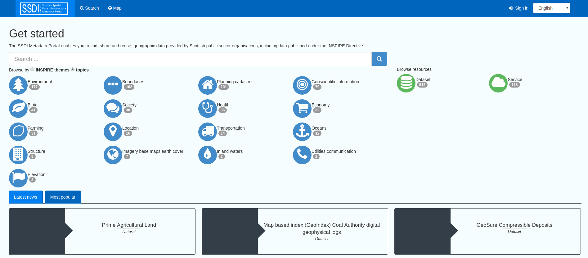
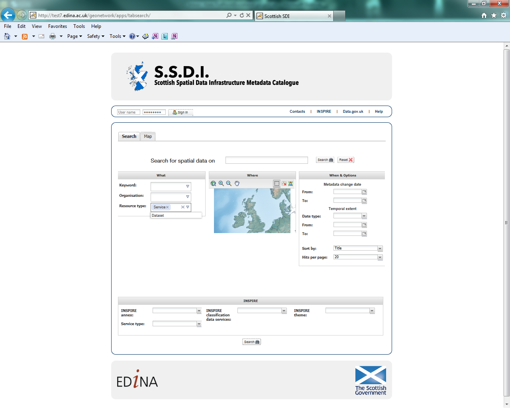

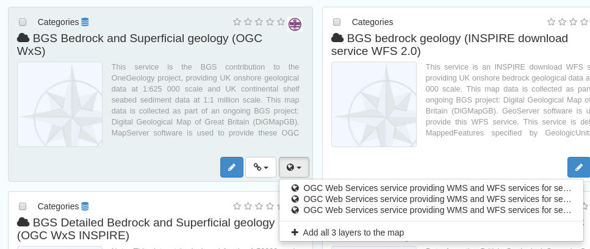
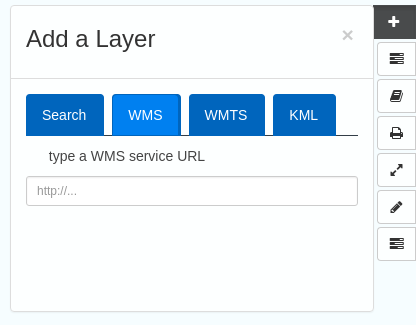
.. |image5| image:: media/image6.png
.. |image6| image:: media/image7.png
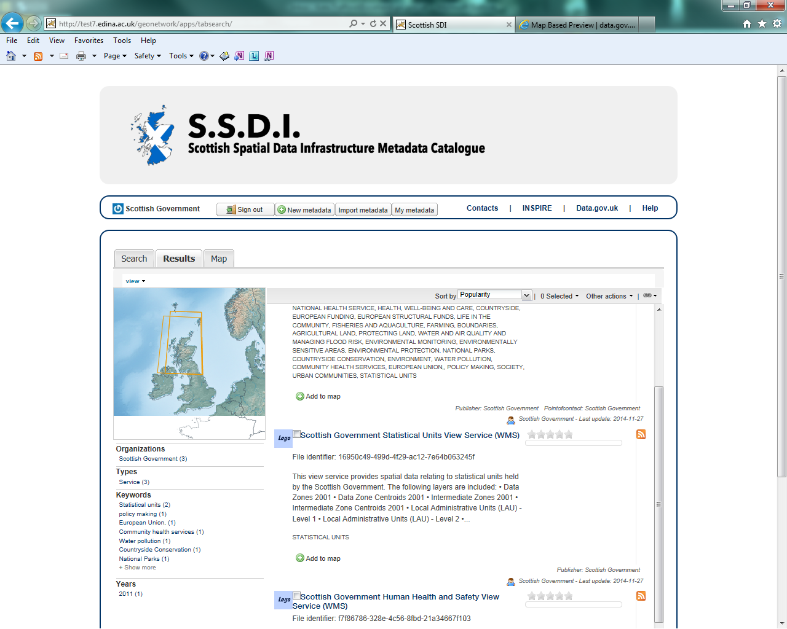
.. |image8| image:: media/image9.png

.. |image13| image:: media/image14.png
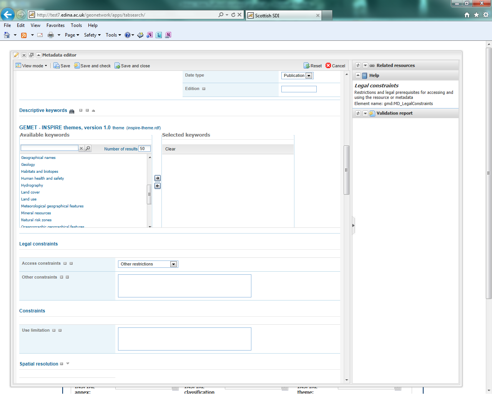
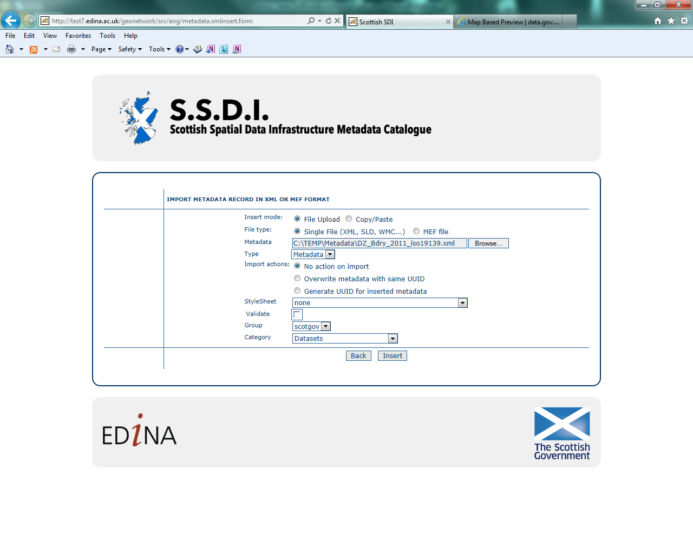
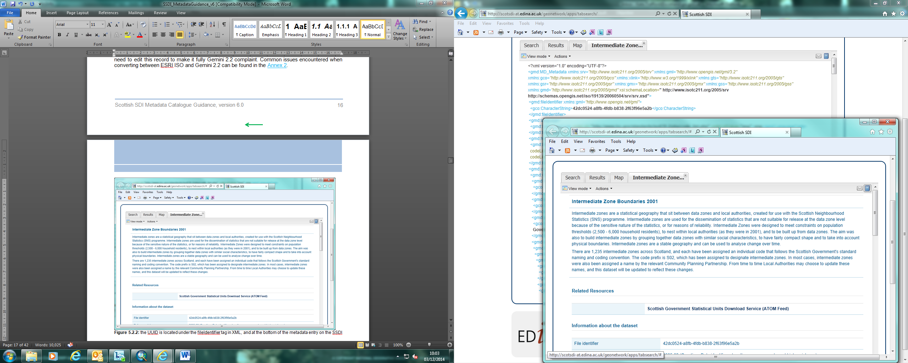
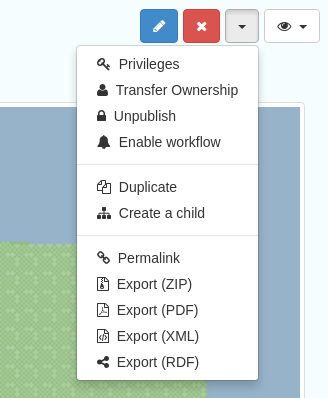
.. |image18| image:: media/image19.png
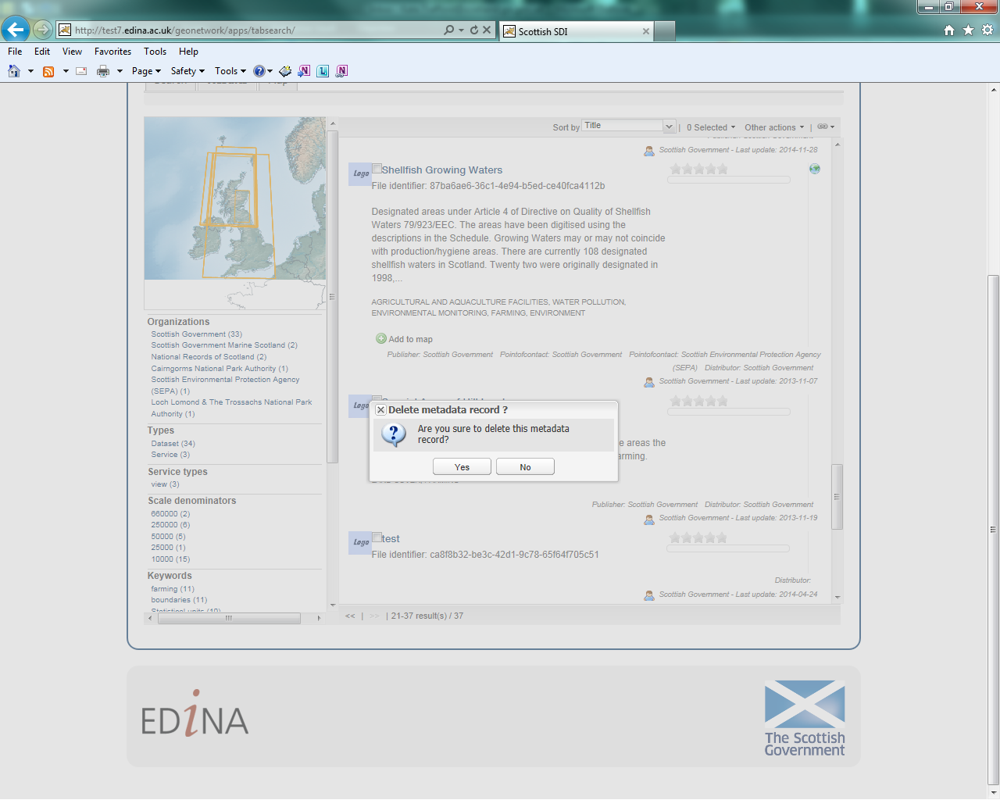
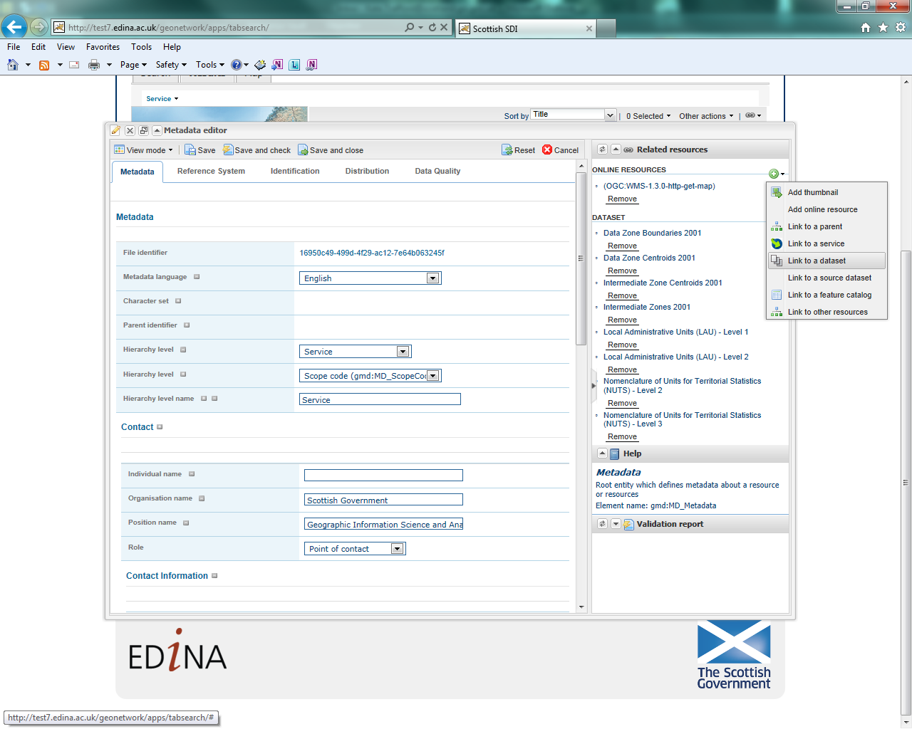
