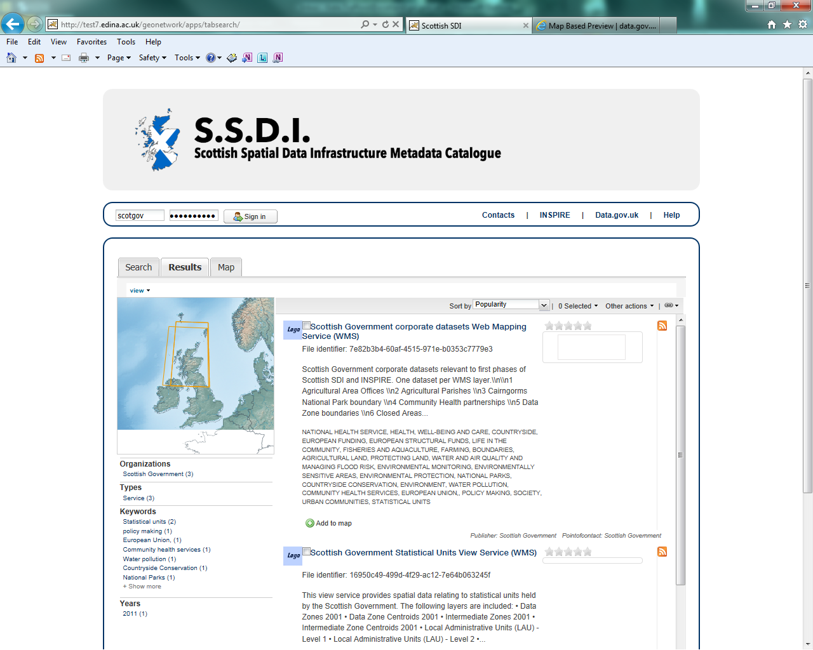
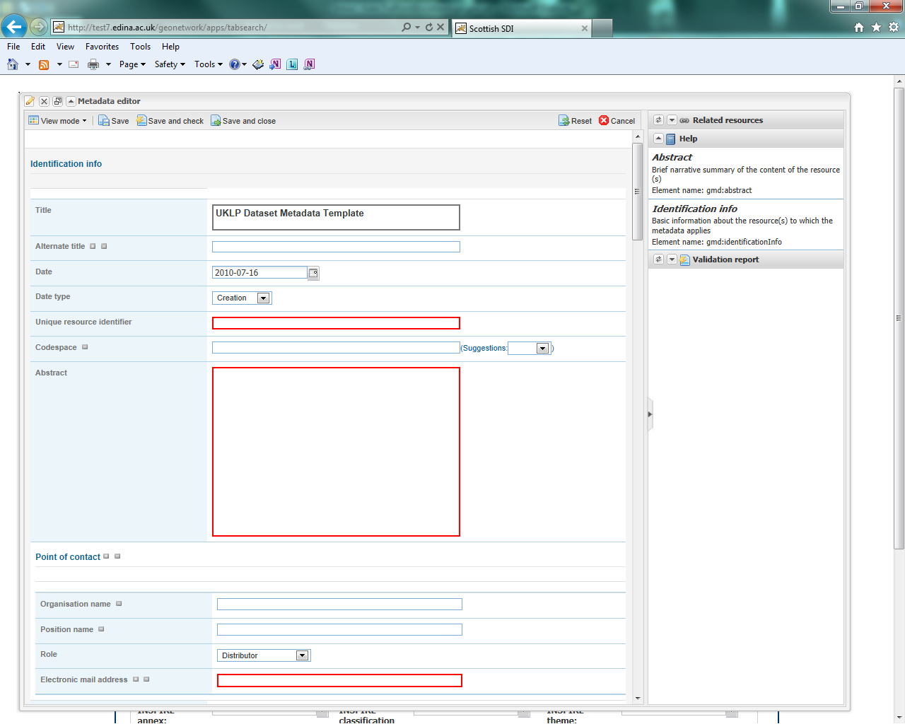

###Contents###

[1 Contents](#_Toc405369561)
[2 Introduction](#introduction)
 [2.1 The Scottish SDI Metadata Catalogue (SSDI)](#the-scottish-sdi-metadata-catalogue-ssdi)
 [2.2 Scottish marine data in the SSDI](#scottish-marine-data-in-the-ssdi)
 [2.3 SSDI metadata requirements](#_Toc405369565)
 [2.4 Where to obtain more information on INSPIRE](#where-to-obtain-more-information-on-inspire)
[3 General Introduction to the SSDI](#general-introduction-to-the-ssdi)
 [3.1 Accessing the SSDI](#accessing-the-ssdi)
 [3.2 Searching for metadata in the SSDI](#searching-for-metadata-in-the-ssdi)
 [3.3 Viewing metadata records on the SSDI](#viewing-metadata-records-on-the-ssdi)
[4 Viewing Spatial Data on the SSDI](#viewing-spatial-data-on-the-ssdi)
 [4.1 Adding services to the main interactive map](#adding-services-to-the-main-interactive-map)
 [4.2 Using the main interactive map](#using-the-main-interactive-map)
[5 Adding Discovery Metadata to the SSDI](#adding-discovery-metadata-to-the-ssdi)
 [5.1 Creating dataset and service metadata from a template](#creating-dataset-and-service-metadata-from-a-template)
 [5.2 Uploading metadata from an existing XML file](#uploading-metadata-from-an-existing-xml-file)
 [5.3 Saving and validating metadata](#_Toc405369577)
 [5.4 Publishing a metadata record](#publishing-a-metadata-record)
 [5.5 Assigning a category](#assigning-a-category)
 [5.6 Editing and deleting a metadata record](#editing-and-deleting-a-metadata-record)
 [5.7 How to create Related Resources](#how-to-create-related-resources)
[6 Metadata Elements](#_Toc405369582)
 [6.1 How to define INSPIRE compliant data in the SSDI](#how-to-define-inspire-compliant-data-in-the-ssdi)
 [6.2 Metadata element definition](#_Toc405369584)
[Annex 1: Example Metadata Record](#_Toc405369585)
[Annex 2: Common SSDI Validation Error Messages](#_Toc405369586)

Introduction
============

The Scottish SDI Metadata Catalogue (SSDI)
------------------------------------------

The Scottish SDI Metadata Catalogue (SSDI) underpins the coordinated and regulated publishing of Scottish public sector spatial data to the INSPIRE and UK Location specified standards. It provides the discovery component for a set of on-line services that will allow users to evaluate and use public sector spatial data.

If you have any questions regarding the SSDI please contact:

  **Kate Trafford**
  **GIS Analyst, Geographic Information Science & Analysis Team**
  **Scottish Government**
  **Email:**
  [Kate.Trafford@scotland.gsi.gov.uk](mailto:kate.trafford@scotland.gsi.gov.uk)

This guide sets out detailed guidance on the creation, publishing and maintenance of INSPIRE discovery metadata. It covers both spatial data being published under INSPIRE and all other spatial data published through the SSDI. The SSDI feeds into the UK public data publishing platform [data.gov.uk](http://data.gov.uk/).

Harvest of the metadata in the SSDI to the [data.gov.uk](http://data.gov.uk/) site is currently unscheduled, but performed on a weekly basis. Users should contact [Kate.Trafford@scotland.gsi.gov.uk](mailto:kate.trafford@scotland.gsi.gov.uk) if any urgent updates or deletions are required.

Scottish marine data in the SSDI
--------------------------------

MEDIN is another format for metadata that relates to marine data and was created for a domain specific purpose. The format of metadata held in the SSDI is sufficient for MEDIN purposes, the additional metadata elements included in MEDIN remain once the metadata has been added to the SSDI). MEDIN metadata can be thought of as a superset of the information held in the SSDI.

The SSDI and data.gov.uk can use MEDIN records (which come as slight but valid and complete supersets of Gemini 2.2 records). It is recommended that for Marine datasets that have metadata in MEDIN format, Scottish organisations should provide the appropriate metadata to both the SSDI and the MEDIN portal.

SSDI metadata requirements
--------------------------

If you publish spatial data on the SSDI then the following ****operational** commitments** must be followed:

-   You will endeavour to adopt a process of continuous improvement for the resources you publish, based on the feedback you receive.
-   You will maintain your discovery metadata:
    -   assuring its quality against appropriate standards
    -   reviewing it, updating it regularly, and ensuring it is updated when new versions of data, data series or on-line services are published.
    -   maintaining metadata File Identifiers (UUID) throughout the life of the metadata resource (new UUIDs should only be created when new resources are published, to prevent duplicate metadata resources).

If you publish on the SSDI then the following ****service** commitments** must be followed:

-   For **all data**:
    -   compliance with the INSPIRE Metadata Regulation and the UK Location operational requirements, as set out in this guide.
    -   if publishing INSPIRE Network Services, compliance with the INSPIRE Network Services Regulation.
    -   the publishing of INSPIRE View Services for a given dataset or data series.

-   For **data that comes under an INSPIRE Theme** and contains features listed in the INSPIRE Data Specifications:
    -   legal compliance with the INSPIRE Directive

Where to obtain more information on INSPIRE
-------------------------------------------

The latest information, and additional resources, can be obtained by visiting the [UK Location](http://data.gov.uk/location) web site. If you would like to contact the UK Location Coordination Unit, please use the contact form at:

<http://data.gov.uk/location/contact_points>

Further information on INSPIRE is also circulated on [Knowledge Hub](https://knowledgehub.local.gov.uk/), within the Scottish SDI Strategy Group, SDI/Inspire forum. The Scottish Government has also published guidance on the delivery of Inspire conformant web map services. The first instalment of this guidance can be accessed at:

<http://www.scotland.gov.uk/Publications/2010/05/06161701/0>

General Introduction to the SSDI
================================

Accessing the SSDI
------------------

The Scottish SDI Metadata catalogue can be accessed from the following link:

<http://scotgovsdi.edina.ac.uk/srv/en/main.home>

The main page consists of three panels: the header section (1), the main search panel (2) and the INSPIRE search panel (3).

Figure 3.1.1: SSDI catalogue main page

Along the header section there is a login button on the left and links to *Contacts, INSPIRE, Data.gov.uk* and *Help* to the right. Once a user has logged in, they will be presented with further buttons for **Sign Out**, **New Metadata**, **Import Metadata**, and **My Metadata**.

*Contacts* allow users to leave feedback on or comments about the site. Though if users have any specific issues around login and passwords then they should contact Kate Trafford ([Kate.Trafford@scotland.gsi.gov.uk](mailto:kate.trafford@scotland.gsi.gov.uk)) directly.

Searching for metadata in the SSDI
----------------------------------

Quick searches on the SSDI can be performed using the free text box at the top centre of the search panel and clicking the ‘**Search**’ button. One of the main functions of the site is to allow users to search for both dataset and service metadata. There are two predefined searches for ‘***Datasets***’ or ‘***Services***’, accessed from a drop down list under the heading ‘***What***’ on the left-hand side of the main search panel. Users can also search by organisation and keyword here. Note that keyword entries in the drop down list are generated from values in the keyword element of existing metadata records. 

Figure 3.2.1: SSDI catalogue search options

Other search options are available under the ‘***Where***’ and ‘***When***’ headings, and also the INSPIRE search panel at the bottom. Each section can be used to limit a user’s search criteria as follows:

-   **What** – allows users to search by Keywords, Organisation, and Resource type.
-   **Where** – the map tool allows users to draw a bounding box to restrict their search.
-   **When** – allows users to limit the search temporally based on the metadata change date or the temporal extent of the data. Note that this section also provides options for sorting of results.
-   **INSPIRE Search options** – allows users to limit their search by Annex, Service Type, Classification and Theme. Drop down boxes or check lists provide the various options available.

Clicking on the ‘**Search**’ button will run a search based on the users selected options. To clear search options, hit the ‘**Reset**’ button.

Viewing metadata records on the SSDI
------------------------------------

Once a search has been performed, users will be presented with a ‘Result’ tab.

Figure 3.3.2: SSDI Results tab

Options to sort by title, relevance, date of change, rating, popularity, and scale are available on the top right of the results window. Users can also select records and perform a series of actions such as export, add the layer to the map, update or delete.

On the left-hand side of the results tab is a map that displays the extent of each record in the search result list. Below this are options to filter search results by organisation, resource type, service type, scale, keywords, and year.

Viewing Spatial Data on the SSDI
================================

Adding services to the main interactive map
-------------------------------------------

Another function of the site is to allow users to view spatial data as Web Mapping Services (WMS) in the interactive map client. The viewing function can be accessed in two ways:

When viewing search results, click on the ‘**Add to map**’ button available at the bottom of the record. This will bring the map tab into view, and a dialog box with the URL for the WMS will already be entered. In the folder list the name of the WMS will appear, and the view can be expanded to see all available layers. Click on the layer you wish to add to the map and then click the ‘**Add**’ button at the bottom right of the dialog box.

OR

If you know the URL of the service you wish to view, activate the map tab and then click on the add layer button (left-most button at the top of the map table of contents). Select the radio button to ‘**add by URL**’, paste the URL into the text box and hit the ‘**connect**’ button. As above, the chosen service will appear in the folder list and layers can be added via the ‘**Add**’ button.

**Figure 4.1.1:** Adding a resource to the interactive map

Some services will contain multiple layers (e.g. Scottish Government or SEPA services), others only one. To see the layer in the main map click on the Add button in the bottom right of the pop up box. Close the pop up box and the layer will be visible on the map in the main window. Not all layers will appear automatically in the map, depending on the scale they are set to be visible at, some will only appear when you have zoomed in. Users can add as many layers to the main map as required.

**Figure 4.1.2:** The Data Zone layer from the Scottish Government's
Statistical Units WMS added to the map

Using the main interactive map
------------------------------

On the left hand side of the interactive map tab is the table of contents (see section 1 on figure 4.2.1). Across the top are several tools. Reading from left to right these are: Add WMS, Remove layer, Layer styles, Metadata, and WMS time. With the exception of the add layer tool, these tools require that you have an active layer identified. You can make a layer active by clicking on it, only one layer may be active at a time. The tool functions are described below:

> 

-   **Add WMS** – Add a service (or layer within a service) if you already know the URL.
-   **Remove Layer** – activate the layer to be removed then click on this button.
-   **Layer Styles** – Not available for all WMS layers.
-   **Metadata** – provides details on the active WMS service.
-   **WMS Time** – Not available for all WMS layers.
 By clicking the button beside ‘Layer manager’ in the table of contents, users can expand or collapse the TOC view. Clicking the arrow buttons at the top left or middle of the right-hand side of the table of contents, users can expand or collapse the map view.

Layers can be turned on and off by checking or unchecking the tick box beside the layer name. Opacity can also be modified using the slide bar underneath the layer name.

There are also a range of mapping tools available across the top of the interactive map (see section 2 on figure 4.2.1). The functions of each tool, again as read from left to right are described below:

-   **Full Extent** – Click this button to go to the full extent of the map.
-   **Zoom In/Zoom Out** – Use these buttons to zoom in or out of the map, by either clicking once or drawing a box.
-   **Pan Map** – Use this button to move the map. Click and hold the left mouse button to move the map.
-   **Feature Information** – This button returns information about features shown on the map.
-   **Previous/Next Extent** – Use these button to return to the previous map extent or go to the next map extent.

Adding Discovery Metadata to the SSDI
=====================================

This section guides you through the process of adding new metadata records into the SSDI catalogue using either the online metadata editor or the metadata insert tool, based on XML documents. To add or edit data and metadata, you must be registered as an Editor in the SSDI catalogue. Contact Kate Trafford ([Kate.Trafford@scotland.gsi.gov.uk](mailto:kate.trafford@scotland.gsi.gov.uk)) if you would like to become a registered editor for the SSDI.

To produce a good metadata record, always try to gather as much details as possible on the resource that you want to describe, taking into account the metadata elements that are explained in the next section ([Metadata Elements](#_Metadata_Elements)). The next step is to properly fill out the fields provided by the metadata template, while at the same time avoiding duplication of information throughout the form.

The table below indicates the mandatory and optional fields according to the UK Gemini 2.2 standard.

Table 5.0.1: Mandatory and optional information for dataset metadata

| ***Mandatory Fields***               |***Optional Fields***
|  ------------------------------------|-------------------------------
|  Title                               | Alternative Title
|  Abstract                            | Additional Information Source
|  Unique Resource Identifier          | Geographic Location/Extent
|  Dataset Language                    | Vertical Extent
|  Resource Locator (Online Resource)  | Equivalent Scale
|  Spatial Reference System            | Data Format
|  Topic Category                      | Data Quality (Conformity)                                    
|  Keyword                                                                   
|  Bounding Box                                                               
|  Temporal Extent                                                            
|  Dataset Reference Date                                                    
|  Frequency of Update                                                        
|  Spatial Resolution                                                        
|  Lineage                                                                    
|  Use Constraints                                                            
|  Limitations on Public Access                                               
|  Responsible Organisation                                                   
|  Metadata Point of Contact                                                  
|  Metadata Date                                                              
|  Metadata Language                                                           
|  Resource Type                        

To edit or import metadata records, you must be logged in. To log on to the metadata tool, go to the top left-hand corner of the header section. Here you can enter the system credentials provided by the system administrator and then click the ‘**Sign In**’ button. You are now logged on and the ‘**Sign Out**’ button will now be visible, along with buttons for new, import and my metadata.

Figure 4.2.1: Enter login credentials to sign in to the SSDI

Creating dataset and service metadata from a template
-----------------------------------------------------

To add dataset or service metadata to the SSDI, click on the ‘***New Metadata***’ button. You wil be presented with a list of templates – one UKLP template for ‘Datasets’ and one for ‘Services’. Select the appropriate template based on the type of resource that is being documented. At the bottom of the popup box, select the group the record is to be added to (for all but site administrators, there will only be one choice here). Then click on the ‘**Create**’ button.

Users can then enter UK Gemini 2.2 compliant metadata in the form provided. More help on the various meanings of the metadata elements can be found in the next section ([Metadata Elements](#_Metadata_Elements)).

**Figure 5.1.1:** Blank dataset metadata template form

Note that the templates for dataset and service metadata are slightly different. Metadata for a service has extra elements for the spatial data service type (i.e. view, download, etc.) and for coupled resources.

The templates have a  where you can add an element or another occurrence of an element (or section). For example, you could have a range of Alternative Titles. Where an  appears, you can delete the associated metadata element or section.

The arrows ( or ) allow you to move that section up or down the document order. Note that Gemini 2.2 is not concerned with the order that sections appear in.

Mandatory fields (e.g. Abstract) that are empty are outlined in red. Note that for sub-elements, this only indicates that the sub-element is mandatory within its context. For example, the Vertical Extent is an optional element, but if you have one, then the minimum and maximum values are mandatory.

The binoculars () allow you to add information from a pre-existing dictionary. For example, if you click on the binoculars beside the Keywords section a pop up box will appear. This contains a drop down list (top left) with the various thesaurus’ available. The thesaurus choices available for the Keyword element are INSPIRE theme or Regions. There is also a thesaurus available for coordinate reference systems.

Select the appropriate thesaurus and then click on any of key words below. Using the arrows in the middle of the pop up box, add your selection to the Selected keywords list and when finished click ‘add’ at bottom of the menu to add them to them all to your metadata.

**Figure 5.1.2:** Inspire theme thesaurus

For some sections, where there is likely to be a range of commonly used values, a ‘suggestion’ drop down list is available to the right of the text entry box. Selecting values form these drop down lists will auto fill the entry for you.

Finally, each section heading has some help associated with it (or ‘tool tip’). When the mouse is hovered over the section heading, a ‘?’ will appear. Click on the heading and a box showing the definition of that heading will appear. Click on the box again to remove the element definition.

Uploading metadata from an existing XML file
--------------------------------------------

To upload a record (such as an xml exported from ArcCatalog), click on the ***‘Import Metadata’*** button from the header menu. Leave the ***‘Insert Mode’*** set to ‘file upload’ and use the ’Browse’ button to navigate to the xml file to be uploaded. From the ***‘Type’*** drop down menu, choose ‘Metadata’.

Figure 5.2.1: the Import Metadata Record menu

Users must consider the appropriate ***‘Import Actions’***. If you are uploading to create a new metadata record then choose the ‘Generate UUID for inserted metadata’. If you are uploading in order to refine or change an existing record on the SSDI, then choose the ‘Overwrite metadata with the same UUID’. If the older version of the record has already been deleted then the ‘No action on import’ option may be selected.

The UUID is a generated automatically by whatever internal system (i.e. ESRI ArcGIS ArcCatalog) was used to write and manage your metadata. In xml, it can be found at the top of the page under the file identifier section. Within the SSDI, the UUID or File Identifier can be found at the bottom of the metadata record display (see Figure 5.2.2). This UUID, together with the metadata date stamp, are used to ensure records are unique within the SSDI, [data.gov.uk](http://data.gov.uk/) and other metadata catalogues like MEDIN.

For an xml that is already in Gemini 2.2 format, leave all the ***‘StyleSheet’*** set at none. To upload a non-Gemini 2.2 xml, select from the ***‘StyleSheet’*** drop down box the appropriate converter (e.g. ESRI-to-GEMINI\_21).

Users should ***NOT*** check the ***‘Validate’*** box during upload - if there are errors in the validation process, the metadata will not be uploaded. The recommended validation technique is to upload without validation, and then go through the SSDI validation process described in the [next section](#_Saving_and_validating).

Click Insert and the record will be uploaded. Once the metadata has been uploaded you will still need to edit this record to make it fully Gemini 2.2 complaint. Common issues encountered when converting between ESRI ISO and Gemini 2.2 can be found in the [Annex 2](#_Annex_2:_Common_1).

Figure 5.2.2: the UUID is located under the fileIdentifier tag in XML,
and at the bottom of the metadata entry on the SSDI

Saving and validating metadata
---------------------------------------

As the user works through the template filling in required elements, the ***‘Save’*** button at the top or bottom of the screen may be used to save the record in progress. Once the record has been completed, the user may click ***‘Save and Close’*** to save the record and exit the editing mode. Users should note that this action will not save a copy of the metadata locally, only on the server. **It is recommended that all master copies of metadata should be stored within the data provider’s own system.**

Once all elements for a new record have been completed or changes have been made to an existing record, it should be validated against the Gemini 2.2 standard rules. This can be done by clicking on the ***‘Save and Check’*** button at the top or bottom of the page, or refreshing the validation report in the panel on the right hand side of the editor window.

A dialogue box will appear in the top right corner of the screen highlighting any errors that need to be corrected (Note: tick the box at the top to see only errors). Solutions to errors are not always obvious from the messages given; [Annex 2](#_Annex_2:_Common_1) of this document provides a list of common error messages encountered and how to resolve them. Users can still save a metadata record that has not been validated and come back to it later.

The validation check should be repeated once amendments have been made until no errors are detected. Once validation is successfully completed, click on the ***‘Save and Close’*** button. When viewing the record (not in an editing session) there is an option to save as an XML file clicking on the actions drop down menu (top left) and selecting ‘save as XML’. The metadata record will appear in a new tab in XML format and users can then save by going to File then ***‘Save as’***.

Publishing a metadata record
----------------------------

Once a metadata record has been saved and successfully validated, it can then be published, making it publicly viewable on the SSDI.

Clicking on the actions drop down from either the record view tab or results list, choose ‘**Other Actions**’, and then ‘**Privileges**’.

Figure 5.4.1: Publishing a metadata record

When the ‘**Privileges**’ option is selected a pop up box will appear. In the row for ‘All’ groups, check each of the tick boxes (or click ***‘Set All’***). This means the record is now publicly viewable on the SSDI and that the metadata record is available for harvesting to [data.gov.uk](http://data.gov.uk/).

Assigning a category
--------------------

As a final step to entering metadata, it should be assigned a category; this will determine the category the map will display under on the home page.

To assign a category for a map, under ***‘Other actions’*** menu, select the ***‘Categories’*** button. This will open up a new pop up box. You can assign the metadata to either the *Interactive resource* or *Dataset* categories by clicking on the check box next to the category. An interactive resource is a view or download service etc., and will show up in the results when searching the SSDI using the ‘Interactive resources’ option for resource type (left panel of the search window, under the heading ‘What’). Conversely, if the *Dataset* category is assigned, the record will appear when only datasets are searched.

Click ***‘Submit’*** to complete the action.

Editing and deleting a metadata record
--------------------------------------

When you search for a metadata record, and assuming you have the login rights, you will be able to edit or delete the record using the edit or delete buttons (under the ‘Actions’ menu).

Once in editing mode, the options are identical to those of metadata creation. To delete the metadata record, select the Delete button and you will be prompted to confirm.

**Figure 5.6.1:** A confirmation screen is displayed when deleting a metadata record

Users should note that the metadata record may continue to appear on the screen until you move to another page (i.e. Home).

How to create Related Resources
-------------------------------

A related resource refers to a relationship between a dataset metadata record, and that for a service. In editing mode, related resources can be viewed in the top right hand panel. Related resources can be added by carrying out the following steps:

 1.  In the dataset metadata, ensure that the ***‘Resource locator’*** element contains the URL for the service. Service links can be added by clcicking the plus button on the upper right of the related resources panel, and choosing ‘Link to a Service’. A popup window will open with a list of service records. Check the box beside the record that you want to create a relationship and hit the ‘**Create Link**’ button at the bottom of the window.
 2.  In the service metadata, related resources are added in a similar manner by choosing ‘Link to a Dataset’ option. A popup window will present a list of datasets, which can be filtered using the search box at the top of the window. Again, once the desired dataset record has been chosen, hit the ‘**Create Link**’ button at the bottom of the window.

**Figure 5.7.1:** Creating the coupled resource relationship

Metadata Elements
====================================================================================================================

The following section provides guidance on how to fill in each Gemini 2.2 metadata element. It is recommended that users also consult the full guidance on Gemini 2.2, which can be found at:

<http://www.agi.org.uk/storage/standards/uk-gemini/GEMINI2.2.pdf>.

There are a number of elements that need to be specifically mentioned. Following the guidance set out below will reduce the number of metadata errors and ensure your organisation is correctly identifying in the SSDI metadata if it’s datasets are covered by the INSPIRE directive.

How to define INSPIRE compliant data in the SSDI
------------------------------------------------

To define within the metadata if a dataset is compliant with INSPIRE, users should ensure the ***Keyword*** section is completed. If the dataset is covered by INSPIRE (e.g. parts of it are within the Scope of an INSPIRE Annex data specification), then the ***first keyword*** should be from the GEMET INSPIRE themes which can be found at:

<http://www.eionet.europa.eu/gemet>

If another controlled vocabulary is used as the first keyword, such as the IPVS – Integrated Public Sector Vocabulary (version 2), then the dataset is not covered by INSPIRE. That said, the dataset and service metadata will still be required to comply with the operation and service commitments of the SSDI, as set out on [page 3](#_SSDI_Metadata_Requirements).

Metadata element definition
--------------------------------------------------------------------------------------------------------------------------

The following table describes the individual metadata elements.

Table 6.2.1: SSDI Metadata elements and definitions
                                                                                                                                                                                                                                                                                                                                                                                    
|Metadata Element |Definition                       | Dataset Obl.1      |Guidance & Examples                              |Service Obl.1  |
|-----------------|---------------------------------|--------------------|-------------------------------------------------|---------------|
|Title            | A unique and readily recognisable name for the resource.  The title should be the formal name if one exists.  | M-1 | The Title will be a searchable field in both a UK and European context and as such should be clear and concise.   Examples: <ul><li> Nitrate Vulnerable Zones</li><li>Community Health Partnerships</li></ul> | M-1 |
|Alternative title |Any short name, other name, acronym or alternative language title for the resource. |O-N | Should be provided when the data resource has more than one Title.  It can also be helpful to include title with spatial or temporal coverage if applicable. Alternative titles will be searchable in the UK context.   Examples: <ul><li>NVZ</li><li>CHP</li><li>Community Health Partnerships 2012</li></ul> | O-N |
|Abstract |A brief narrative summary of the data resource. |M-1 |The Abstract should provide a clear and concise statement of the content of the dataset (i.e. the ‘what’ aspect of the dataset), and not general background information. Jargon and abbreviations should be avoided, as this element should be understood by non-experts.   Examples:  “Agricultural parishes are based on Civil Parishes which were abolished as an administrative unit in Scotland in 1975. Agricultural parishes continue to be used for boundary and statistical purposes. There are 891 agricultural parishes in Scotland and they are used in the Agricultural Census and for the payment of farming grants and subsidies. The dataset contains parish boundaries, parish names and parish codes.” |M-1| 
|Unique resource identifier| A value uniquely identifying the data resource within your organisation (i.e. how your organisation references the dataset).| M-1 |The Code element is mandatory, and should be a recognisable identifier within the context of your organisation (i.e. a unique code of numbers, letters or combination of referring to a single dataset).  If it is not guaranteed to be unique across UK Location and INSPIRE, then the Codespace sub-element must be specified; this should be the internet domain of the data provider/owner.  The Authority and Version sub-elements can be ignored.  NOTE: When inserting a new Unique resource identifier, it is best to select “Identifier (gmd:RS_Identifier)” before clicking the ‘+’, as the alternative (gmd:MD_Identifier) does not allow for the Codespace.  Examples: <ul><li>For the Designated Bathing Waters dataset provided by Scottish Government: Code: SDME_SG_DESBATHING_WATERS, Codespace: www.scotland.gov.uk</li><li>For the Trunk Road Network service provided by Transport Scotland: Code: Trunk_Road_Network_WMS_service, Codespace: www.transportscotland.gov.uk</li></ul> |O-1 |
|Dataset language | The language used within the dataset (assuming the data resource contains text/written information, e.g. in attribute tables). | C-N | It is recommended to select a value from a controlled vocabulary, for example ISO 639-2 which uses three-letter primary tags with optional subtags.   The values for UK languages are:<ul><li> English – eng</li><li>Welsh – cym </li><li>Gaelic (Irish) – gle</li><li>Gaelic (Scots) – gla</li><li>Cornish – cor</li><li>Ulster Scots - sco</li></ul>This element is set to ‘eng’ in the SSDI templates.  In the majority of cases no change to this will be required. Where Scottish Gaelic is used within the dataset (i.e. place names), this can also be added.  NOTE:  For records covered under INSPIRE, the language must be one of the 24 official languages of the European Union, which for UK purposes would be English (eng).  If the dataset is also available in another language (e.g. Scots Gaelic), then a second metadata record must be provided for that language. | C-N |
|OnLine Resource  (Resource locator sub element)|Location (address) for on-line access using a Uniform Resource Locator (URL) address scheme. The resource locator has to be an http URL.| C-N |This element of the dataset metadata should contain the WMS/WFS service URL. The URL should be the location the data can be downloaded and may be different from where it can be ordered. Multiple entries are allowed if more than one service is provided. The three additional sub-elements (Name, Description and Function) are optional, but provide helpful details for users.  Examples:  http://inspirescotland.org/cgi-bin/mapserv.exe?map=E:/ms4w/apps/sg_inspire/inspire.map&SERVICE=WMS&VERSION=1.3.0&REQUEST=GetCapabilities& |See Coupled resource |
|Coupled resource | Unique Resource Identifier (URI) of the datasets that the service operates on.|  - | Applicable to service metadata only. This must be completed for every dataset included in the service (i.e. portrayed as a view service layer). Additional Coupled resource sections can be added by clicking on the ‘+’. Click on the binocular icon to search for a dataset and add to the coupled resource.  This will auto fill the xlink and Metadata uuid fields. | C-N |
| Spatial reference system | Identifier of the system of spatial referencing. | M-1 | Identify the spatial reference system used to spatially reference the data in the data resource. The UK Location encoding recommendation is to use the URN form of reference to an EPSG code.  EPSG codes can be accessed at: http://epsg-registry.org/ For the SSDI, suggested coordinate reference systems can be added using the drop down list, or by clicking on the binocular icon and adding an entry from the CRS thesaurus.   Examples:<ul><li> urn:ogc:def:crs:EPSG::4258 for ETRS89</li><li>urn:ogc:def:crs:EPSG::4326 for WGS84 </li><li>urn:ogc:def:crs:EPSG::27700 for British National Grid</li></ul>| C-1 |
| Additional information |Other descriptive information about the data resource.| O-1 |Provide a URL(s) that links to other documents related to the resource. This should be used to link to other sources of descriptive information about the resource.  It should not be used to record the link to the online resource.  Examples:  For Data Zones 2001, a link to the document outlining how they were created was provided: http://www.scotland.gov.uk/library5/society/sndata-00.asp |O-1 |
|Topic Category| Describes the main theme(s) of the dataset. |M-N |Select from the drop down list one or more categories that most closely represent the topic of the data resource. If more than one topic is applicable then the ‘+’ icon should be used to add another Topic category element.   Choices available in the dropdown list are: <ul><li>Biota</li> <li>Boundaries</li> <li>Climatology, meteorology, atmosphere</li> <li>Economy</li> <li>Elevation</li> <li>Environment</li> <li>Farming</li> <li>Geoscientific information</li> <li>Health</li> <li>Imagery base maps earth cover</li> <li>Inland waters</li> <li>Intelligence military</li> <li>Location</li> <li>Oceans</li> <li>Planning cadastre </li> <li>Society</li> <li>Structure</li> <li>Transportation</li> <li>Utilities and communication</li></ul> Greater detail for the topic of a particular dataset can be given through the Keyword element. Not all sectors are included (i.e. Historic) and some form of agreement needs to be made as to which topic these sectors are assigned. | O-N | 
|Keyword |The topic of the content of the data.  These should be more specific than those entered under Topic category. A sub-element of this is the Originating controlled vocabulary, which is the name of the formally registered thesaurus or a similar authoritative source of keywords. | M-N | Keyword values should be taken from a list standard subject categories, identified in the ‘originating controlled vocabulary’ element. If the dataset is covered under INSPIRE, then the first keyword should be from the General Environmental Multi-Lingual Thesaurus (GEMET), which can be found at: http://www.eionet.europa.eu/gemet. If another controlled vocabulary is used then this should be stated.  NOTE: Users will be unable to edit this section once a keyword has been added, they will have to delete and add the correct one in.  Examples: <ul><li>Keyword: Address, Originating controlled vocabulary: GEMET Thesaurus version 1.0, vocabulary publication date 2009-06-30.</li><li>Keyword: Farming, Originating controlled vocabulary: IPVS – Integrated Public Sector Vocabulary version 2, revision date 2006-04-02</li></ul> | M-N|
|Extent (Geographic element)| The spatial extent or coverage of the data resource.| O-N| Select a pre-defined extent from the drop down box to the right of the map or draw a rectangle on the map. Values for the North, East, West, and South bounding coordinates will then be automatically filled. It is also recommended that the extent be described using the ISO 3166-2 standard for subdivisions of countries (i.e. for Scotland, the Code would be SCT).  To enter this, select “Identifier (gmd:MD_Identifier)” from the drop down before clicking the ‘+’ next to Geographic Identifier.  This will allow you to enter the Code, along with the Citation (e.g. Title: ISO 3166-2, Date: 2007/12/13 (2nd edition), Date Type: Revision).| O-N |
|West Bounding Longitude |Western most limit of the dataset expressed in longitude in decimal degrees (positive east) |M-1 |Approximate values to identify the data on a global basis are required.  If a pre-defined extent is chosen in the Geographic element, a value will be automatically provided.  Alternatively, a box can be drawn on the map. The west bounding longitude should be less than the east bounding longitude. |C-1 |
|East Bounding Longitude |Eastern most limit of the dataset expressed in longitude in decimal degrees (positive east) |M-1| Approximate values to identify the data on a global basis are required.  If a pre-defined extent is chosen in the Geographic element, a value will be automatically provided.  Alternatively, a box can be drawn on the map. The east bounding longitude should have a greater value than the west bounding longitude.| C-1 |
|North Bounding Latitude |Northern most limit of the dataset expressed in latitude in decimal degrees (positive north) |M-1| Approximate values to identify the data on a global basis are required.  If a pre-defined extent is chosen in the Geographic element, a value will be automatically provided.  Alternatively, a box can be drawn on the map. The north bounding latitude must be greater than the south bounding longitude. |C-1| 
|South Bounding Latitude |Southern most limit of the dataset expressed in latitude in decimal degrees (positive north) |M-1| Approximate values to identify the data on a global basis are required.  If a pre-defined extent is chosen in the Geographic element, a value will be automatically provided.  Alternatively, a box can be drawn on the map. The south bounding latitude must be smaller than the north bounding latitude. |C-1|
|Vertical extent information |Describes the vertical domain (height range) of the data resource. |O-1 |This element should be completed where relevant (e.g. geology, mining, etc.). Sub-elements are the minimum, maximum value and the coordinate reference system to which the minimum and maximum were measured. If the vertical extent does not apply to the data resource, then users should delete this section of the metadata record as it will not be validated by the SSDI. |O-1 |
|Temporal extent |This is the date(s) that describes the time period covered by the content of the dataset.  It may refer to the (1) period of collection of the data or (2) the date at which it is deemed to be current. |M-1 |Temporal extent is the date of the validity of the data, and is different from the Dataset reference date. Dates may be to any degree of precision, from century (YY) to full date and time. The extended date format (YYYY-MM-DD) should be used, where YYYY is the year, MM the month, and DD the day. If required, time (HH:MM:SS, where HH is the hour, MM the minute, and SS the second) may be added, with ‘T’ separating the two parts. Periods are recorded as {fromdate/todate} (e.g. 2006-04-01/2007-03-31).  Either the from date or the to date (but not both) may be left blank to indicate uncertainty. Examples: For the Urban Rural Classification, the Temporal extent can be entered as 2011 to 2012.| C-1 |
|Dataset reference date |Reference date for the data resource, indicating the date of publication, creation or last revision. (NOTE: for services, this date relates to the creation, publication, and/or revision of the service, not the dataset(s) within it.) |M-N |The Dataset reference date is a notional date of “publication” of the data resource. It is different from the Temporal extent, which is the date of currency of the data. Multiple dataset reference dates can be defined but there can only be one ‘creation date’. Dates may be to any degree of precision, from century (YY) to full date and time. The extended date format (YYYY-MM-DD) should be used, where YYYY is the year, MM the month, and DD the day. If required, time (HH:MM:SS, where HH is the hour, MM the minute, and SS the second) may be added, with ‘T’ separating the two parts. Periods are recorded as fromdate/todate (e.g. 2006-04-01/2007-03-31).  Either the ‘from date’ or the ‘to date’ (but not both) may be left blank to indicate uncertainty.  Examples:  If the dataset has been created as part of legislation the date should be the date of enactment of that piece of legislation.  For example, the establishment of Community Health Partnerships (CHPs) was designated in the National Health Service Reform (Scotland) Act, which received Royal Assent on June 11th, 2004; therefore this date was entered as the original ‘creation’ date whereas October 2012 is used as the date for the particular version of the dataset.  If the dataset has been created in support of a publication the date of the publication should be used.  For example, the Urban Rural Classification 2011-2012 was published on August 28th, 2012.| M-N|

TO BE CONTINUED
